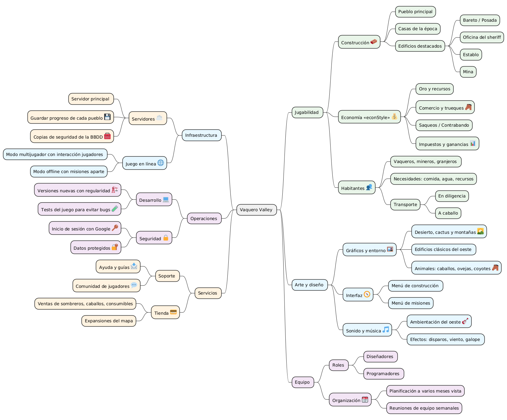
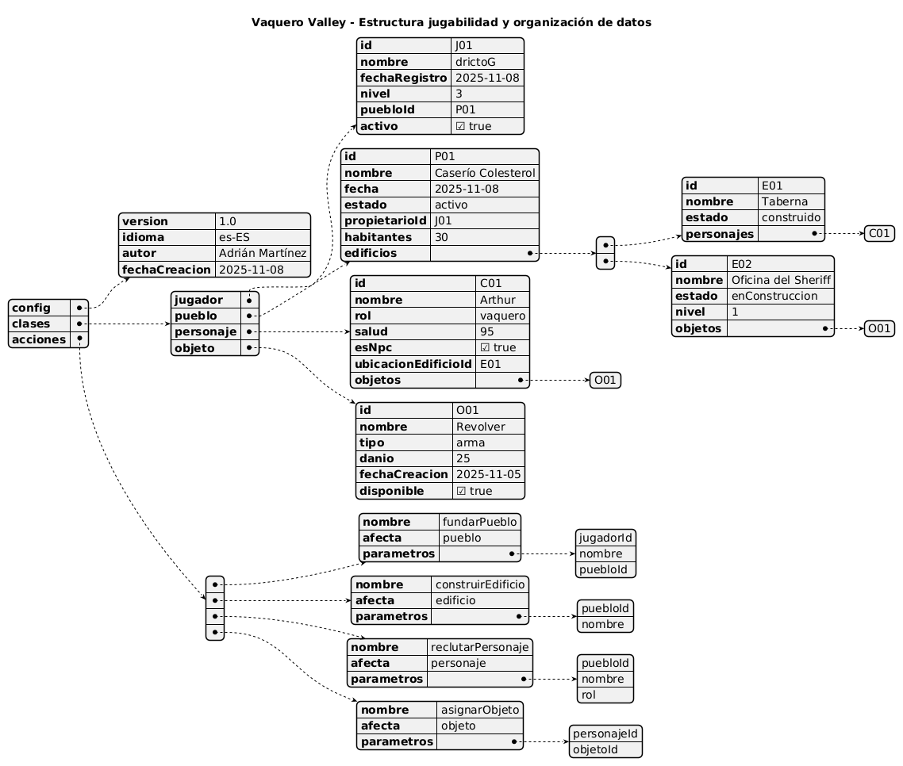
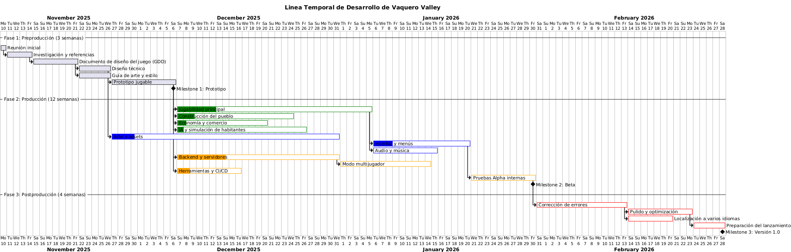
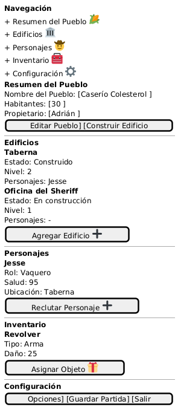

# Vaquero Valley 🌵

## Introducción

**Vaquero Valley** es un proyecto de diseño conceptual que utiliza **PlantUML** para representar distintos aspectos del desarrollo de un juego tipo "City Builder" ambientado en el Lejano Oeste.  
A través de varios diagramas (Mindmap, JSON, Gantt y Wireframe/Salt), se describen los elementos del juego, su estructura interna, la planificación del proyecto y una propuesta visual de la interfaz (la interfaz es MUY pero que MUY conceptual).

---

## 🧠 Mindmap - Estructura del Juego

El **Mindmap** muestra la estructura general del proyecto *Vaquero Valley*, incluyendo jugabilidad, infraestructura, artStyle, operaciones y servicios.

---

## 🧩 JSON Visualizer - Datos del Juego

Este **JSON Visualizer** representa la organización de los datos del juego: pueblos, edificios, personajes y objetos, así como las acciones posibles dentro del sistema.

---

## 🕒 Gantt - Planificación del Proyecto

El **diagrama de Gantt** muestra la planificación de desarrollo del juego, incluyendo fases como diseño, programación, pruebas y publicación.

---

## 🧱 Wireframe / Salt - Interfaz del Juego

El **wireframe Salt** representa un "boceto" de interfaz.  

