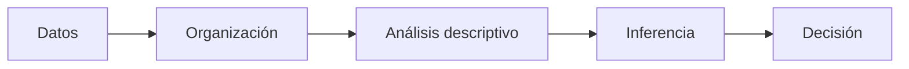
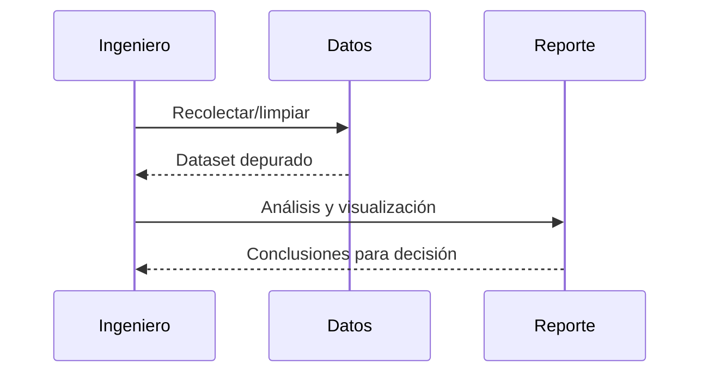

# ⚙️ Tipos de Datos y Variables

**Ruta:** Inicio > Datos > Tipos de Datos y Variables

**Creado:** 2025-10-22 · **Actualizado:** 2025-10-22  
⏱️ Lectura estimada: 7–9 min  
**Tags: estadística, ingeniería, fundamentos, AEC, miniwiki**

> [!NOTE]
> Esta página forma parte de la miniwiki *Estadística*. Enlaza con [Fundamentos](./articulo-1.md), [Variables](./articulo-2.md), [Frecuencias](./articulo-3.md), [Medidas](./articulo-4.md) y [Aplicaciones](./articulo-5.md).

> [!WARNING]
> Revisa las definiciones y supuestos antes de aplicar fórmulas: un mal supuesto puede invalidar conclusiones.

## 📑 Tabla de contenidos
- [Introducción](#introducción)
- [Sección 1 — Conceptos clave](#sección-1--conceptos-clave)
- [Sección 2 — Metodología](#sección-2--metodología)
- [Sección 3 — Ejemplos y práctica](#sección-3--ejemplos-y-práctica)
- [Sección 4 — Errores frecuentes](#sección-4--errores-frecuentes)
- [Sección 5 — Resumen y conclusiones](#sección-5--resumen-y-conclusiones)
- [Diagramas](#diagramas)
- [Tablas](#tablas)
- [Bloques interactivos](#bloques-interactivos)
- [Citas](#citas)
- [Notas](#notas)
- [Navegación](#navegación)

## Introducción
Para analizar correctamente, primero hay que **nombrar** correctamente: qué tipo de variable tenemos y en qué escala medimos. Las decisiones estadísticas dependen de esto: un promedio tiene sentido en escalas numéricas, pero no sobre categorías sin orden. Diferenciaremos variables **cualitativas** y **cuantitativas**, y revisaremos las escalas nominal, ordinal, intervalar y de razón. Verás ejemplos de ingeniería (clases de defecto, niveles de severidad, temperaturas, masas), y enlaces a [Fundamentos](./articulo-1.md), [Frecuencias](./articulo-3.md) para construir tablas coherentes y a [Medidas](./articulo-4.md) para elegir métricas válidas. Cerramos con errores comunes al clasificar y consejos prácticos para documentar unidades y transformaciones de datos.

En esta página encontrarás una guía breve y directa, con ejemplos sencillos, alertas de buenas prácticas y enlaces internos a otros artículos de la miniwiki para ampliar o repasar. También incluimos **dos diagramas Mermaid** (uno conceptual y otro de proceso), **tres tablas** (comparativa, datos y resumen) y bloques colapsables con *información adicional*, *ejemplos detallados* y *contexto histórico*. Consulta también el [glosario](./glosario.md) y las [referencias](./referencias.md). Para continuar, puedes saltar a [Variables](./articulo-2.md), [Distribución de Frecuencias](./articulo-3.md), [Medidas de Centralización y Dispersión](./articulo-4.md) o volver a la [portada](./index.md).

## Sección 1 — Conceptos clave
**1.1 Definiciones esenciales**  
- *Dato*, *variable*, *población*, *muestra* y *parámetro* se introducen en [Población y muestra](./articulo-4.md).  
- Diferencia entre **estadística descriptiva** e **inferencial** (ver [Fundamentos](./articulo-1.md) y [Medidas](./articulo-4.md)).  
- Rol en ingeniería: control de calidad y análisis de rendimiento (ver [Aplicaciones](./articulo-5.md)).

**1.2 Supuestos y condiciones**  
- Independencia, escala de medición adecuada y tamaño muestral suficiente.  
- **Cuidado:** *outliers* y sesgos de selección pueden sesgar resultados [1].  
- Ver también *sesgo* en el [glosario](./glosario.md).

**1.3 Notación y símbolos**  
- Media `\(\bar x\)`, mediana `\(\tilde x\)`, varianza `\(s^2\)` y desviación típica `\(s\)`.  
- Uso de `\(\mu, \sigma\)` para población.  
- Más símbolos en [Medidas](./articulo-4.md).

> [!TIP]
> Antes de calcular, dibuja: un **histograma** o **dispersión** suele revelar patrones que las tablas no muestran. Consulta imágenes en `./recursos/imagenes/`.

## Sección 2 — Metodología
**2.1 Recolección y muestreo**  
- Muestreo aleatorio simple, estratificado y sistemático [2].  
- Diseños recomendados en proyectos de ingeniería (ver [Aplicaciones](./articulo-5.md)).  
- Instrumentación: precisión y calibración.

**2.2 Limpieza y organización**  
- Detección de valores perdidos y atípicos.  
- Normalización de nombres y unidades (*p. ej.*, m, s, °C).  
- Construcción de **tablas de frecuencias** (ver [Frecuencias](./articulo-3.md)).

**2.3 Análisis descriptivo**  
- Cálculo de media, mediana, modo, rango, varianza y desviación (ver [Medidas](./articulo-4.md)).  
- Visualización: histogramas y diagramas de caja [3].  
- Relación entre variables: dispersión y correlación.

## Sección 3 — Ejemplos y práctica
**3.1 Caso sencillo (resistencias)**  
Se miden 100 piezas: calcula `\(\bar x\)`, `\(s\)` y representa un histograma (ver imagen en `/recursos/imagenes/histograma.png`). Enlaza con [Medidas](./articulo-4.md).

**3.2 Caso bivariante (tiempo vs tamaño)**  
Registra pares `(x, y)` y dibuja la dispersión (ver `/recursos/imagenes/dispersion.png`). Revisa [Variables](./articulo-2.md) para elegir la escala correcta.

**3.3 Interpretación**  
Compara la forma del histograma con la teoría y contrasta si hay tendencia lineal en la dispersión. Vuelve a [Fundamentos](./articulo-1.md) o amplía en [Aplicaciones](./articulo-5.md).

## Sección 4 — Errores frecuentes
**4.1 Confundir correlación con causalidad**  
La coexistencia de dos tendencias no implica causa–efecto [1]. *Ver también:* [Frecuencias](./articulo-3.md).

**4.2 Ignorar supuestos**  
Aplicar fórmulas paramétricas con variables ordinales genera conclusiones débiles. Revisa [Variables](./articulo-2.md).

**4.3 Sobreajuste y cherry-picking**  
Seleccionar subconjuntos “a medida” conduce a falsos positivos. Mitiga con pre-registro y *holdout* [2].

## Sección 5 — Resumen y conclusiones
- La estadística organiza, resume y ayuda a decidir.  
- Empieza con la **descriptiva** y valida supuestos antes de avanzar.  
- Visualiza primero, calcula después.  
- Integra buenas prácticas y ética profesional (ver [Aplicaciones](./articulo-5.md)).

## Diagramas
**Conceptual (flowchart)**  

**Proceso (sequence)**  

## Tablas
**Comparativa (alineación mixta)**  
| Criterio | Descriptiva | Inferencial |
|:--|:--:|--:|
| Objetivo | Resumir | Generalizar |
| Supuestos | Bajos | Moderados/Altos |
| Resultado | Medidas/Gráficos | Estimaciones/Tests |

**Tabla de datos (5 filas)**  
| id | medida | nota |
|--:|--:|:--|
| 1 | 12.3 | ok |
| 2 | 9.8 | revisar |
| 3 | 10.1 | ok |
| 4 | 11.7 | ok |
| 5 | 8.5 | outlier leve |

**Resumen/Conclusiones**  
| Hallazgo | Impacto |
|:--|:--|
| Variabilidad moderada | Ajustar tolerancias |
| Tendencia lineal | Modelar relación |
| Pocos atípicos | Verificar medición |

## Bloques interactivos

Información adicional

La calidad de los datos define la calidad de las conclusiones. Documenta siempre el origen y el método.

Ejemplo detallado

Calcula la media con `x̄ = (Σ xi)/n` y la varianza con `s² = Σ(xi−x̄)²/(n−1)`.

Datos históricos

Desde Graunt y Quételet hasta Gosset (Student), la estadística ha evolucionado con la computación.

## Citas
> 💬 “Lo que no se define no se puede medir; lo que no se mide no se puede mejorar.” — (atrib.) Kelvin

> 💬 “Tortura los datos y te confesarán cualquier cosa.” — Ronald Coase

> 💬 “In God we trust, all others must bring data.” — W. Edwards Deming

## Notas
[1] Montgomery & Runger — *Applied Statistics and Probability for Engineers*.  

[2] Walpole, Myers & Myers — *Probabilidad y Estadística para Ingeniería*.  

[3] Wikipedia — *Estadística* (acceso general).  

## Navegación
← [Fundamentos de la Estadística](./articulo-1.md) | [Distribución de Frecuencias](./articulo-3.md) →  

↑ [Volver arriba](#)  

**Ver también:** [Fundamentos](./articulo-1.md) · [Variables](./articulo-2.md) · [Frecuencias](./articulo-3.md) · [Medidas](./articulo-4.md) · [Aplicaciones](./articulo-5.md)

---
**Autor:** Alejandro de la Riva · **Contribuidores:** Alejandro de la Riva  
**Licencia:** MIT · **Última actualización:** 2025-10-22  
↑ [Volver arriba](#)
