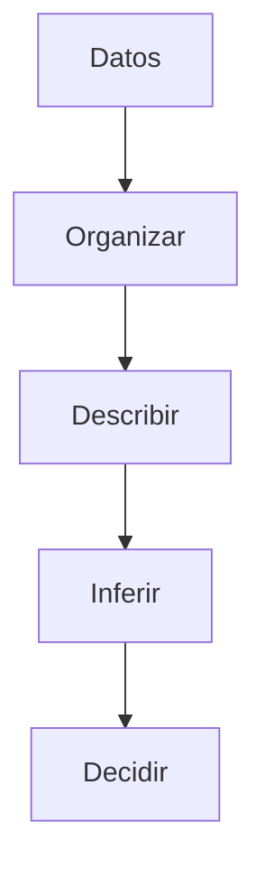
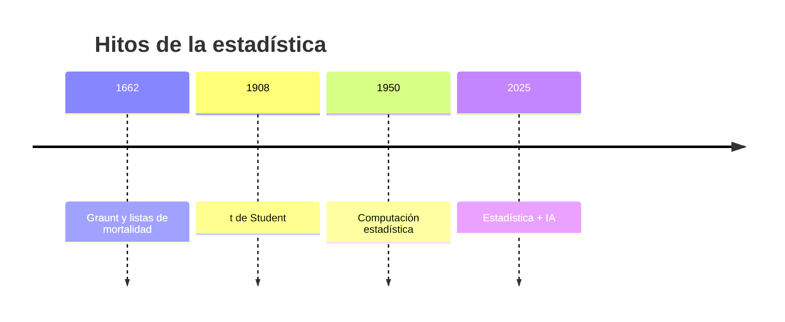

# 📘 Estadística — Miniwiki de Alejandro de la Riva

  
  
  

Bienvenido/a 👋 Esta miniguía recoge los fundamentos de **Estadística** con enfoque práctico para Ingeniería. Incluye 5 artículos temáticos con navegación, diagramas Mermaid, tablas, citas, alertas y recursos visuales.

## 📂 Índice
| Nº | Artículo | Descripción |
|:--:|:--|:--|
| 1 | [Fundamentos de la Estadística](./articulo-1.md) | Qué es, para qué sirve, conceptos base. |
| 2 | [Tipos de Datos y Variables](./articulo-2.md) | Naturaleza y escalas de medida. |
| 3 | [Distribución de Frecuencias](./articulo-3.md) | Tablas, histogramas y formas. |
| 4 | [Medidas de Centralización y Dispersión](./articulo-4.md) | Media, mediana, varianza, rango. |
| 5 | [Aplicaciones y Ética en la Ingeniería](./articulo-5.md) | Casos, sesgos y responsabilidad. |

## 🧭 Mapa conceptual (Mermaid)

## 🕒 Timeline

## 🎯 Misiones secundarias
- Recolecta 20 datos de tiempo de carga de una web y sube el histograma a `recursos/imagenes/` 🕒  
- Relaciona 15 pares `(x, y)` y guarda la dispersión en `recursos/imagenes/` 🔗  
- Escribe 3 riesgos éticos en tu contexto de ingeniería ⚠️

## 🧩 Plan de commits (sugerido)
1. `init: estructura miniwiki`  
2. `feat(index): portada e índice`  
3. `feat(art-1): fundamentos`  
4. `feat(art-2): variables`  
5. `feat(art-3): frecuencias`  
6. `feat(art-4): medidas`  
7. `feat(art-5): aplicaciones y ética`  
8. `feat(img): histograma y dispersión`  
9. `docs(xref): enlaces internos y notas`  
10. `fix: pulidos menores`  

---
**Autor:** Alejandro de la Riva · **Contribuidores:** Alejandro de la Riva  
**Licencia:** MIT · **Última actualización:** 2025-10-22  
↑ [Volver arriba](#)
