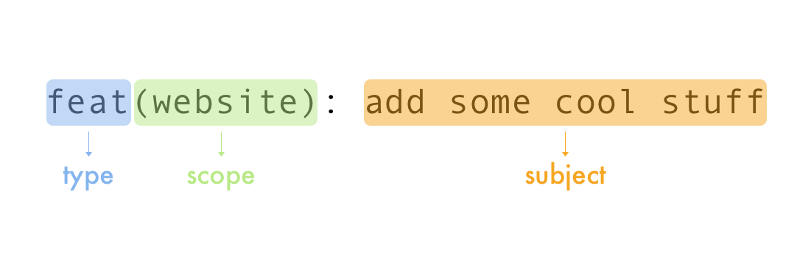
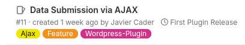

# Documentacion de Gitflow

## Indice

1. [Introducción a Gitflow](#introducción-a-gitflow)
2. [Tipos de ramas](#tipos-de-ramas)
   - [Ramas no protegidas](#ramas-no-protegidas)
     - [feat (Feature)](#feat-feature)
     - [fix (HotFix)](#fix-hotfix)
   - [Ramas protegidas](#ramas-protegidas)
     - [Master (Main)](#master-main)
     - [Beta](#beta)
     - [Develop](#develop)
3. [Estructura de Commits](#estructura-de-commits)
   - [Semántica de commits](#semántica-de-commits)
     - [Header](#header)
       - [Type](#type)
       - [Scopes](#scopes)
         - [Ejemplo de uso](#ejemplo-de-uso)
     - [Subject](#subject)
     - [Body](#body)
     - [Footer](#footer)
       - [Ejemplo](#ejemplo)
   - [Tipos de commits](#tipos-de-commits)
     - [feat (Feature)](#feat-feature-2)
     - [fix (HotFix)](#fix-hotfix-2)
     - [chore (Task)](#chore-task)
     - [docs (Documentation)](#docs-documentation)
     - [style](#style)
     - [refactor](#refactor)
     - [test](#test)
     - [perf (Performance)](#perf-performance)
     - [ci/cd (Continuous Integration/Continuous Deployment)](#ci-cd-continuous-integration-continuous-deployment)
     - [build](#build)
     - [revert](#revert)
4. [GitLab con modelo Gitflow](#gitlab-con-modelo-gitflow)
   - [Roles](#roles)
     - [Developers](#developers)
     - [Maintainer](#maintainer)
   - [Versionado semántico](#versionado-semántico)
     - [Major](#major)
     - [Minor](#minor)
     - [Patch](#patch)
   - [Flujo de trabajo](#flujo-de-trabajo)
5. [Issues](#issues)
   - [Flujo de los Issues](#flujo-de-los-issues)
   - [Proyectos que utilizan Issues](#proyectos-que-utilizan-issues)
   - [Apartados](#apartados)
     - [Etiquetas](#etiquetas)
     - [Milestones](#milestones)

## Introducción a Gitflow

**Gitflow** es un modelo alternativo de ramas que ayuda a tener un flujo de trabajo a la hora de trabajar con nuestros proyectos en esta documentación se hablara sobre:

- Tipos de **ramas**.
- Estructura de **commits**.
- **GitLab** con modelo **Gitflow**.
- Flujo de trabajo con **Gitflow**.
- I**SSUES**.

### Requerimientos

Para esta documentación se necesita saber algunos conceptos básicos antes de comenzar a aprender **Gitflow**. Algunos de los requerimientos son:

1. Uso básico de la **terminal** (Linux/Windows).
2. Saber que es un **repositorio**.
3. Saber que es **Git**.
4. **Comandos** básicos de **Git**.
5. Saber que es un **controlador de versiones**.

- Si aun no sabes como funciona **Git** y puedes consultar **[aquí]** **(No disponible)**.
- Si aun no sabes como utilizar las terminales Windows y Linux puedes consultar **[aquí]** **(No disponible)**.

---

## Tipos de ramas

Existen 2 tipos de ramas **Ramas no protegidas** y **Ramas protegidas**, cada una hace su respectivo flujo de trabajo interno a continuación se explicaran estos dos tipos de ramas:

### Ramas no protegidas

Las ramas no protegidas son las encargadas de manejar la parte de **Desarrollo** de nuestro proyecto con el propósito de **implementar** o **arreglar** nuevas funcionalidades a la rama **Delevop**.

Algunas de estas ramas son:

- `feat`
- `fix`

A continuación se presentaran las características de cada rama y sus funcionalidades:

#### feat (Feature)

Esta rama se utiliza para **crear** o **implementar los commits** que se realizaron en el código y luego llevarlos a tu rama no protegida **local o remota**, la semántica para crear esta rama sera la siguiente:

```bash
git branch feat/NombreTuRama

# o

git checkout -b feat/NombreTuRama
```

#### fix (HotFix)

Esta rama se **implementaran los commits** de arreglos de errores de las **[Ramas protegida](#ramas-protegidas)** o **Ramas no protegidas** esta rama llevara la siguiente semántica:

```bash
git branch fix/NombreTuRama

# o

git checkout -b fix/NombreTuRama
```

### Ramas protegidas

Estas ramas son las encargadas de manejar el Desarrollo de nuestro proyecto y a si ver fallos y darles mantenimiento en algún futuro.

#### Master (Main)

Esta rama es la principal y es la que se le muestra al publico.

#### Beta

Esta rama es la que se le presenta al cliente, para ver como va el progreso del proyecto. Digamos que es un proyecto **semi terminado**.

#### Develop

Esta rama es donde hay muchas cosas por las cuales faltan por hacer y que hay que desarrollar comun mente aqui hay muchos fallos o faltan funcionalidad las cuales hay que implementar.

## Estructura de Commits

En este tema se abarcara en como estructurar un **commit** siguiendo esta metodología implementada en nuestro equipo a continuación te explicare la **semantica** y **estructuracion** de como tienes que hacer cada **commit**.

### Semántica de commits

Para llevar un buen historial de **commits** es necesario llevar un orden y una semántica.A continuación te dejo un ejemplo de como seria la estructura del commit:

```bash
#Exemple:

git commit -m "Header" -m "Body" -m "Footer"
#----------------------------------------------------------------------------
git commit -m "feat(signup, login): add signup and login" -m "Description..."
-m "Refs#"
```

#### Header

La sintaxys sera la siguiente en la **Header** tiene que llevar espacio entre comas, tiene que ser todo en minúsculas, y un espacio entre los dos puntos. La estructura de la **Header** sera la siguiente:


##### Type

Esta lleva un **[Tipo de commit](#tipos-de-commits)** en especifico en lo que se realizo en el codigo. Pero los commits que se pondran son:

- `feat`
- `fix`
- `docs`
- `style`
- `refactor`
- `test`
- `perf`
- `ci/cd`
- `build`
- `revert`

##### Scopes

Acá se pondrán las áreas del proyecto que se ve afectada por un cambio en un **commit**. Algunos **Scopes** que se utilizan son:

- **Frontend**: `ui`, `styles`, `components`, `layout`
- **Backend**: `api`, `database`, `auth`, `server`
- **Sysadmin**: `ci/cd`, `build`, `docker`, `scripts`
- **General**: `docs`, `tests`, `config`

###### Ejemplo de uso

Acá te dejo algunos ejemplos para usar correctamente los **Scopes**.

- `feat(auth): add password reset functionality`
- `fix(ui): correct button alignment on mobile`
- `docs(readme): update installation instructions`

##### Subject

En este apartado se pondrá una breve descripción de lo que se realizo en el proyecto osea poner un titulo.

#### Body

Acá se pondrá una descripción o resumen de lo que se realizo en el proyecto. Esto es para que la persona que valla a ver el **commit** tenga una idea de los cambios que se realizaron.

#### Footer

Acá se pondrá el **numero de referencia** del [ISSUE](#issue) que se esta haciendo **referencia**, es **importante** poner el `#` con su respectivo numero en cada **footer**:

##### Ejemplo:

Este [ISSUE](#issue) es el numero **#11** .

Así que en el commit pondremos los siguiente:

```bash
git commit -m "header" -m "body" -m "#11"
```

### Tipos de commits

Existen varios tipos de **commits** estos ayudan a describir que **tipo** de funcionalidades o elementos hemos implementado en nuestro proyecto.

Algunas de estos **commits** son:

- `feat`
- `fix`
- `docs`
- `style`
- `refactor`
- `test`
- `perf`
- `ci/cd`
- `build`
- `revert`
  A continuación se presentaran las características de cada commit y sus propósitos:

#### feat (Feature)

Este **commit** se utiliza para **implementar** **nuevas características** y funcionalidades al proyecto.

##### Propósitos

- Implementan de funcionalidades.
- Aislamiento de cambios.
- Revisión y pruebas.
- Versionado.

#### fix (HotFix)

Este **commit** se **encarga** de realizar **parches** o arreglar errores que vengan de cualquiera de las **[Ramas protegida](#ramas-protegidas)**.

##### Propósitos

- Solucionar errores que rompen la aplicación (errores críticos o "bloqueadores").
- Corregir problemas de lógica en el código que causen resultados inconscientes.
- Reparar fallos de interfaz o de diseño que afectan la usabilidad.
- Ajustar problemas de compatibilidad con ciertas versiones de navegadores o dispositivos
- Resolver errores que aparecen en producción y requieren correcciones rápidas.

#### chore (Task)

Este **commit** realiza cambios de **mantenimiento** que no afectan a la lógica como tal algunos.

##### Propósitos

- Actualizaciones de librerías.
- Limpieza de código.
- Configuraciones.

#### docs (documentation)

Este **commit** se **encarga** de manejar la **documentación** ne nuestro proyecto para a si separar la documentación y el código de nuestro proyecto y hacer una colaboración mas eficaz.

##### Propósito

Algunos **propósitos** de la rama son:

- Actualización y mejora de la documentación en archivos `README.MD` y `CONTRIBUTING.MD`.
- Creación de guías de usuario, manuales de instalación, y pasos de configuración.
- Adición de comentarios extensivos en el código que expliquen la lógica o las funcionalidad entre secciones.
- Documentación de nuevas funcionalidades, cambios en la API, y descripciones de endpoints en proyectos de backend.

##### style

Este **commit** se **encarga** de **gestionar** los cambios de **estilos** o **temas** del proyecto sin afectar lógica o funcionalidad.

#### Propósito

- Correcciones en la indentación, espaciado, y formato de código.
- Ajustes en la apariencia de la interfaz de usuario (colores,margenes,fuentes, etc).
- Actualizaciones en archivos de configuración de estilos (ESLint, Prettier, o litenrs específicos de CSS).
- Mejoras en a legibilidad del código y organización visual, como re nombramientos de variables o reordamiento de funciones sin alterar la lógica.

#### refactor

Este **commit** se **encarga** de **refactorizar el código** en una manera en que optimice, mejore la calidad, sea legible, eficiente, mantenible y fácil de entender sin alterar el comportamiento de la aplicación.

##### Propósito

- Reorganización y simplificación de funciones o métodos para mejorar su claridad.
- Eliminación de código duplicado o redundante.
- Reconstrucción de componentes para mejorar la arquitectura del proyecto.
- Mejora de la eficiencia del código, como la optimizan de algoritmos.
- Implementación de patrones de diseño que aumenten la cohesión y reduzcan la dependencia entre módulos.

#### test

Este **commit** es para **agregar** funcionalidades de **testing** y hacer pruebas en el proyecto comúnmente esta rama la maneja el **QA** del equipo y es para verificar si el proyecto sigue los requerimiento y condiciones necesarias para ser aceptado.

##### Propósito

- Pruebas unitarias.
- Pruebas de integración.
- Pruebas de aceptación .
- Pruebas de aceptación.
- Pruebas de regresión.

#### perf (performance)

Este **commit** es para **agregar** **optimizaciones** que mejoren el rendimiento de nuestro proyecto sin cambiar funcionalidad.

##### Propósito

- Mejora de algoritmos para reducir tiempos de procesamiento.
- Optimizar de consultas a bases de datos para reducir el tiempo de respuesta .
- Reducción del consumo de memoria o uso de recursos.
- Optimizar la carga de recursos en el frontend, como archivos de imágenes, CSS o JavaScript.

#### ci/cd (Continuous Integration/Continuous Deployment)

Este **commit** se utiliza para gestionar la configuración y automatización del ciclo de vida de desarrollo de nuestro proyecto. Para ello se especificara el propósito de la **Integracion** y el **Despliegue** continuo de cada una de ellas:

##### Propósito

- **Integración Continua (CI)**: Ejecutar pruebas automáticas, linters y análisis de código en cada **commit** o **PR** (pull request) para **garantizar** que el nuevo código **funcione correctamente** y cumpla con los estándares.

- **Despliegue Continuo (CD)**: **Automatizar** el **proceso de despliegue de aplicaciones**, desde entornos de prueba hasta producción, permitiendo lanzamientos más rápidos y confiables.

#### build

se utiliza para manejar tareas de compilación y generación de versiones del proyecto. Es especialmente útil en proyectos que requieren la generación de artefactos (por ejemplo, archivos `.zip`, `.jar`, o ejecutables).

##### Propósito

- Configurar scripts para compilar el código fuente en artefactos de distribución.
- Configurar la minificación y empaquetado de archivos de frontend (CSS, JavaScript).
- Crear y optimizar imágenes de Docker.
- Generar archivos de configuración y documentos específicos para el entorno de producción o staging.
- Definir y ejecutar scripts de pre-procesamiento y post-procesamiento del código, como transpiladores.

#### revert

Este **commit** se utiliza para deshacer o revertir cambios específicos en el código, especialmente aquellos que introdujeron errores o problemas inesperados en el proyecto.

##### Propósito

- Revertir un commit problemático que rompió la funcionalidad.
- Deshacer un conjunto de cambios que causan problemas de rendimiento o errores en producción.
- Mantener un historial claro de reversión en el proyecto, facilitando la identificación de qué cambios se deshicieron y por qué.

---

## GitLab con modelo Gitflow

### Roles

Primero hay que tener en cuenta que existen 2 roles **Developers** y **Manteiners**, a continuación se explicara que hace cada uno de estos roles.

#### Developers

Los **Developers** se encargan de las ramas **[Ramas no protegidas](# ramas-no-protegidas)** y su propósito es desarrollar, implementar o arreglar código en estos tipos de ramas para enviarlas a la rama protegida **[Develop](#develop)**.

#### Manteiner# ramas-protegidas

Los **Manteiner** se encargan de las **[Ramas Protegidas](#ramas-protegidas)** su propósito es dar mantenimiento, aceptar y revisar **merges** que hacen los **Developer**.

### Versionado semántico

En este tema se hablara de que es la versión semántica. La versión semántica son mucha de tantas formas de versionar un proyecto la semántica que utilizaremos **SemVeres (1.0.0)**.

Para que entiandas un poco de como se maneja este versionado se te dejara una imagen a continuación:


#### Major

Indica cambios incompatibles con versiones anteriores, que pueden incluir grandes modificaciones, refactorización, o nuevas implementaciones que pueden romper la compatibilidad.

#### Minor

Indica que no hay cambios incompatibles, pero sí nuevas funcionalidades de forma compatible.

#### Patch

Indica correcciones de errores y mejoras menores, compatibles y que no añaden nuevas funcionalidades.

### Flujo de trabajo

A continuación te dejo los pasos de como se realizara el flujo de trabajo:

1. Primero se crean las ramas no protegidas con sus respectivos [Semantic commits](#semántica-de-commits).
2. Luego se crea un **Merge Request** y el **[Mainteiner](#mainteiner)** encargado revisara los cambios de las ramas no protegidas y hacer un testing si es apto o no para entrar a la rama **Develop**.
3. Una ves Aceptado el **merge** pasa a la rama protegida **Develop**.
4. Luego los **manteiners** se encargan de revisar si la rama **Develop** es apta para mostrarcela al cliente.
5. Si el **Develop** es apto entra a la otra rama protegida que seria **Beta** que sera la rama de nuestro proyecto que se le presentara al **Cliente**.
6. Si al **Cliente** cree que es apto para mostrarle el proyecto de la rama **Beta** al publico. Entonces pasa a la rama **Master**.
7. Luego se hace el [Versionado](#versionado-semántico) de la rama **Master**.

### ISSUS

Acá se pondrán los errores del proyecto, hay que tener en cuenta que los commits se pondrán automáticamente gracias que en su **footer** tienen el numero del ISSUS que se les hace referencia.

A continuación se hablara en que flujo siguen estos **ISSUS**:

### Flujo de los ISSUS

1. El **BA** crea la historia de usuario.
2. Luego el responsable creara la tarea o el **ISSUS** y tambien tiene que tener una idea de donde se encuentra el error.
3. Luego se hacen lo cambios y al final se hace referencia al **ISSUS** que se a completado.

### Proyectos que utilizan ISSUS

- Recursos humanos (RRHH).
- Genesis.
- Temas wordpress.

### Apartados

#### Etiquetas

Aca se hablara sobre las etiquetas que lleva cada **ISSUS**.

- tipos de cambios (tipos de commits).
- Nombre de proyecto.
- Carpeta de proyecto.
- (Etiquetas que ya existen).

#### Milestones

Los **Milestones** es en donde se agrupan los **ISSUS** es como una carpeta. A continuación hablare de los propositos.

- Se utilizan para declarar metas fijas.
  - **Ejemplo**: Desplegar la nueva version de RRHH.
- Son objetivos grandes.
- Por lo general no hay muchos Milestones.
- Llevar historial de **ISSUS** completos y pendientes.