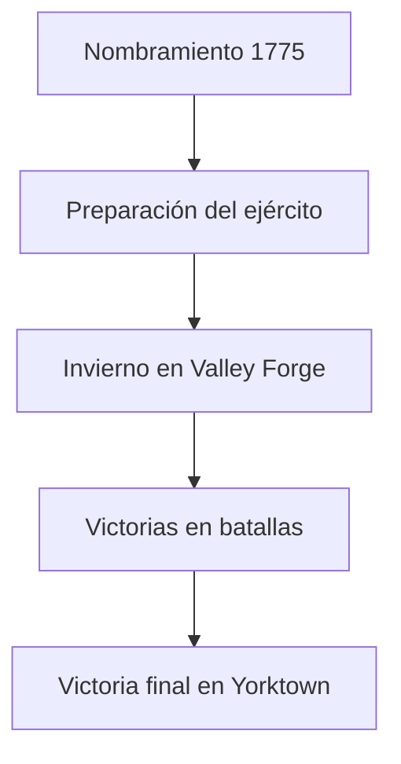

#  George Washington y la Guerra de Independencia :crossed_swords:

[Inicio](index.md) > [Biografía](Articulo2.md) > George Washington y la Guerra de Independencia  

:calendar: **Creado:** 22 de octubre de 2025  
:arrows_counterclockwise:**Última actualización:** 26 de octubre de 2025  
:hourglass: **Lectura:** 5 min  
:ticket: **Etiquetas:** #Historia #EEUU #Washington #Independencia #Ejército  

---

## Tabla de Contenidos
1. [Introducción](#introducción)  
2. [Nombramiento y liderazgo](#nombramiento-y-liderazgo)  
3. [Valley Forge y dificultades](#valley-forge-y-dificultades)  
4. [Victorias clave](#victorias-clave)  
5. [Impacto y legado](#impacto-y-legado)  

---

##  Introducción
En 1775, George Washington fue nombrado **Comandante en Jefe del Ejército Continental** durante la Guerra de Independencia.  
A pesar de la falta de recursos y la inexperiencia de sus tropas, su disciplina y capacidad estratégica lo convirtieron en un líder respetado y decisivo para el éxito de las colonias.  

> [!NOTE]
> La selección de Washington como comandante fue clave porque combinaba experiencia militar con reputación moral intachable.

---

##  Nombramiento y liderazgo
Washington asumió el mando con un ejército poco entrenado, enfrentando la logística más difícil de la época.  
Su enfoque se centró en mantener la moral, entrenar soldados y organizar suministros.

| Año | Evento | Resultado |
|:----|:-------|-----------|
| 1775 | Nombramiento | Comienzo del liderazgo |
| 1776 | Cruzada del río Delaware | Victoria sorpresa |
| 1777 | Batalla de Saratoga | Punto de inflexión de la guerra |

> [!TIP]
> La disciplina y la perseverancia de Washington mantuvieron unido al ejército en los momentos críticos.

---

##  Valley Forge y dificultades
El invierno de 1777-1778 fue un momento crítico: hambre, frío y enfermedades afectaron a las tropas.  
Washington supervisó personalmente la alimentación, entrenamiento y cuidado de los soldados, consolidando su reputación de líder comprometido.

  
📜 Información adicional

  Durante Valley Forge, el ejército adoptó nuevas tácticas gracias a la ayuda del general prusiano Friedrich von Steuben, mejorando su eficacia en combate.

---

##  Victorias clave
La victoria más decisiva fue en **Yorktown (1781)**, con apoyo de Francia.  
Esto aseguró la independencia de Estados Unidos y consolidó a Washington como héroe nacional.

>[!WARNING]
A pesar de las victorias, Washington siempre buscó minimizar bajas y proteger a sus soldados.

## Impacto y legado

Washington se convirtió en un símbolo de unidad y liderazgo.
Su conducta ética y estratégica durante la guerra sentó las bases de su futura presidencia y del gobierno de Estados Unidos.

| Valor        | Acción                     | Efecto                      |
|:------------|:---------------------------|:----------------------------|
| Liderazgo   | Mantener la disciplina     | Respeto y cohesión del ejército |
| Estrategia  | Batallas clave             | Independencia conseguida     |
| Perseverancia | Soportar adversidades    | Inspiración nacional         |

##  Referencias
[1] Mount Vernon – Official Site. "George Washington and the Revolutionary War." https://www.mountvernon.org/george-washington/revolutionary-war  
[2] Britannica. "George Washington." https://www.britannica.com/biography/George-Washington  

← [Anterior: La Juventud de George Washington](Articulos1.md) | [Siguiente: La Presidencia de George Washington →](Articulo3.md)
