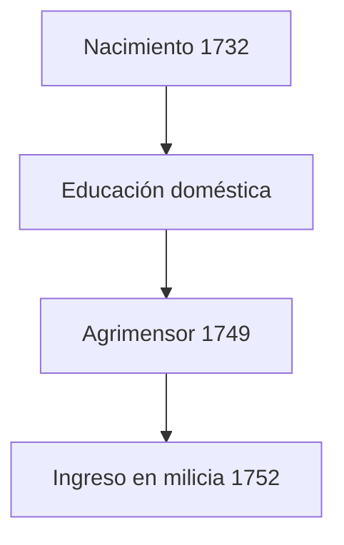
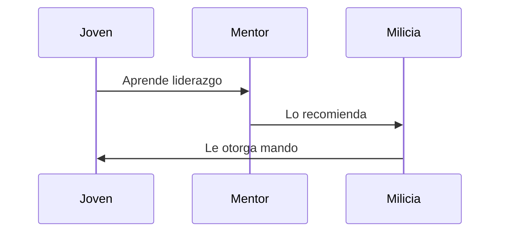

# George washintong :classical_building: 
[Inicio](index.md) > [Biografía](Articulos1.md) > La Juventud de George Washington  

 *:calendar: *Creado:** 22 de octubre de 2025  
:arrows_counterclockwise: **Última actualización:** 26 de octubre de 2025  
:hourglass: **Lectura:** 5 min  
:ticket: **Etiquetas:** #Historia #EEUU #Washington #SigloXVIII  

---

## Tabla de Contenidos
1. [Introducción](#introducción)  
2. [Infancia y familia](#infancia-y-familia)  
3. [Formación y primeros trabajos](#formación-y-primeros-trabajos)  
4. [Valores y carácter](#valores-y-carácter)  
5. [Camino hacia el liderazgo](#camino-hacia-el-liderazgo)  

---

##  Introducción
George Washington nació el **22 de febrero de 1732** en Virginia, en una familia de plantadores.  
Su juventud estuvo marcada por el esfuerzo, la disciplina y el deseo de superarse. Aunque no tuvo estudios universitarios, aprendió por sí mismo matemáticas, agrimensura y normas de conducta que moldearon su carácter.  

> [!NOTE]
> Washington fue autodidacta: su educación provenía más de la práctica que de los libros.

---

##  Infancia y familia
Creció en un entorno rural. Su padre, Augustine Washington, murió cuando él tenía 11 años, y su madre Mary Ball Washington lo educó con rigor.  
Vivía bajo la influencia de la sociedad colonial inglesa, donde el trabajo, la fe y el honor eran esenciales.  

| Aspecto | Descripción |
|:--------|:-------------|
| Nacimiento | 1732, Westmoreland, Virginia |
| Familia | Clase media-alta rural |
| Educación | Doméstica y práctica |

---

##  Formación y primeros trabajos
A los 17 años trabajó como **agrimensor**, recorriendo tierras vírgenes de Virginia.  
Este empleo le dio conocimiento del territorio y disciplina militar.  

>[!TIP]
Gracias a su experiencia en el campo, conocía mejor el terreno que muchos oficiales británicos.

## Valores y carácter

Washington destacó por su honor, autocontrol y humildad.
Desde joven escribió normas de comportamiento conocidas como Rules of Civility, reflejo de su deseo de perfección moral.

 
📖 Información adicional
 Las 110 reglas de cortesía que copió en su adolescencia moldearon su conducta pública. 

>[!CAUTION]
Washington creía que el poder sin virtud llevaba al abuso.

## Camino hacia el liderazgo

Tras sus primeras misiones militares, comprendió la importancia de la disciplina y del ejemplo personal.
Aunque sufrió derrotas, su serenidad y constancia le ganaron respeto.

##  Referencias
[1] Mount Vernon – Official Site. "George Washington: Early Life." https://www.mountvernon.org/george-washington/early-life  
[2] Britannica. "George Washington Biography." https://www.britannica.com/biography/George-Washington  

⬆️ [Volver arriba](#🇺🇸-la-juventud-de-george-washington)  
← [Anterior: Inicio](index.md) | [Siguiente: Guerra de Independencia →](articulo-2.md)

