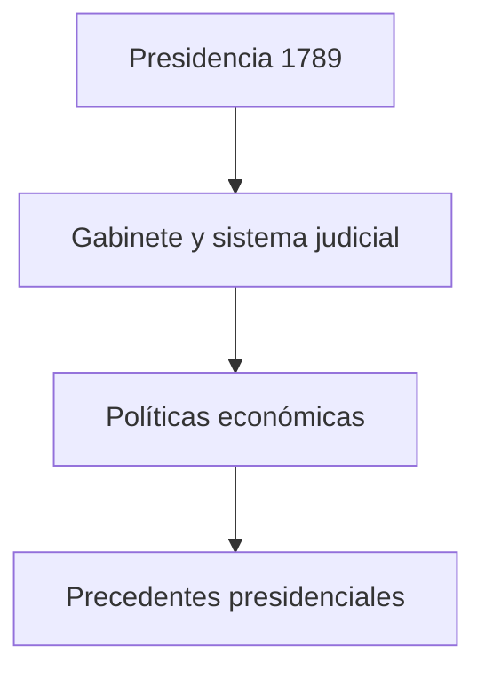

# :classical_building: La Presidencia de George Washington

[Inicio](index.md) > [Biografía](Articulo3.md) > La Presidencia de George Washington  

:calendar: **Creado:** 22 de octubre de 2025  
:arrows_counterclockwise: **Última actualización:** 22 de octubre de 2025  
:hourglass: **Lectura:** 5 min  
:ticket: **Etiquetas:** #Historia #EEUU #Washington #Presidencia #Gobierno  

---

## Tabla de Contenidos
1. [Introducción](#introducción)  
2. [Elección y toma de posesión](#elección-y-toma-de-posesión)  
3. [Principales acciones y políticas](#principales-acciones-y-políticas)  
4. [Desafíos internos y externos](#desafíos-internos-y-externos)  
5. [Legado presidencial](#legado-presidencial)  

---

##  Introducción
George Washington fue el **primer presidente de Estados Unidos** (1789–1797) y estableció precedentes fundamentales para el cargo.  
Durante sus dos mandatos, enfrentó retos políticos, económicos y diplomáticos, consolidando la autoridad del gobierno federal y la unidad del país.

> [!NOTE]
> Washington es conocido como el “Padre de la Nación” por su papel en la fundación del sistema presidencial estadounidense.

---

##  Elección y toma de posesión
Washington fue elegido **por unanimidad**, reflejando la confianza de los ciudadanos y líderes políticos en su carácter y liderazgo.  
Su toma de posesión tuvo lugar en **Nueva York**, la primera capital temporal del país.

| Año | Evento | Lugar |
|:---|:------|:-----|
| 1789 | Elección presidencial | Nueva York |
| 1789 | Juramento de cargo | Nueva York |
| 1793 | Reelección | Nueva York |

> [!TIP]
> Estableció el precedente de limitarse a **dos mandatos**, que luego fue formalizado en la Constitución.

---

##  Principales acciones y políticas
Washington sentó las bases del gobierno federal y definió roles clave en el gabinete presidencial.  
Entre sus logros destacan:

- Creación de la **Corte Suprema** y del sistema judicial.  
- Nombramiento de **Alexander Hamilton** como Secretario del Tesoro.  
- Introducción de políticas económicas sólidas, incluyendo impuestos y deuda pública.  

## Desafíos internos y externos

Durante su presidencia, Washington enfrentó:

Conflictos políticos entre federalistas y antifederalistas.

Tensiones con potencias extranjeras (Gran Bretaña y Francia).

Rebeliones internas como la Rebelión del Whiskey (1794)
| Desafío                  | Solución                          | Efecto                               |
|:-------------------------|:---------------------------------|:------------------------------------|
| Rebelión del Whiskey      | Envío del ejército federal       | Reafirmó la autoridad federal       |
| Tensiones políticas       | Neutralidad en conflictos europeos | Mantuvo la estabilidad nacional    |
| Debates fiscales          | Políticas de Hamilton            | Consolidación de la economía        |

## Legado presidencial

Washington dejó precedentes clave que definieron el rol del presidente:
| Legado             | Explicación                                           |
|:------------------|:-----------------------------------------------------|
| Dos mandatos       | Limitó su permanencia voluntariamente               |
| Gabinete presidencial | Estableció un equipo de asesores clave           |
| Neutralidad        | Política exterior prudente y efectiva               |

 
📖 Datos adicionales
 Washington escribió un **Discurso de Despedida (1796)** donde aconsejaba evitar partidos políticos y mantener relaciones neutrales con otras naciones. 

## Referencias
[1] Mount Vernon – Official Site. "George Washington: Presidency." https://www.mountvernon.org/george-washington/presidency  
[2] Chernow, Ron. *Washington: A Life*. New York: Penguin Press, 2010.  
[3] Britannica. "George Washington: First President of the United States." https://www.britannica.com/biography/George-Washington

⬆ [Volver arriba](#-la-presidencia-de-george-washington)  
← [Anterior: Guerra de Independencia](Articulo2.md) | [Siguiente: Legado y Muerte de Washington →](Articulo4.md)
