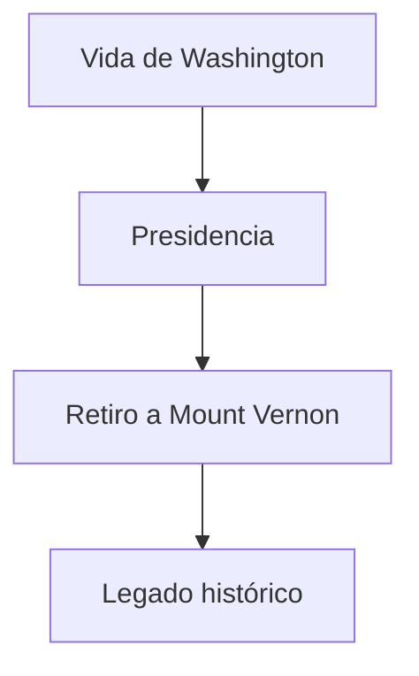

# :dove: Legado y Muerte de George Washington

[Inicio](index.md) > [Biografía](Articulo4.md) > Legado y Muerte de George Washington  

:calendar: **Creado:** 22 de octubre de 2025  
:arrows_counterclockwise: **Última actualización:** 22 de octubre de 2025  
:hourglass: **Lectura:** 5 min  
:ticket: **Etiquetas:** #Historia #EEUU #Washington #Legado #Muerte  

---

##  Tabla de Contenidos
1. [Introducción](#introducción)  
2. [Fin de la presidencia](#fin-de-la-presidencia)  
3. [Últimos años y vida privada](#últimos-años-y-vida-privada)  
4. [Muerte](#muerte)  
5. [Legado histórico](#legado-histórico)  

---

##  Introducción
George Washington falleció el **14 de diciembre de 1799**, dejando un legado que lo consagra como el **Padre de la Nación**.  
Su vida ejemplar sirvió como modelo de liderazgo, ética y patriotismo, y su influencia perdura en la historia y la política de Estados Unidos.

> [!NOTE]
> Washington fue uno de los pocos líderes históricos que renunció voluntariamente al poder, consolidando los principios democráticos de su país.

---

##  Fin de la presidencia
Tras dos mandatos, Washington decidió retirarse del cargo en 1797, **dejando precedentes de moderación y responsabilidad**.  
Se mudó a su hogar en **Mount Vernon**, donde retomó la vida de agricultor y planificador de su finca.

| Año | Evento | Descripción |
|:---|:------|:------------|
| 1797 | Retiro presidencial | Termina su segundo mandato |
| 1797 | Vida privada | Administración de Mount Vernon |

> [!TIP]
> Su decisión de retirarse estableció la norma de los **dos mandatos presidenciales**, respetada hasta hoy.

---

##  Últimos años y vida privada
Washington dedicó sus últimos años a:  
- Mejorar sus plantaciones y sistemas agrícolas.  
- Escribir memorias y cartas sobre la fundación de Estados Unidos.  
- Mantener relaciones con líderes políticos y amigos cercanos.  

  
 Información adicional

  Aunque alejado del poder, Washington ofrecía consejos discretos sobre política nacional y diplomacia.

---

## Muerte
El 14 de diciembre de 1799, Washington falleció a los 67 años en Mount Vernon, probablemente por una infección respiratoria aguda.  
Su funeral fue un acto solemne que reunió a figuras políticas y ciudadanos de todo el país.

| Fecha | Lugar | Causa |
|:-----|:------|:-----|
| 14 diciembre 1799 | Mount Vernon | Infección respiratoria |

> [!WARNING]
> La muerte de Washington provocó un duelo nacional, reflejando el profundo respeto que inspiró durante su vida.

---

##  Legado histórico
Washington dejó un **legado duradero** como líder, militar y presidente:

| Legado             | Descripción |
|:------------------|:------------|
| Liderazgo ético    | Ejemplo de integridad y moderación |
| Fundación política | Establecimiento de precedentes presidenciales |
| Inspiración nacional | Símbolo de unidad y libertad |

>[!NOTE]
Su figura sigue siendo un referente mundial de liderazgo, patriotismo y ética pública
##  Referencias
[1] Mount Vernon – Official Site. "George Washington: Death and Legacy." https://www.mountvernon.org/george-washington/death-legacy  
[2] Flexner, James. *George Washington: The Indispensable Man*. Boston: Little, Brown, 1974.  
[3] Britannica. "George Washington." https://www.britannica.com/biography/George-Washington

⬆[Volver arriba](#🕊️-legado-y-muerte-de-george-washington)  
← [Anterior: La Presidencia de George Washington](Articulo3.md) | [Siguiente: Legado póstumo →](Articulo5.md)
