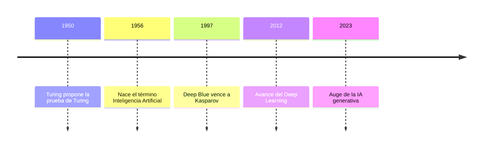

# Mini Wiki: Inteligencia Artificial

**Autor:** Daniel Mora  
**Fecha:** 25/10/2025

Bienvenido a mi mini-wiki sobre Inteligencia Artificial (IA).  
Aquí conocerás su historia, tipos, aplicaciones y el impacto ético que tiene en nuestra sociedad.

---

## Índice

1. [Historia de la IA](articulo-1.md)
2. [Tipos de IA](articulo-2.md)
3. [Aplicaciones cotidianas](articulo-3.md)
4. [Ética de la IA](articulo-4.md)
5. [Futuro de la IA](articulo-5.md)
6. [Glosario](glosario.md)
7. [Referencias](referencias.md)

---

