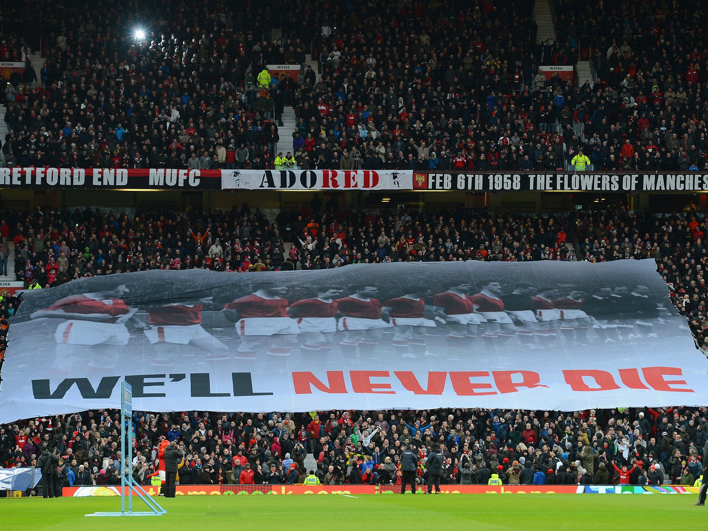
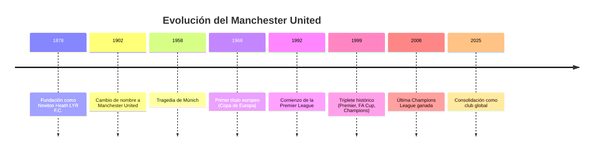
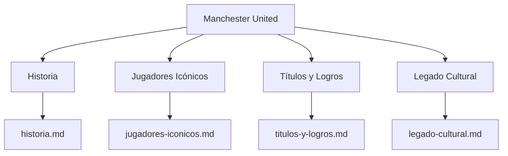

# 🔴 Manchester United Wiki  

  

---

## 🧭 Descripción del Proyecto

Bienvenido a mi **Wiki Personal Interconectada del Manchester United**. Soy **Diego Gonzales** y he creado este proyecto para ofrecerte una visión clara y estructurada sobre la **evolución histórica del club**, sus jugadores icónicos, títulos, logros y su legado cultural.

He interconectado cada artículo para que puedas navegar y comprender fácilmente cómo ha crecido el Manchester United a lo largo del tiempo, mostrando por qué se ha convertido en uno de los clubes más importantes del fútbol mundial.

---

## 📚 Índice Visual de Artículos

| 🏷️ Categoría | 📘 Artículo | 🔗 Enlace |
|:-------------|:------------|:---------|
| Historia | [Evolución del Club](historia.md) | ➡️ |
| Jugadores | [Jugadores Icónicos](jugadores-iconicos.md) | ➡️ |
| Títulos | [Palmarés y Logros](titulos-y-logros.md) | ➡️ |
| Legado | [Impacto Cultural](legado-cultural.md) | ➡️ |

---

## 🕰️ Línea de Tiempo del Manchester United

---

## 🧠 Mapa Conceptual de Artículos

---

## ❓ Preguntas Frecuentes (FAQ)

¿Cuándo se fundó el Manchester United?

Fue fundado en 1878 como Newton Heath LYR F.C., cambiando su nombre a Manchester United en 1902.

¿Cuál fue la tragedia de Múnich?

En 1958, un accidente aéreo en Múnich cobró la vida de 23 personas, incluyendo jugadores y staff, afectando profundamente al club.

¿Cuándo consiguió el triplete?

En 1999, Manchester United ganó **Premier League, FA Cup y Champions League**, un logro histórico.

¿Qué significa “Red Devils”?

Es el apodo del club, derivado del logo y la tradición histórica del equipo.

¿Dónde puedo encontrar todos los artículos?

Consulta el índice visual o los enlaces en la sección “Ver también” para acceder a cada artículo.

---

## 👨‍💻 Contribuidores

| Nombre          | Rol             | Contacto  |
|-----------------|-----------------|-----------|
| Diego Gonzales  | Autor principal | GitHub    |