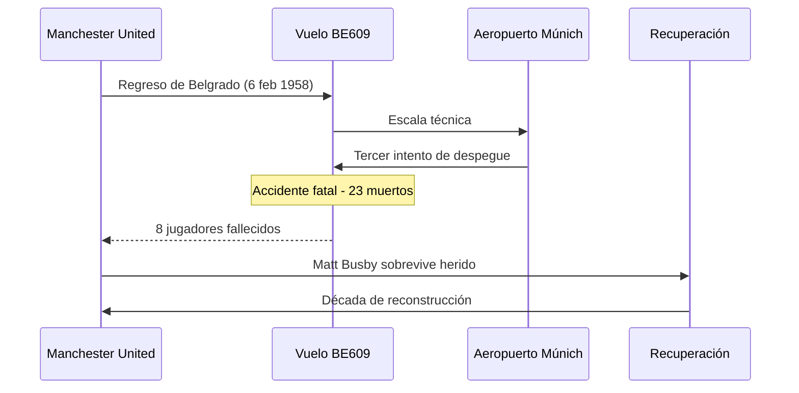
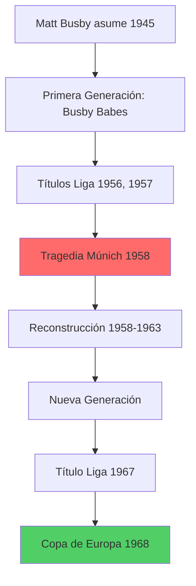
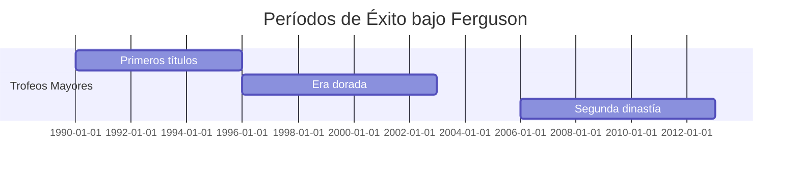

# Historia del Manchester United 🏰

**Inicio** > **Historia** > **Manchester United: Orígenes y Evolución**

📅 **Creado:** 20 de octubre de 2025 | **Actualizado:** 25 de octubre de 2025  
⏱️ **Tiempo de lectura:** 6 minutos  
🏷️ **Tags:** `historia`, `manchester-united`, `fútbol-inglés`, `premier-league`

---

## 📑 Tabla de Contenidos

1. [Introducción](#introducción)
2. [La Tragedia de Múnich (1958)](#la-tragedia-de-múnich-1958)
3. [La Era Dorada de Matt Busby](#la-era-dorada-de-matt-busby)
4. [El Imperio de Ferguson](#el-imperio-de-ferguson)
5. [Referencias](#referencias)
6. [Ver También](#ver-también)

---

## Introducción

El **Manchester United Football Club** es uno de los equipos más emblemáticos del fútbol mundial. Fundado en 1878 como *Newton Heath LYR Football Club*, el club ha atravesado momentos de gloria absoluta y tragedias devastadoras que marcaron su identidad. Desde sus humildes inicios en los ferrocarriles de Manchester hasta convertirse en una potencia global, el United ha construido una historia rica en tradición, pasión y éxito.

La transformación del club en el siglo XX, especialmente bajo la dirección de **Matt Busby** y posteriormente **Alex Ferguson**, estableció los cimientos de lo que hoy conocemos como uno de los clubes más valiosos del planeta. Con 20 títulos de liga inglesa y 3 Copas de Europa, el Manchester United no solo ha dominado el fútbol inglés, sino que también ha dejado una huella imborrable en la cultura popular británica y mundial.

> [!NOTE]
> En 1902, tras enfrentar la bancarrota, el club fue salvado por el empresario **John Henry Davies**, quien cambió el nombre a **Manchester United**.

---

## La Tragedia de Múnich (1958)

### El Desastre Aéreo

El **6 de febrero de 1958**, un avión que transportaba al equipo desde Belgrado se estrelló en Múnich durante el despegue. Ocho jugadores fallecieron inmediatamente, incluyendo a estrellas como **Duncan Edwards** y **Tommy Taylor**. Este evento marcó el punto más oscuro en la historia del club.

| Víctima | Posición | Edad |
|---------|----------|------|
| Duncan Edwards | Centrocampista | 21 |
| Tommy Taylor | Delantero | 26 |
| Roger Byrne | Defensa (Capitán) | 28 |
| David Pegg | Extremo | 22 |
| Eddie Colman | Centrocampista | 21 |

> [!WARNING]
> La tragedia eliminó a gran parte del equipo titular conocido como los **"Busby Babes"**, jóvenes talentos que prometían dominar el fútbol europeo durante años.

<strong>📚 Datos históricos: Los Busby Babes</strong>

Los *Busby Babes* eran un grupo de jóvenes talentos desarrollados en la cantera del United. Con una edad promedio de 22 años, habían ganado dos ligas consecutivas (1956, 1957) y llegado a semifinales de la Copa de Europa. Su estilo ofensivo y juventud revolucionó el fútbol inglés de la época.

### La Reconstrucción

**Matt Busby**, quien sobrevivió gravemente herido, dedicó la siguiente década a reconstruir el equipo. Con determinación inquebrantable, formó un nuevo conjunto que eventualmente conquistaría Europa en 1968, convirtiéndose en el **primer club inglés** en ganar la Copa de Europa.

<strong>🔍 Ejemplo detallado: El partido de Wembley 1968</strong>

El 29 de mayo de 1968, ante 100,000 espectadores en Wembley, el United venció al Benfica 4-1 en tiempo extra. Bobby Charlton anotó dos goles, y George Best selló la victoria. Matt Busby, con lágrimas en los ojos, cumplió su promesa de conquistar Europa en honor a sus jugadores fallecidos.

---

## La Era Dorada de Matt Busby

### Triunfo en Europa (1968)

Diez años después de Múnich, el Manchester United logró su mayor hazaña: ganar la **Copa de Europa** derrotando al Benfica. Este logro fue un tributo emocional a los caídos en la tragedia.

| Competición | Año | Resultado Final |
|-------------|-----|----------------|
| Copa de Europa | 1968 | United 4-1 Benfica |
| Liga Inglesa | 1965, 1967 | Campeones |
| FA Cup | 1963 | Campeones |

### Jugadores Legendarios

- **[George Best](articulo-4.md#george-best)**: Genio irlandés y primer superstar mediático del fútbol
- **Bobby Charlton**: Sobreviviente de Múnich y máximo goleador histórico hasta 2008
- **Denis Law**: El "Rey de Old Trafford", máximo artillero de la década

> [!TIP]
> La filosofía de Busby era desarrollar talento joven de la cantera, un legado que el club mantiene hasta hoy con su famosa academia.

<strong>📖 Información adicional: El legado de Busby</strong>

Matt Busby fue nombrado **Sir** en 1968 por sus servicios al fútbol. Estableció la cultura del "United Way": juego ofensivo, desarrollo juvenil y nunca rendirse. Su estatua permanece fuera de Old Trafford como símbolo eterno de su contribución.

---

## El Imperio de Ferguson

### 26 Años de Dominio (1986-2013)

**[Sir Alex Ferguson](articulo-5.md)** transformó al Manchester United en el club más exitoso de Inglaterra. Bajo su gestión, el equipo ganó **13 [Premier League](glosario.md#premier-league)**, **5 FA Cups** y **2 Champions League**.

| Período | Títulos de Liga | Champions League |
|---------|----------------|------------------|
| 1986-1995 | 3 | 0 |
| 1996-2005 | 6 | 1 (1999) |
| 2006-2013 | 4 | 1 (2008) |

### Momentos Cumbre

**El Triplete de 1999**: Premier League, FA Cup y Champions League en una sola temporada, culminando con la remontada épica ante Bayern Múnich en el Camp Nou (2-1), con goles en los minutos 91 y 93.

**La Clase del 92**: Generación de oro que incluyó a [David Beckham](articulo-4.md#david-beckham), [Ryan Giggs](articulo-4.md#ryan-giggs), Paul Scholes, Gary Neville y Nicky Butt.

> [!CAUTION]
> Desde la retirada de Ferguson en 2013, el club no ha ganado la Premier League, enfrentando su período más largo sin títulos de liga en 30 años.

<strong>🔍 Ejemplo detallado: La remontada de 1999</strong>

El 26 de mayo de 1999, el United perdía 1-0 ante Bayern Múnich en la final de Champions League. En tiempo añadido, Teddy Sheringham empató (90+1') y Ole Gunnar Solskjær anotó el ganador (90+3'). Fue considerada la mayor remontada en una final europea, completando el único triplete en la historia del fútbol inglés.

### Enlaces Externos de Interés

- [Sitio oficial del Manchester United](https://www.manutd.com) [1]
- [Museo del Manchester United](https://www.manunited.com/en/museum) [2]
- [Documental: "99" - Amazon Prime](https://www.amazon.com/99-documentary) [3]

---

## Referencias

1. Manchester United Official Website (2025). *Club History*. https://www.manutd.com
2. National Football Museum (2024). *The Munich Air Disaster*. 
3. Ferguson, Alex (2013). *My Autobiography*. Hodder & Stoughton.

---

## Ver También

- [Títulos y Logros del Manchester United →](articulo-2.md)
- [Jugadores Icónicos del Club →](articulo-4.md)
- [La Era Ferguson: Análisis Completo →](articulo-5.md)
- [Impacto Cultural del Manchester United](articulo-3.md)

---

[← Volver al Índice](index.md) | [Siguiente: Títulos y Logros →](articulo-2.md)

[↑ Volver arriba](#historia-del-manchester-united-)