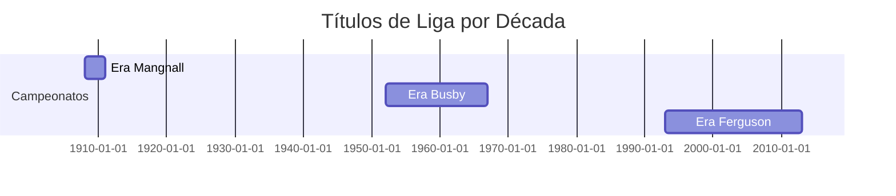
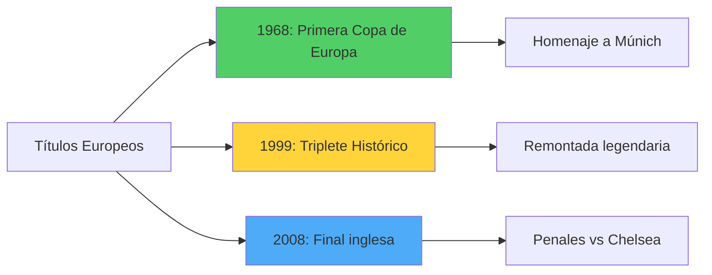
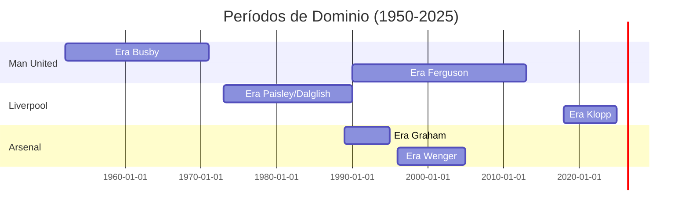

# Títulos y Logros del Manchester United 🏆

**Inicio** > **Logros** > **Palmarés Completo del Manchester United**

📅 **Creado:** 21 de octubre de 2025 | **Actualizado:** 25 de octubre de 2025  
⏱️ **Tiempo de lectura:** 6 minutos  
🏷️ **Tags:** `títulos`, `estadísticas`, `manchester-united`, `trofeos`, `récords`

---

## 📑 Tabla de Contenidos

1. [Introducción](#introducción)
2. [Campeonatos Nacionales](#campeonatos-nacionales)
3. [Títulos Europeos](#títulos-europeos)
4. [Comparativa con Rivales Históricos](#comparativa-con-rivales-históricos)
5. [Referencias](#referencias)
6. [Ver También](#ver-también)

---

## Introducción

El **Manchester United** es el club más laureado de Inglaterra, con un palmarés que refleja décadas de dominio tanto a nivel nacional como internacional. Con **20 títulos de [Primera División/Premier League](glosario.md#premier-league)**, el United ha establecido récords que definen la élite del fútbol británico.

Desde la consolidación bajo **[Matt Busby](articulo-1.md#la-era-dorada-de-matt-busby)** en los años 50 y 60, hasta el imperio construido por **[Sir Alex Ferguson](articulo-5.md)** entre 1986 y 2013, el club ha acumulado trofeos que narran la historia del fútbol inglés moderno. Este artículo desglosa sistemáticamente los títulos conquistados, compara el rendimiento con sus rivales históricos y analiza las épocas doradas que cementaron su reputación global.

> [!NOTE]
> El United es uno de solo cinco clubes que han ganado la **triple corona europea**: Copa de Europa/Champions League, Recopa de Europa y Copa UEFA/Europa League.

---

## Campeonatos Nacionales

### Premier League / Primera División

El Manchester United ha ganado el **campeonato inglés en 20 ocasiones**, récord compartido con Liverpool.

| Década | Títulos | Temporadas Destacadas |
|--------|---------|----------------------|
| 1900-1920 | 2 | 1907-08, 1910-11 |
| 1950-1970 | 5 | 1955-56, 1956-57, 1964-65 |
| 1990-2000 | 7 | 1992-93 (primera Premier), 1998-99 (triplete) |
| 2000-2013 | 6 | 2012-13 (último título) |

<strong>📖 Información adicional: La sequía entre épocas</strong>

Entre 1967 y 1993, el United pasó **26 años sin ganar la liga**, su período más largo de sequía. La llegada de Ferguson y la creación de la Premier League en 1992 marcó el renacimiento del club como potencia dominante.

### Copas Domésticas

| Competición | Títulos | Años Destacados |
|-------------|---------|----------------|
| **FA Cup** | 12 | 1909, 1963, 1999, 2004, 2016, 2024 |
| **Copa de la Liga** | 6 | 1992, 2006, 2009, 2023 |
| **Community Shield** | 21 | Récord absoluto |

> [!TIP]
> El United ha completado el **doblete** (Liga + FA Cup) en tres ocasiones: 1993-94, 1995-96 y 1998-99.

<strong>🔍 Ejemplo detallado: El doblete de 1994</strong>

En la temporada 1993-94, el United se convirtió en el primer equipo en ganar el doblete Liga-FA Cup en la era Premier League. [Eric Cantona](articulo-4.md#eric-cantona) fue clave, anotando en la final de la FA Cup ante Chelsea (4-0) y siendo elegido Jugador del Año.

---

## Títulos Europeos

### Champions League / Copa de Europa

El Manchester United ha conquistado **3 Copas de Europa**, convirtiéndose en uno de los clubes más exitosos del continente.

| Año | Rival en Final | Resultado | Sede |
|-----|---------------|-----------|------|
| **1968** | Benfica | 4-1 (t.e.) | Wembley, Londres |
| **1999** | Bayern Múnich | 2-1 | Camp Nou, Barcelona |
| **2008** | Chelsea | 1-1 (6-5 pen.) | Moscú, Rusia |

> [!WARNING]
> El United también ha perdido 2 finales de Champions League: en 2009 ante Barcelona (0-2) y en 2011 nuevamente ante Barcelona (1-3).

### Otros Títulos Europeos

| Competición | Títulos | Años |
|-------------|---------|------|
| Recopa de Europa | 1 | 1991 |
| Supercopa de Europa | 1 | 1991 |
| Copa UEFA/Europa League | 1 | 2017 |

<strong>📚 Datos históricos: El triplete de 1999</strong>

El Manchester United es el **único club inglés** que ha ganado el triplete (Liga, FA Cup y Champions League) en una misma temporada. Esta hazaña, lograda en 1998-99 bajo [Alex Ferguson](articulo-5.md), incluyó la dramática remontada ante Bayern Múnich con goles en los minutos 91 y 93.

---

## Comparativa con Rivales Históricos

### Los Tres Grandes de Inglaterra

Comparación de títulos mayores entre Manchester United, Liverpool y Arsenal:

| Club | Ligas | Champions/Copa Europa | FA Cups | Total Títulos |
|------|-------|----------------------|---------|---------------|
| **Manchester United** | 20 | 3 | 12 | **69** |
| **Liverpool** | 19 | 6 | 8 | **68** |
| **Arsenal** | 13 | 0 | 14 | **48** |

> [!NOTE]
> Aunque Liverpool tiene más Champions League (6 vs 3), el United lidera en títulos de liga doméstica compartiendo el récord con 20.

<strong>📖 Información adicional: La rivalidad Liverpool-United</strong>

La rivalidad entre Manchester United y Liverpool es considerada la más intensa del fútbol inglés. Ambos clubes han dominado diferentes épocas: Liverpool en los 70s-80s y United en los 90s-2000s. La batalla por superar los 20 títulos de liga ha sido un elemento central de esta rivalidad desde 2010.

### Resumen de Logros por Época

| Época | Manager | Años | Títulos Liga | Copas Europa |
|-------|---------|------|--------------|--------------|
| Fundacional | Ernest Mangnall | 1903-1912 | 2 | 0 |
| Dorada Busby | Matt Busby | 1945-1969 | 5 | 1 |
| Imperio Ferguson | Alex Ferguson | 1986-2013 | 13 | 2 |
| Post-Ferguson | Varios | 2013-2025 | 0 | 0 |

> [!CAUTION]
> La era post-Ferguson representa el mayor desafío moderno del club: recuperar el dominio doméstico perdido desde 2013.

### Enlaces Externos de Interés

- [UEFA - Historial del Manchester United](https://www.uefa.com) [1]
- [Premier League - Estadísticas históricas](https://www.premierleague.com) [2]
- [Transfermarkt - Palmarés completo](https://www.transfermarkt.com) [3]

---

## Referencias

1. UEFA Official Website (2025). *Manchester United Club Competitions*. https://www.uefa.com
2. Premier League (2024). *All-Time Records & Statistics*.
3. Deloitte Football Money League (2024). *Most Successful English Clubs*.

---

## Ver También

- [Historia del Manchester United ←](articulo-1.md)
- [La Era Ferguson: Liderazgo y Legado →](articulo-5.md)
- [Jugadores Icónicos del Club](articulo-4.md)
- [Impacto Cultural del Manchester United](articulo-3.md)

---

[← Anterior: Historia](articulo-1.md) | [Siguiente: Impacto Cultural →](articulo-3.md)

[↑ Volver arriba](#títulos-y-logros-del-manchester-united-)