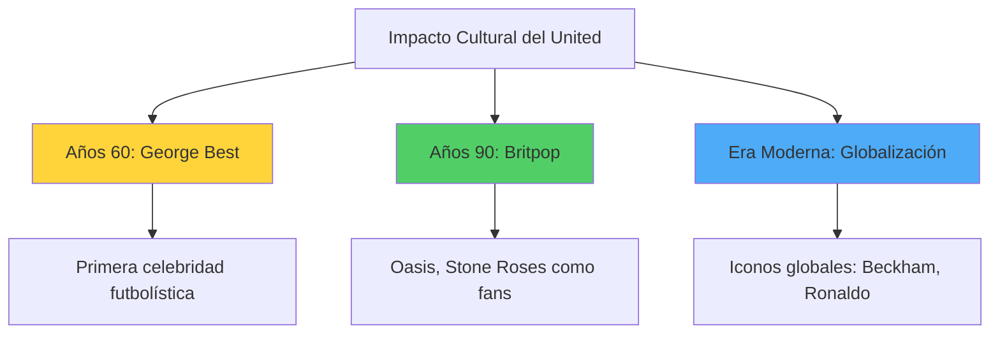
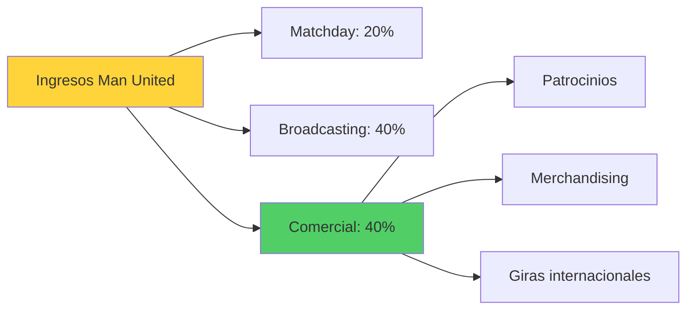
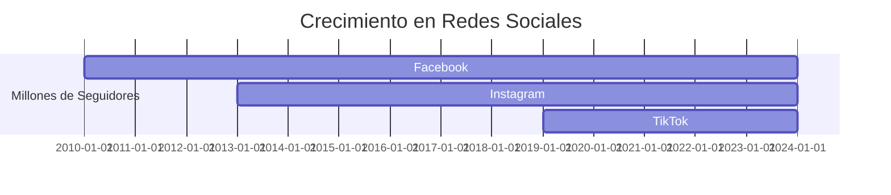

# Impacto Cultural del Manchester United 🌍

**Inicio** > **Cultura** > **Influencia Global del Manchester United**

📅 **Creado:** 22 de octubre de 2025 | **Actualizado:** 25 de octubre de 2025  
⏱️ **Tiempo de lectura:** 6 minutos  
🏷️ **Tags:** `cultura`, `marca-global`, `fanáticos`, `merchandising`, `redes-sociales`

---

## 📑 Tabla de Contenidos

1. [Introducción](#introducción)
2. [Influencia en la Música y Cultura Británica](#influencia-en-la-música-y-cultura-británica)
3. [Manchester United como Marca Global](#manchester-united-como-marca-global)
4. [Presencia en Redes Sociales](#presencia-en-redes-sociales)
5. [Referencias](#referencias)
6. [Ver También](#ver-también)

---

## Introducción

El **Manchester United** trasciende el fútbol para convertirse en un fenómeno cultural global. Con más de **1,100 millones de seguidores** en todo el mundo según estudios de 2024, el club representa mucho más que un equipo deportivo: es una marca de lifestyle, un símbolo de excelencia y un elemento fundamental de la cultura popular británica.

Desde su influencia en la música de los años 60 con **George Best** como ícono de la moda "Swinging London", hasta su presencia masiva en redes sociales con **150 millones de seguidores combinados**, el United ha sabido construir una identidad que conecta generaciones y atraviesa fronteras. Su impacto cultural abarca desde el cine y la televisión hasta colaboraciones con marcas de lujo, consolidándose como uno de los clubes más valiosos y reconocibles del planeta.

> [!NOTE]
> El valor de marca del Manchester United alcanzó **$6.55 mil millones** en 2024 según Forbes, ubicándolo entre las 5 marcas deportivas más valiosas del mundo.

---

## Influencia en la Música y Cultura Británica

### Los Años 60: Best y el Swinging London

**[George Best](articulo-4.md#george-best)**, estrella del United en los 60, se convirtió en el **primer superstar mediático del fútbol**. Su estilo de vida, relaciones con modelos y apariciones en revistas de moda lo transformaron en un ícono cultural equivalente a músicos como The Beatles.

| Aspecto Cultural | Influencia del United |
|------------------|----------------------|
| **Moda** | Best popularizó el cabello largo y ropa moderna entre futbolistas |
| **Música** | The Stone Roses, Oasis y otros grupos de Manchester son fanáticos declarados |
| **Cine** | Documentales como "United" (2011) sobre la tragedia de Múnich |

<strong>📚 Datos históricos: George Best y la cultura pop</strong>

George Best apareció en la portada de revistas como *Vogue* y *Playboy*, algo inédito para un futbolista. Sus boutiques de ropa en Manchester y Londres lo convirtieron en empresario de moda, estableciendo el precedente para futuras generaciones de futbolistas-celebrities como [David Beckham](articulo-4.md#david-beckham).

### Britpop y el Manchester de los 90

Durante la era **[Ferguson](articulo-5.md)** en los 90, el éxito del United coincidió con el boom del **Britpop**. Bandas como **Oasis** (con los hermanos Gallagher como fanáticos acérrimos) y **The Stone Roses** asociaron su identidad con el club, fusionando fútbol y música en la cultura mancuniana.

> [!TIP]
> La canción "Glory Glory Man United" es uno de los himnos de club más reconocibles del fútbol mundial, adaptada del himno de batalla "The Battle Hymn of the Republic".

<strong>🔍 Ejemplo detallado: Oasis y el United</strong>

Noel y Liam Gallagher de Oasis han sido seguidores del United toda su vida. La banda tocó en Old Trafford en 2005, y Noel declaró que el triplete de 1999 fue "mejor que cualquier álbum que hayamos hecho". Esta conexión entre el Britpop y el United simboliza la cultura mancuniana de los 90.

---

## Manchester United como Marca Global

### Expansión Comercial

El Manchester United opera como una **corporación global** con presencia en más de 200 países. Su estrategia comercial incluye patrocinios millonarios, merchandising internacional y giras pretemporada que generan ingresos masivos.

| Área de Negocio | Datos Clave |
|----------------|-------------|
| **Patrocinios** | Contrato con Adidas: $1,000M/10 años (2015-2025) |
| **Merchandising** | Tiendas oficiales en 20 países |
| **Giras Pretemporada** | Tours por Asia, Australia y EE.UU. cada verano |
| **Academias** | Escuelas de fútbol en 50 países |

> [!WARNING]
> A pesar del éxito comercial, críticos argumentan que la excesiva comercialización ha alejado al club de sus raíces trabajadoras y su base de fans local.

### Colaboraciones de Lujo

El United ha trascendido el deporte para asociarse con marcas de lujo que elevan su perfil global:

- **TAG Heuer**: Patrocinador oficial de relojes
- **Emirates**: Aerolínea oficial del club
- **DHL**: Socio logístico global
- **Chevrolet**: Patrocinador principal del jersey (2014-2021, $559M)

<strong>📖 Información adicional: El fenómeno Beckham</strong>

[David Beckham](articulo-4.md#david-beckham) elevó el perfil global del United en los 90s y 2000s. Su matrimonio con Victoria Adams (Spice Girls), contratos con marcas como Pepsi y Armani, y su estilo de vida mediático convirtieron al United en parte de la cultura celebrity global. Su venta al Real Madrid en 2003 por £25M fue tanto deportiva como comercial.

---

## Presencia en Redes Sociales

### Dominio Digital

El Manchester United lidera la presencia digital entre clubes de fútbol, con una estrategia multiplataforma que alcanza **cientos de millones de seguidores**.

| Plataforma | Seguidores (2024) | Contenido Destacado |
|------------|-------------------|---------------------|
| **Facebook** | 74 millones | Videos de goles históricos |
| **Instagram** | 62 millones | Behind-the-scenes, jugadores |
| **Twitter/X** | 38 millones | Noticias en tiempo real |
| **YouTube** | 9 millones | Documentales, entrevistas |
| **TikTok** | 15 millones | Contenido viral, challenges |

> [!NOTE]
> El United fue uno de los primeros clubes en tener **contenido específico** para mercados asiáticos, con cuentas en chino, árabe y otros idiomas desde 2012.

### Estrategia de Engagement

El club utiliza **contenido nostalgia** (goles de [Eric Cantona](articulo-4.md#eric-cantona), [Cristiano Ronaldo](articulo-4.md#cristiano-ronaldo)) y **acceso exclusivo** (entrenamientos, entrevistas) para mantener engagement con fans globales que nunca han visitado Old Trafford.

<strong>🔍 Ejemplo detallado: Campaña #MUFC en Asia</strong>

En 2023, el United lanzó una campaña específica para el mercado chino coincidiendo con el Año Nuevo Lunar. El contenido incluía mensajes de jugadores en mandarín, diseños especiales del jersey y giras virtuales de Old Trafford. La campaña generó 100M de impresiones en 48 horas, demostrando el alcance global de la marca.

### Documentales y Medios

| Producción | Año | Plataforma | Tema |
|------------|-----|------------|------|
| *Clase del 92* | 2013 | Cines/Netflix | Generación dorada |
| *Munich* | 2011 | BBC | Tragedia de 1958 |
| *99* | 2023 | Amazon Prime | Triplete de 1999 |

> [!TIP]
> Documentales como "Clase del 92" han introducido la historia del United a nuevas generaciones que no vivieron las épocas doradas de Ferguson.

### Enlaces Externos de Interés

- [Manchester United Official Website](https://www.manutd.com) [1]
- [MUTV - Canal oficial del club](https://www.youtube.com/manutd) [2]
- [Deloitte Football Money League Report](https://www2.deloitte.com/uk/en/pages/sports-business-group/articles/deloitte-football-money-league.html) [3]

---

## Referencias

1. Manchester United Official (2025). *Global Fanbase Statistics*. https://www.manutd.com
2. Forbes (2024). *The World's Most Valuable Soccer Teams*.
3. Deloitte (2024). *Football Money League: Top 20 Revenue-Generating Clubs*.

---

## Ver También

- [Historia del Manchester United ←](articulo-1.md)
- [Jugadores Icónicos y su Influencia →](articulo-4.md)
- [Títulos y Logros del Club](articulo-2.md)
- [La Era Ferguson: Liderazgo](articulo-5.md)

---

[← Anterior: Títulos y Logros](articulo-2.md) | [Siguiente: Jugadores Icónicos →](articulo-4.md)

[↑ Volver arriba](#impacto-cultural-del-manchester-united-)