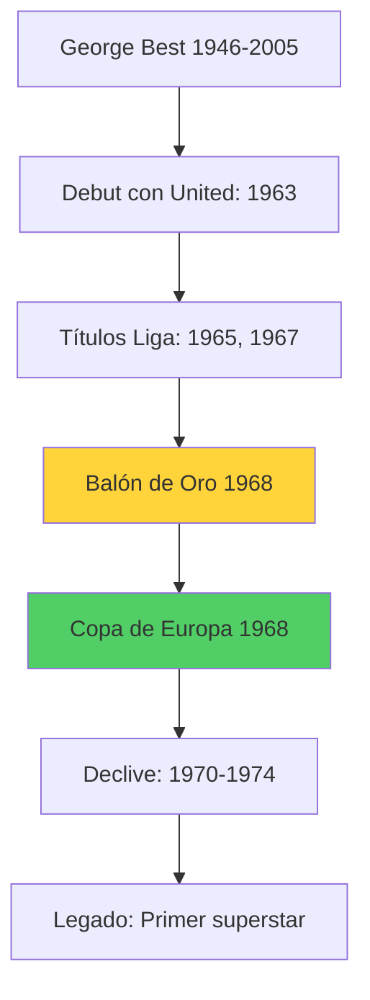
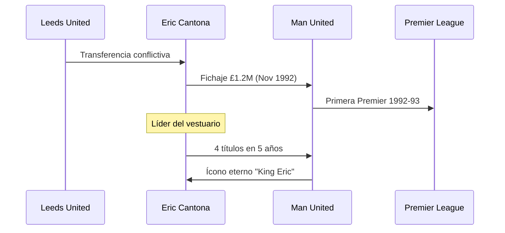
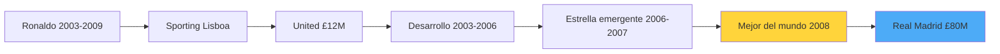

# Jugadores Icónicos del Manchester United ⭐

**Inicio** > **Jugadores** > **Leyendas del Manchester United**

📅 **Creado:** 23 de octubre de 2025 | **Actualizado:** 25 de octubre de 2025  
⏱️ **Tiempo de lectura:** 7 minutos  
🏷️ **Tags:** `jugadores`, `leyendas`, `estrellas`, `historia`, `manchester-united`

---

## 📑 Tabla de Contenidos

1. [Introducción](#introducción)
2. [George Best: El Primer Superstar](#george-best-el-primer-superstar)
3. [Eric Cantona: El Rey](#eric-cantona-el-rey)
4. [Cristiano Ronaldo: El Fenómeno Global](#cristiano-ronaldo-el-fenómeno-global)
5. [Referencias](#referencias)
6. [Ver También](#ver-también)

---

## Introducción

El **Manchester United** ha sido hogar de algunos de los futbolistas más talentosos y carismáticos de la historia. Desde el genio rebelde de **George Best** en los años 60, pasando por la arrogancia artística de **Eric Cantona** en los 90, hasta el perfeccionismo atlético de **Cristiano Ronaldo** en los 2000s, el club ha atraído y moldeado leyendas que trascienden el deporte.

Estos jugadores no solo acumularon trofeos y récords, sino que definieron épocas, inspiraron generaciones y establecieron el estándar de excelencia que caracteriza al club. Cada uno aportó algo único: Best trajo el glamour, Cantona la mentalidad ganadora, y Ronaldo la ambición sin límites. Este artículo examina las contribuciones de tres de las figuras más icónicas que vistieron la camiseta roja del United.

> [!NOTE]
> El Manchester United ha tenido 4 ganadores del **[Balón de Oro](glosario.md#balón-de-oro)**: Denis Law (1964), Bobby Charlton (1966), George Best (1968) y Cristiano Ronaldo (2008).

---

## George Best: El Primer Superstar

### El Quinto Beatle

**George Best** (1946-2005) fue mucho más que un futbolista extraordinario: fue el **primer celebrity deportivo** de la era moderna. Jugó para el United de 1963 a 1974, ganando **2 títulos de liga** y la **Copa de Europa en 1968**.

| Estadística | Dato |
|-------------|------|
| **Partidos** | 470 |
| **Goles** | 179 |
| **Títulos de Liga** | 2 (1965, 1967) |
| **Balón de Oro** | 1968 |
| **Copa de Europa** | 1968 |

### Estilo de Juego y Legado

Best era un **extremo mágico** con habilidades de regate incomparables. Su capacidad para superar a múltiples defensores, combinada con su visión de juego y definición letal, lo convirtieron en uno de los jugadores más espectaculares de su generación.

> [!TIP]
> Best fue famoso por su frase: "Gasté mucho dinero en alcohol, mujeres y coches rápidos. El resto lo desperdicié", reflejando su estilo de vida controversial fuera del campo.

<strong>📚 Datos históricos: Best y el fútbol moderno</strong>

George Best estableció el precedente para la figura del **futbolista-celebrity**. Abrió boutiques de ropa, apareció en comerciales de televisión y fue portada de revistas de moda. Su influencia se extendió más allá del fútbol, convirtiéndolo en un ícono de la cultura pop de los 60s, comparable a The Beatles o los Rolling Stones.

<strong>🔍 Ejemplo detallado: Gol ante Benfica 1968</strong>

En la final de la Copa de Europa 1968, Best regateó al portero del Benfica y anotó con calma el tercer gol del United. Este momento simbolizó su genialidad: técnica perfecta bajo máxima presión. El United ganó 4-1, y Best fue declarado el mejor jugador del torneo a los 22 años.

> [!WARNING]
> A pesar de su genio, Best luchó contra el alcoholismo toda su vida, lo que acortó su carrera y eventualmente contribuyó a su muerte prematura en 2005 a los 59 años.

---

## Eric Cantona: El Rey

### Revolución en el United

**Eric Cantona** (1966-) llegó al United desde Leeds United en 1992 por apenas **£1.2 millones** y transformó completamente la mentalidad del club. En sus 5 años (1992-1997), ganó **4 [Premier League](glosario.md#premier-league)** y **2 FA Cups**.

| Estadística | Dato |
|-------------|------|
| **Partidos** | 185 |
| **Goles** | 82 |
| **Títulos de Liga** | 4 (1993, 1994, 1996, 1997) |
| **FA Cups** | 2 (1994, 1996) |
| **Doblete** | 2 veces (1994, 1996) |

### El Factor Cantona

Cantona no era solo un jugador talentoso; era un **líder carismático** que inspiraba a sus compañeros. Su presencia elevó el nivel de jugadores jóvenes como [Ryan Giggs](glosario.md#ryan-giggs), [Paul Scholes](glosario.md#paul-scholes) y [David Beckham](articulo-4.md#david-beckham).

> [!NOTE]
> [Sir Alex Ferguson](articulo-5.md) declaró que Cantona fue **"el catalizador"** que transformó al United de aspirantes a campeones dominantes.

<strong>📖 Información adicional: El incidente de Selhurst Park</strong>

En enero de 1995, Cantona protagonizó uno de los momentos más controversiales del fútbol: realizó una patada de kung-fu a un aficionado del Crystal Palace que lo insultaba. Fue suspendido 8 meses y multado, pero regresó más fuerte, liderando al United al doblete en 1996. Este incidente paradójicamente aumentó su estatus de leyenda.

### Tabla Comparativa: Impacto de Cantona

| Aspecto | Antes de Cantona (1986-1992) | Con Cantona (1992-1997) |
|---------|------------------------------|-------------------------|
| **Títulos de Liga** | 0 en 26 años | 4 en 5 años |
| **Mentalidad** | Aspirantes | Ganadores |
| **Estilo de Juego** | Inconsistente | Dominante, ofensivo |

<strong>🔍 Ejemplo detallado: Gol de volea vs Sunderland 1996</strong>

El 21 de diciembre de 1996, Cantona anotó uno de los goles más emblemáticos de la Premier League: una volea perfecta desde fuera del área con el cuello de la camiseta levantado, su pose característica. Este gol ejemplificó su combinación de técnica suprema y presencia intimidante.

---

## Cristiano Ronaldo: El Fenómeno Global

### De Promesa a Leyenda

**Cristiano Ronaldo** (1985-) llegó al United en 2003 como un flaco talento portugués de 18 años. Bajo la tutela de **[Ferguson](articulo-5.md)**, se convirtió en el mejor jugador del mundo, ganando el **[Balón de Oro](glosario.md#balón-de-oro) 2008** y liderando al club a la **Champions League 2008**.

| Estadística | Dato |
|-------------|------|
| **Partidos** | 292 |
| **Goles** | 118 |
| **Títulos de Liga** | 3 (2007, 2008, 2009) |
| **Champions League** | 1 (2008) |
| **Balón de Oro** | 1 (2008) |

### Evolución y Perfeccionismo

Ronaldo transformó su juego de extremo tramposo a máquina de goles. Su **ética de trabajo legendaria**, dedicación al gimnasio y práctica de tiros libres lo convirtieron en el jugador más completo de su generación.

> [!TIP]
> Ferguson reveló que Ronaldo frecuentemente se quedaba horas después del entrenamiento practicando tiros libres y regates, una dedicación que inspiró a toda la plantilla.

<strong>📚 Datos históricos: Temporada 2007-08</strong>

En la temporada 2007-08, Ronaldo anotó **42 goles en todas las competiciones**, un récord para el United. Ganó el Balón de Oro, la Bota de Oro, y lideró al club a la **doble corona**: Premier League y Champions League (venciendo al Chelsea en penales en Moscú).

### Tabla Comparativa: Los Tres Ídolos

| Jugador | Época | Partidos | Goles | Títulos Liga | Balón de Oro |
|---------|-------|----------|-------|--------------|--------------|
| **George Best** | 1963-1974 | 470 | 179 | 2 | 1 (1968) |
| **Eric Cantona** | 1992-1997 | 185 | 82 | 4 | 0 |
| **Cristiano Ronaldo** | 2003-2009 | 292 | 118 | 3 | 1 (2008) |

<strong>🔍 Ejemplo detallado: Gol de 40 metros vs Porto 2009</strong>

En abril de 2009, en cuartos de final de Champions League, Ronaldo disparó un tiro libre desde 40 metros que entró con una potencia y efecto inigualables. El portero Helton quedó paralizado. Este gol demostró que Ronaldo había alcanzado un nivel físico y técnico sin precedentes en el fútbol moderno.

> [!CAUTION]
> Su transferencia al Real Madrid en 2009 por **£80 millones** (récord mundial entonces) dejó un vacío que el United tardó años en llenar, contribuyendo al declive post-Ferguson.

### Enlaces Externos de Interés

- [George Best Foundation](https://www.georgebestfoundation.com) [1]
- [Eric Cantona - Entrevistas históricas](https://www.manutd.com/cantona) [2]
- [Cristiano Ronaldo Stats - Transfermarkt](https://www.transfermarkt.com/cristiano-ronaldo) [3]

---

## Referencias

1. Manchester United Official (2025). *Legends Profile*. https://www.manutd.com
2. The Guardian (2023). *George Best: The First Football Superstar*.
3. Ferguson, Alex (2013). *My Autobiography*. Hodder & Stoughton.

---

## Ver También

- [Impacto Cultural del Manchester United ←](articulo-3.md)
- [La Era Ferguson: Liderazgo y Legado →](articulo-5.md)
- [Historia del Manchester United](articulo-1.md)
- [Títulos y Logros del Club](articulo-2.md)

---

[← Anterior: Impacto Cultural](articulo-3.md) | [Siguiente: La Era Ferguson →](articulo-5.md)

[↑ Volver arriba](#jugadores-icónicos-del-manchester-united-)