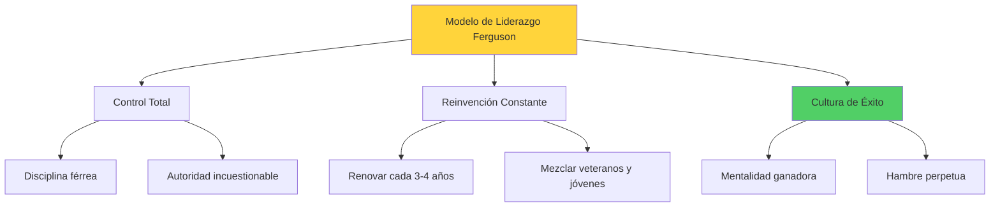
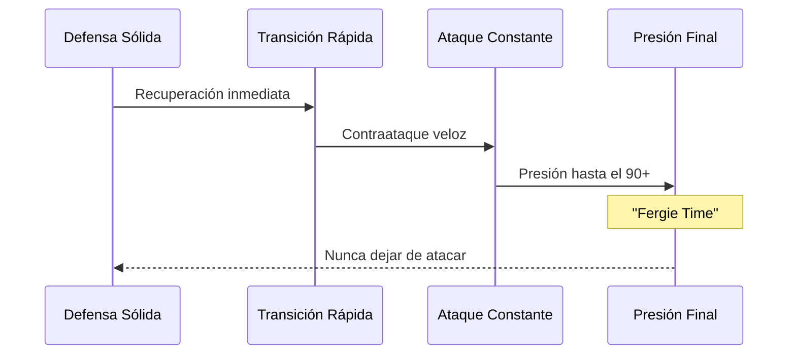
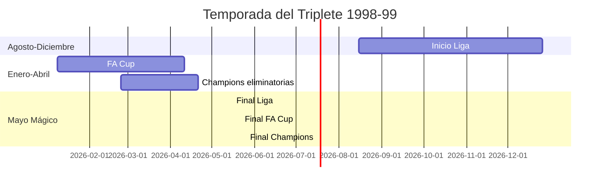

# La Era Ferguson: Liderazgo y Legado 👑

**Inicio** > **Historia** > **La Era de Sir Alex Ferguson**

📅 **Creado:** 24 de octubre de 2025 | **Actualizado:** 25 de octubre de 2025  
⏱️ **Tiempo de lectura:** 7 minutos  
🏷️ **Tags:** `alex-ferguson`, `liderazgo`, `management`, `éxito`, `legado`

---

## 📑 Tabla de Contenidos

1. [Introducción](#introducción)
2. [Gestión y Filosofía de Liderazgo](#gestión-y-filosofía-de-liderazgo)
3. [Tácticas y Desarrollo del Club](#tácticas-y-desarrollo-del-club)
4. [El Triplete de 1999: Análisis Detallado](#el-triplete-de-1999-análisis-detallado)
5. [Referencias](#referencias)
6. [Ver También](#ver-también)

---

## Introducción

**Sir Alex Ferguson** (1941-) es considerado el **mejor manager de la historia del fútbol**. Durante sus **26 años** al frente del Manchester United (1986-2013), transformó al club de aspirante en crisis a la dinastía más dominante del fútbol inglés. Su palmarés incluye **13 [Premier League](glosario.md#premier-league)**, **5 FA Cups**, **2 Champions League** y numerosos trofeos más.

Pero los números solo cuentan parte de la historia. Ferguson construyó un imperio basado en disciplina férrea, desarrollo juvenil, mentalidad ganadora y una capacidad única para reinventar equipos cada 3-4 años. Su influencia se extendió más allá de las tácticas: fue un psicólogo, motivador, mentor y líder que inspiró lealtad absoluta de sus jugadores. Este artículo explora los pilares de su éxito y el legado imborrable que dejó en Old Trafford.

> [!NOTE]
> Ferguson fue nombrado **Caballero** (Sir) en 1999 tras ganar el triplete, reconociendo sus servicios al fútbol británico.

---

## Gestión y Filosofía de Liderazgo

### Los Pilares del Éxito

Ferguson construyó su imperio sobre **tres principios fundamentales** que aplicó consistentemente durante casi tres décadas:

| Principio | Descripción | Ejemplo |
|-----------|-------------|---------|
| **Disciplina absoluta** | Tolerancia cero con egos y desafíos a su autoridad | Vendió a [David Beckham](articulo-4.md#david-beckham) en 2003 |
| **Mentalidad ganadora** | Nunca rendirse, atacar hasta el último minuto | "Fergie Time": goles en minutos finales |
| **Desarrollo juvenil** | Priorizar la cantera sobre fichajes caros | Clase del 92: Giggs, Scholes, Beckham, Neville |

### El "Hairdryer Treatment"

Ferguson era famoso por su **"hairdryer treatment"**: gritos intensos cara a cara cuando un jugador no cumplía sus estándares. Esta intimidación psicológica mantenía a todos enfocados y temerosos de decepcionarlo.

> [!WARNING]
> Ferguson no toleraba desafíos a su autoridad. Jugadores legendarios como Roy Keane y Ruud van Nistelrooy fueron vendidos cuando cuestionaron sus decisiones, sin importar su importancia deportiva.

<strong>📚 Datos históricos: El incidente Beckham 2003</strong>

En febrero de 2003, tras una derrota ante Arsenal, Ferguson pateó accidentalmente una bota que golpeó a Beckham sobre el ojo. Este incidente simbolizó la ruptura entre ambos. Meses después, Beckham fue vendido al Real Madrid por £25M, demostrando que nadie estaba por encima del club bajo Ferguson.

### Gestión de Vestuario

Ferguson aplicaba **psicología individualizada**: sabía exactamente cómo motivar a cada jugador. Con [Cristiano Ronaldo](articulo-4.md#cristiano-ronaldo) usaba desafíos, con [Ryan Giggs](glosario.md#ryan-giggs) confianza absoluta, y con Roy Keane lo empoderaba como extensión de su liderazgo en el campo.

<strong>🔍 Ejemplo detallado: La gestión de Ronaldo</strong>

Cuando Ronaldo llegó en 2003 como un joven engreído, Ferguson lo retó constantemente: "Si quieres ser el mejor, demuéstralo". Le dio el icónico número 7 (de Best, Cantona, Beckham) como motivación. Esta presión transformó a Ronaldo de talento desperdiciado a Balón de Oro. Ferguson sabía que su ego necesitaba alimentación, no humillación.

---

## Tácticas y Desarrollo del Club

### Evolución Táctica

Ferguson no era dogmático: **adaptaba sus tácticas** a los jugadores disponibles y rivales enfrentados. Su único principio no negociable era el ataque.

| Período | Formación Principal | Estilo de Juego |
|---------|-------------------|----------------|
| **1986-1994** | 4-4-2 tradicional | Juego directo, wings |
| **1995-2003** | 4-4-2 con extremos | Velocidad por bandas, Beckham/Giggs |
| **2004-2009** | 4-3-3 / 4-5-1 | Ronaldo libre, Rooney de apoyo |
| **2010-2013** | 4-2-3-1 flexible | Control medio, transiciones rápidas |

### "Fergie Time"

El concepto del **"Fergie Time"** (tiempo de Ferguson) se refiere a la tendencia del United de anotar goles decisivos en los minutos finales. Esto no era suerte: era mentalidad, condición física superior y presión psicológica sobre árbitros y rivales.

> [!TIP]
> Ferguson entrenaba específicamente la **mentalidad de los últimos 10 minutos**: sus equipos nunca bajaban la intensidad, sabiendo que la persistencia generaba oportunidades.

### Desarrollo de la Cantera

Ferguson revolucionó el fútbol inglés al confiar en la **Clase del 92**: [David Beckham](articulo-4.md#david-beckham), [Ryan Giggs](glosario.md#ryan-giggs), Paul Scholes, Gary Neville, Phil Neville y Nicky Butt. Estos jóvenes formaron el núcleo de los equipos más exitosos del United.

<strong>📖 Información adicional: La apuesta de Ferguson en 1995</strong>

En verano de 1995, Ferguson vendió a tres titulares (Ince, Hughes, Kanchelskis) y los reemplazó con juveniles de 19-21 años. Alan Hansen, exjugador del Liverpool, declaró: "No puedes ganar nada con niños". Esa temporada, el United ganó el doblete Liga-FA Cup, y Ferguson demostró que los jóvenes comprometidos superan a mercenarios costosos.

---

## El Triplete de 1999: Análisis Detallado

### La Temporada Perfecta

La temporada **1998-99** fue la más gloriosa en la historia del club: **Premier League**, **FA Cup** y **Champions League**. Es el único triplete logrado por un club inglés.

| Competición | Resultado Final | Momento Decisivo |
|-------------|----------------|------------------|
| **Premier League** | Campeones (79 pts) | Victoria vs Tottenham (última jornada) |
| **FA Cup** | 2-0 vs Newcastle | Goles de Scholes y Sheringham |
| **Champions League** | 2-1 vs Bayern (t.e.) | Remontada minutos 91 y 93 |

### La Remontada de Barcelona

El **26 de mayo de 1999** en el Camp Nou, el United perdía 1-0 ante Bayern Múnich hasta el minuto 90. Lo que sucedió después es legendario:

> [!NOTE]
> **Minuto 90+1**: Teddy Sheringham empata tras un córner.  
> **Minuto 90+3**: Ole Gunnar Solskjær anota el ganador de volea.  
> **Resultado**: United 2-1 Bayern (tiempo extra)

<strong>🔍 Ejemplo detallado: La psicología de Ferguson</strong>

Durante el descanso, con el United perdiendo 1-0, Ferguson no gritó. Simplemente dijo: "A este nivel, simplemente gana el equipo que marca goles. Sigan intentándolo". Esta calma bajo presión extrema transmitió confianza. En tiempo añadido, el United bombardeó el área rival con desesperación organizada. Los sustitutos Sheringham y Solskjær, frescos y motivados, completaron la remontada más icónica del fútbol.

### Citas Históricas

> "El fútbol, sangriento infierno" - Comentarista de ITV, Clive Tyldesley, al narrar el gol de Sheringham.

> "Treble winners! Manchester United have reached the Promised Land!" - Tyldesley tras el gol de Solskjær.

<strong>📚 Datos históricos: Importancia del triplete</strong>

El triplete de 1999 no solo fue un logro deportivo: **consolidó al United como marca global**. La remontada dramática se transmitió a mil millones de personas, generando una narrativa épica que atrajo fans en Asia, África y América. Comercialmente, el club creció exponencialmente en los años siguientes. Ferguson había creado no solo un equipo campeón, sino una institución global.

### Legado Post-Ferguson

| Aspecto | Era Ferguson (1986-2013) | Post-Ferguson (2013-2025) |
|---------|-------------------------|---------------------------|
| **Títulos de Liga** | 13 | 0 |
| **Managers** | 1 | 5+ |
| **Estabilidad** | Total | Caótica |
| **Mentalidad** | Ganadora | En reconstrucción |

> [!CAUTION]
> El éxito de Ferguson creó una **dependencia institucional**. Ningún sucesor ha replicado su combinación de autoridad, visión y resultados, dejando al club en transición perpetua desde 2013.

### Enlaces Externos de Interés

- [Sir Alex Ferguson Foundation](https://www.alexferguson.com) [1]
- [Documental "99" - Amazon Prime](https://www.amazon.com/99-documentary) [2]
- [Ferguson: Biografía autorizada](https://www.manutd.com/ferguson-biography) [3]

---

## Referencias

1. Ferguson, Alex (2013). *My Autobiography*. Hodder & Stoughton.
2. The Guardian (2023). *Sir Alex Ferguson: The Greatest Manager*.
3. Manchester United Official (2025). *Ferguson Legacy*. https://www.manutd.com

---

## Ver También

- [Jugadores Icónicos del Manchester United ←](articulo-4.md)
- [Historia del Manchester United](articulo-1.md)
- [Títulos y Logros del Club](articulo-2.md)
- [Impacto Cultural del Manchester United](articulo-3.md)

---

[← Anterior: Jugadores Icónicos](articulo-4.md) | [Volver al Índice](index.md)

[↑ Volver arriba](#la-era-ferguson-liderazgo-y-legado-)