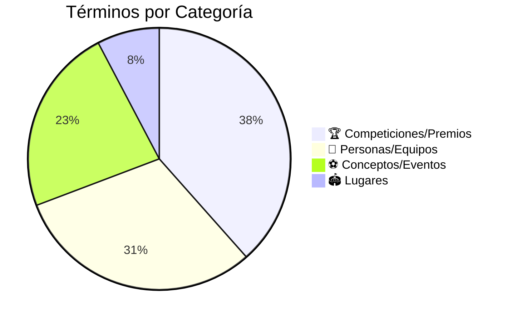

# Glosario del Manchester United 📚

**Inicio** > **Recursos** > **Glosario de Términos**

📅 **Creado:** 25 de octubre de 2025 | **Actualizado:** 25 de octubre de 2025  
⏱️ **Tiempo de lectura:** 5 minutos  
🏷️ **Tags:** `glosario`, `términos`, `definiciones`, `referencia`, `manchester-united`

---

## 📑 Tabla de Contenidos

1. [Introducción](#introducción)
2. [Términos del Glosario](#términos-del-glosario)
3. [Categorías de Términos](#categorías-de-términos)
4. [Ver También](#ver-también)

---

## Introducción

Este glosario contiene **13 términos fundamentales** relacionados con el **Manchester United**, organizados alfabéticamente. Cada entrada incluye enlaces bidireccionales a los artículos donde se mencionan, facilitando la navegación entre conceptos.

> [!NOTE]
> Los términos están categorizados: 🏆 Competiciones/Premios | 👤 Personas/Equipos | ⚽ Conceptos | 🏟️ Lugares

---

## Términos del Glosario

### Balón de Oro 🏆 

**Categoría:** Premios Individuales

El **Balón de Oro** es el premio individual más prestigioso del fútbol mundial, otorgado anualmente al mejor jugador. Cuatro jugadores del Manchester United lo han ganado: Denis Law (1964), Bobby Charlton (1966), [George Best](articulo-4.md#george-best) (1968) y [Cristiano Ronaldo](articulo-4.md#cristiano-ronaldo) (2008).

**Menciones en:** [Jugadores Icónicos](articulo-4.md), [La Era Ferguson](articulo-5.md)

---

### Busby Babes 👤 

**Categoría:** Equipos Históricos

Nombre dado a la **generación de jóvenes talentos** desarrollados por Matt Busby en los años 50. Con edad promedio de 22 años, ganaron dos títulos consecutivos (1956, 1957) pero fueron devastados por la [Tragedia de Múnich](#tragedia-de-múnich) en 1958.

**Jugadores destacados:** Duncan Edwards, Bobby Charlton, Roger Byrne

**Menciones en:** [Historia del Manchester United](articulo-1.md#la-tragedia-de-múnich-1958)

---

### Champions League 🏆 

**Categoría:** Competiciones Europeas

La **UEFA Champions League** es la competición de clubes más prestigiosa de Europa. El Manchester United la ha ganado **3 veces**: 1968 (vs Benfica), 1999 (vs Bayern Múnich) y 2008 (vs Chelsea).

**Menciones en:** [Títulos y Logros](articulo-2.md#títulos-europeos), [La Era Ferguson](articulo-5.md#el-triplete-de-1999)

---

### Clase del 92 👤 

**Categoría:** Equipos Históricos

Generación legendaria de juveniles que debutaron alrededor de 1992: [David Beckham](articulo-4.md#david-beckham), Ryan Giggs, Paul Scholes, Gary Neville, Phil Neville y Nicky Butt. Formaron el núcleo del equipo más exitoso bajo [Alex Ferguson](#sir-alex-ferguson).

**Menciones en:** [La Era Ferguson](articulo-5.md#tácticas-y-desarrollo-del-club), [Impacto Cultural](articulo-3.md)

---

### FA Cup 🏆 

**Categoría:** Competiciones Domésticas

La **Football Association Cup** es la competición de copa más antigua del mundo (1871). El Manchester United la ha ganado **12 veces**, siendo parte fundamental del [Triplete de 1999](#triplete).

**Menciones en:** [Títulos y Logros](articulo-2.md), [La Era Ferguson](articulo-5.md#el-triplete-de-1999)

---

### Fergie Time ⚽ 

**Categoría:** Conceptos Futbolísticos

Término que describe la tendencia del United bajo Ferguson de anotar **goles decisivos en minutos finales**. Combinaba mentalidad inquebrantable, condición física superior y presión psicológica. Ejemplo icónico: remontada ante Bayern 1999 (goles en 90+1 y 90+3).

**Menciones en:** [La Era Ferguson](articulo-5.md#tácticas-y-desarrollo-del-club)

---

### Matt Busby 👤 

**Categoría:** Managers Históricos

**Sir Matt Busby** (1909-1994) fue manager del United de 1945 a 1969. Sobrevivió a la [Tragedia de Múnich](#tragedia-de-múnich) y reconstruyó el equipo para ganar la Copa de Europa en 1968. Ganó 5 ligas y fue nombrado Caballero en 1968.

**Menciones en:** [Historia del Manchester United](articulo-1.md#la-era-dorada-de-matt-busby), [Títulos y Logros](articulo-2.md)

---

### Old Trafford 🏟️ 

**Categoría:** Estadios

**Old Trafford** es el estadio del Manchester United desde 1910, conocido como **"El Teatro de los Sueños"**. Capacidad: 74,310 espectadores (segundo más grande de Inglaterra).

**Menciones en:** [Impacto Cultural](articulo-3.md), [Historia del United](articulo-1.md)

---

### Premier League 🏆 

**Categoría:** Competiciones Domésticas

La **Premier League** es la máxima categoría del fútbol inglés desde 1992. El Manchester United fue su **primer campeón** (1992-93) y tiene el récord de **13 títulos** en esta era, más 7 de la antigua Primera División (20 totales).

**Menciones en:** [Títulos y Logros](articulo-2.md), [La Era Ferguson](articulo-5.md)

---

### Sir Alex Ferguson 👤 

**Categoría:** Managers Históricos

**Sir Alex Ferguson** (1941-) dirigió al United durante **26 años** (1986-2013), ganando **38 trofeos**: 13 Premier League, 5 FA Cups, 2 Champions League. Es considerado el mejor manager de la historia del fútbol.

**Filosofía:** Disciplina férrea, desarrollo juvenil, mentalidad ganadora

**Menciones en:** [La Era Ferguson](articulo-5.md) (artículo completo), [Historia](articulo-1.md#el-imperio-de-ferguson), [Títulos](articulo-2.md)

---

### Tragedia de Múnich ⚽ 

**Categoría:** Eventos Históricos

El **desastre aéreo de Múnich** ocurrió el **6 de febrero de 1958** cuando el avión del equipo se estrelló en el despegue. **23 personas murieron**, incluyendo **8 jugadores** de los [Busby Babes](#busby-babes). Matt Busby sobrevivió y reconstruyó el equipo.

**Menciones en:** [Historia del Manchester United](articulo-1.md#la-tragedia-de-múnich-1958)

---

### Triplete 🏆 

**Categoría:** Logros Históricos

El **Triplete** es ganar tres competiciones mayores en una temporada. El Manchester United es el **único club inglés** que lo logró: temporada 1998-99 bajo [Ferguson](#sir-alex-ferguson) (Premier League, FA Cup, Champions League).

**Momento icónico:** Remontada ante Bayern (goles en minutos 90+1 y 90+3)

**Menciones en:** [La Era Ferguson](articulo-5.md#el-triplete-de-1999), [Títulos y Logros](articulo-2.md)

---

### United Way ⚽ 

**Categoría:** Conceptos Futbolísticos

**"The United Way"** es la filosofía del club establecida por Matt Busby: juego ofensivo y atractivo, desarrollo de talento joven de la cantera, nunca rendirse. Ferguson continuó esta tradición con la [Clase del 92](#clase-del-92).

**Principios:** Ataque constante, canteranos, mentalidad ganadora

**Menciones en:** [Historia del United](articulo-1.md), [La Era Ferguson](articulo-5.md)

---

## Categorías de Términos

### Tabla de Referencia Rápida

| Término | Categoría | Tipo | Artículos Relacionados |
|---------|-----------|------|------------------------|
| [Balón de Oro](#balón-de-oro) | Premios | 🏆 | [Jugadores](articulo-4.md), [Ferguson](articulo-5.md) |
| [Busby Babes](#busby-babes) | Equipos | 👤 | [Historia](articulo-1.md) |
| [Champions League](#champions-league) | Competiciones | 🏆 | [Títulos](articulo-2.md), [Ferguson](articulo-5.md) |
| [Clase del 92](#clase-del-92) | Equipos | 👤 | [Ferguson](articulo-5.md), [Cultura](articulo-3.md) |
| [FA Cup](#fa-cup) | Competiciones | 🏆 | [Títulos](articulo-2.md) |
| [Fergie Time](#fergie-time) | Conceptos | ⚽ | [Ferguson](articulo-5.md) |
| [Matt Busby](#matt-busby) | Personas | 👤 | [Historia](articulo-1.md) |
| [Old Trafford](#old-trafford) | Lugares | 🏟️ | [Cultura](articulo-3.md) |
| [Premier League](#premier-league) | Competiciones | 🏆 | [Títulos](articulo-2.md) |
| [Sir Alex Ferguson](#sir-alex-ferguson) | Personas | 👤 | [Ferguson](articulo-5.md) |
| [Tragedia de Múnich](#tragedia-de-múnich) | Eventos | ⚽ | [Historia](articulo-1.md) |
| [Triplete](#triplete) | Logros | 🏆 | [Ferguson](articulo-5.md) |
| [United Way](#united-way) | Conceptos | ⚽ | [Historia](articulo-1.md), [Ferguson](articulo-5.md) |

### Distribución por Categoría

<strong>📖 Información adicional: Uso del glosario</strong>

Este glosario está diseñado para:
- **Consulta rápida** de términos específicos
- **Navegación** entre artículos relacionados mediante enlaces
- **Comprensión** de conceptos clave del Manchester United

Todos los términos incluyen enlaces bidireccionales: desde los artículos al glosario y viceversa.

<strong>🔍 Ejemplo detallado: Enlaces bidireccionales</strong>

**Desde los artículos al glosario:**
Cuando lees [La Era Ferguson](articulo-5.md) y encuentras "[Premier League](glosario.md#premier-league)", el enlace te trae a esta definición.

**Del glosario a los artículos:**
Desde la definición de [Triplete](#triplete), puedes navegar directamente a [La Era Ferguson](articulo-5.md#el-triplete-de-1999) para leer el análisis completo.

<strong>📚 Datos históricos: Evolución terminológica</strong>

Algunos términos han evolucionado:
- **"Primera División"** se convirtió en **"Premier League"** en 1992
- **"Copa de Europa"** pasó a ser **"Champions League"** en 1992
- **"Busby Babes"** era inicialmente un apodo periodístico, ahora es término oficial

---

## Ver También

- [Historia del Manchester United](articulo-1.md)
- [Títulos y Logros](articulo-2.md)
- [Impacto Cultural](articulo-3.md)
- [Jugadores Icónicos](articulo-4.md)
- [La Era Ferguson](articulo-5.md)
- [Referencias Bibliográficas →](referencias.md)

---

[← Volver al Índice](index.md) | [Ver Referencias →](referencias.md)

[↑ Volver arriba](#glosario-del-manchester-united-)