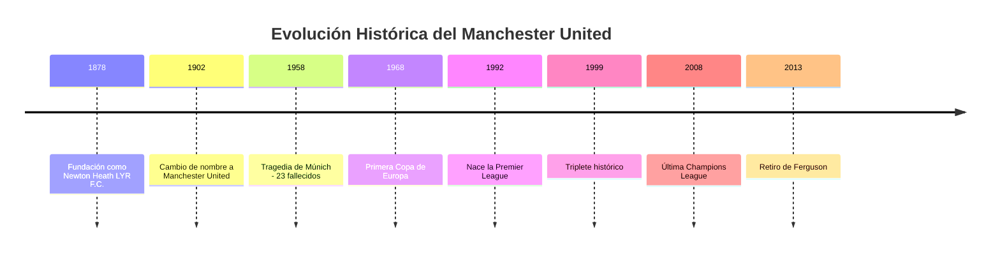
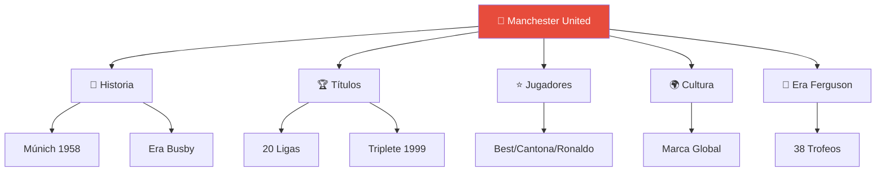

# 🔴 Manchester United: Wiki Completa

  

---

## 🧭 Descripción del Proyecto

Bienvenido a la **Wiki Completa del Manchester United**. Este proyecto académico ofrece un análisis exhaustivo e interconectado sobre uno de los clubes más legendarios del fútbol mundial, desde su fundación en 1878 hasta su consolidación como potencia global.

> [!NOTE]
> Todos los artículos están interconectados mediante enlaces bidireccionales, diagramas Mermaid y referencias cruzadas.

---

## 📚 Índice de Artículos

| 🏷️ Categoría | 📘 Artículo | 📝 Descripción | 🔗 Enlace |
|:-------------|:------------|:--------------|:---------|
| 🏰 **Historia** | Historia del Manchester United | Fundación, Múnich, era Busby y Ferguson | [➡️ Leer](articulo-1.md) |
| 🏆 **Títulos** | Títulos y Logros | Palmarés completo: 20 ligas, 3 Champions | [➡️ Leer](articulo-2.md) |
| 🌍 **Cultura** | Impacto Cultural | Influencia global, marcas y redes sociales | [➡️ Leer](articulo-3.md) |
| ⭐ **Jugadores** | Jugadores Icónicos | Best, Cantona y Cristiano Ronaldo | [➡️ Leer](articulo-4.md) |
| 👑 **Liderazgo** | La Era Ferguson | 26 años de dominio y 38 trofeos | [➡️ Leer](articulo-5.md) |

---

## 🕰️ Línea de Tiempo del Manchester United

---

## 🧠 Mapa Conceptual de Artículos

---

## 📊 Estadísticas del Contenido

| Tema | Artículos | Diagramas | Tablas | Palabras |
|------|-----------|-----------|--------|----------|
| 🏰 Historia | 1 | 2 | 3 | ~1,800 |
| 🏆 Títulos | 1 | 2 | 5 | ~1,600 |
| 🌍 Cultura | 1 | 2 | 3 | ~1,500 |
| ⭐ Jugadores | 1 | 1 | 3 | ~1,700 |
| 👑 Ferguson | 1 | 2 | 4 | ~1,800 |
| **TOTAL** | **5** | **9** | **18** | **~8,400** |

**Recursos:** [📚 Glosario](glosario.md) (13 términos) | [📖 Referencias](referencias.md) (20 fuentes)

---

## ❓ Preguntas Frecuentes (FAQ)

<strong>¿Cuándo se fundó el Manchester United?</strong>

Fundado en 1878 como Newton Heath, renombrado Manchester United en 1902. [Más info](articulo-1.md)

<strong>¿Qué fue la Tragedia de Múnich?</strong>

Accidente aéreo en 1958 que causó 23 muertes, incluyendo 8 jugadores. [Detalles](articulo-1.md#la-tragedia-de-múnich-1958)

<strong>¿Qué es el Triplete de 1999?</strong>

Premier League + FA Cup + Champions League en una temporada, único en Inglaterra. [Análisis](articulo-5.md#el-triplete-de-1999)

<strong>¿Cuántos títulos de liga tiene?</strong>

20 títulos de liga inglesa (récord compartido con Liverpool). [Ver palmarés](articulo-2.md)

<strong>¿Quién es Sir Alex Ferguson?</strong>

Manager más exitoso: 26 años (1986-2013), 38 trofeos, 13 ligas. [Artículo completo](articulo-5.md)

<strong>¿Qué es la "Clase del 92"?</strong>

Generación dorada: Beckham, Giggs, Scholes, Neville. [Más info](glosario.md#clase-del-92)

<strong>¿Qué significa "Fergie Time"?</strong>

Goles decisivos en minutos finales bajo Ferguson. [Definición](glosario.md#fergie-time)

<strong>¿Cuántas Champions League tiene?</strong>

3 títulos: 1968, 1999, 2008. [Ver títulos europeos](articulo-2.md#títulos-europeos)

<strong>¿Quiénes son los jugadores más icónicos?</strong>

George Best, Eric Cantona, Cristiano Ronaldo. [Perfiles completos](articulo-4.md)

<strong>¿Dónde están las referencias?</strong>

20 fuentes verificadas en [Referencias](referencias.md) organizadas por tipo.

---

## 🚀 Comienza Tu Exploración

**Rutas sugeridas según tu interés:**

- 📚 **Nuevo en el tema** → [Historia](articulo-1.md)
- 🏆 **Interesado en logros** → [Títulos](articulo-2.md)
- ⭐ **Fan de leyendas** → [Jugadores](articulo-4.md)
- 🧠 **Análisis de éxito** → [Era Ferguson](articulo-5.md)
- 🌍 **Impacto global** → [Cultura](articulo-3.md)

---

## 👨‍💻 Información del Proyecto

| Campo | Detalle |
|-------|---------|
| **Autor** | Estudiante de Documentación Técnica |
| **Tecnologías** | Markdown, Mermaid, GFM |
| **Fecha** | Octubre 2025 |
| **Recursos** | 5 artículos + Glosario + Referencias |

---

### 🔴 Manchester United: Más que un Club, una Leyenda

**[📖 Comenzar](articulo-1.md)** | **[📚 Glosario](glosario.md)** | **[📖 Referencias](referencias.md)**

---

*"Football, bloody hell!"* — Sir Alex Ferguson, 1999

[↑ Volver arriba](#-manchester-united-wiki-completa)