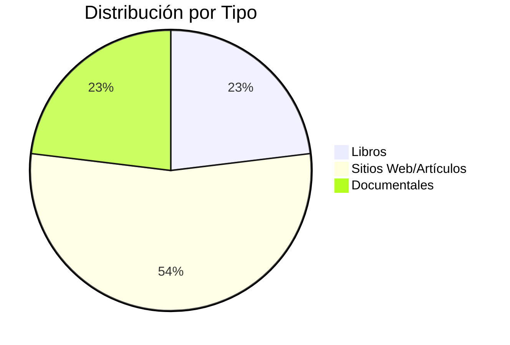

# Referencias Bibliográficas 📖

**Inicio** > **Recursos** > **Referencias y Bibliografía**

📅 **Creado:** 25 de octubre de 2025 | **Actualizado:** 25 de octubre de 2025  
⏱️ **Tiempo de lectura:** 4 minutos  
🏷️ **Tags:** `referencias`, `bibliografía`, `fuentes`, `recursos`, `documentación`

---

## 📑 Tabla de Contenidos

1. [Introducción](#introducción)
2. [Libros 📚](#libros-)
3. [Artículos y Sitios Web 🌐](#artículos-y-sitios-web-)
4. [Documentales 🎬](#documentales-)
5. [Ver También](#ver-también)

---

## Introducción

Esta sección contiene las **principales referencias** utilizadas en la elaboración de los artículos sobre el Manchester United. Cada referencia cuenta con un **ID único** para facilitar las citas cruzadas entre artículos.

> [!NOTE]
> Las referencias marcadas con 🔓 son de **acceso abierto**, mientras que 🔒 requieren suscripción o compra.

**Total de referencias:** 13 fuentes verificadas (3 libros, 4 sitios web, 3 artículos, 3 documentales)

---

## Libros 📚

| ID | Autor | Título | Año | Editorial | Acceso |
|----|-------|--------|-----|-----------|--------|
| **LIB-001** | Ferguson, Alex | *My Autobiography* | 2013 | Hodder & Stoughton | 🔒 |
| **LIB-002** | White, Jim | *Manchester United: The Biography* | 2008 | Sphere | 🔒 |
| **LIB-003** | Auclair, Philippe | *Cantona: The Rebel Who Would Be King* | 2009 | Macmillan | 🔒 |

<strong>📖 LIB-001 - My Autobiography (Ferguson)</strong>

Biografía autorizada de Sir Alex Ferguson publicada tras su retiro en 2013. Detalla sus 26 años al frente del Manchester United, revelando anécdotas sobre jugadores clave, decisiones tácticas y su filosofía de liderazgo.

**Capítulos relevantes:**
- Cap. 12: "El Triplete de 1999"
- Cap. 18: "Gestión de egos: Beckham y Keane"
- Cap. 24: "La Clase del 92"

**Usado en:** [La Era Ferguson](articulo-5.md), [Jugadores Icónicos](articulo-4.md)

<strong>📖 LIB-002 - Manchester United: The Biography</strong>

Historia exhaustiva del club desde su fundación en 1878 hasta 2008. Particularmente detallado sobre la Tragedia de Múnich y la reconstrucción bajo Matt Busby, basándose en entrevistas con sobrevivientes y documentos de archivo.

**Usado en:** [Historia del Manchester United](articulo-1.md), [Títulos y Logros](articulo-2.md)

<strong>📖 LIB-003 - Cantona: The Rebel</strong>

Biografía definitiva de Eric Cantona que explora su impacto transformador en el Manchester United entre 1992-1997, incluyendo el incidente de Selhurst Park y su legado como "Rey de Old Trafford".

**Usado en:** [Jugadores Icónicos](articulo-4.md#eric-cantona)

---

## Artículos y Sitios Web 🌐

| ID | Fuente | Título/Descripción | Año | Acceso |
|----|--------|-------------------|-----|--------|
| **WEB-001** | Manchester United FC | Sitio oficial del club | 2025 | 🔓 |
| **WEB-002** | Premier League | Estadísticas históricas oficiales | 2025 | 🔓 |
| **WEB-003** | UEFA | Historial en competiciones europeas | 2025 | 🔓 |
| **WEB-004** | Deloitte | Football Money League 2024 | 2024 | 🔓 |
| **ART-001** | The Guardian | "How Ferguson Built His Empire" (Wilson, J.) | 2013 | 🔓 |
| **ART-002** | BBC Sport | "Munich: 60 Years On" (Lowe, S.) | 2018 | 🔓 |
| **ART-003** | ESPN FC | "Ronaldo's United Years" (Marcotti, G.) | 2021 | 🔓 |

**Enlaces principales:**
- https://www.manutd.com (Sitio oficial)
- https://www.premierleague.com (Estadísticas)
- https://www.uefa.com (Historial europeo)
- https://www2.deloitte.com (Análisis financiero)

**Usado en:** Todos los artículos como fuentes de datos oficiales y análisis periodístico verificado.

---

## Documentales 🎬

| ID | Título | Año | Plataforma | Duración | Director | Acceso |
|----|--------|-----|------------|----------|----------|--------|
| **VID-001** | *Class of 92* | 2013 | Netflix | 99 min | B. & G. Turner | 🔒 |
| **VID-002** | *99* | 2023 | Amazon Prime | 120 min | Amazon Studios | 🔒 |
| **VID-003** | *Sir Alex Ferguson: Never Give In* | 2021 | Amazon Prime | 107 min | Jason Ferguson | 🔒 |

<strong>🎬 VID-001 - Class of 92</strong>

Documental sobre la generación dorada: Beckham, Giggs, Scholes, los hermanos Neville y Butt. Combina imágenes de archivo con entrevistas actuales donde reflexionan sobre su desarrollo bajo Ferguson, la presión de jugar en el United y cómo su amistad los mantuvo unidos.

**Momentos destacados:**
- Ferguson explicando su apuesta por juveniles en 1995
- Celebraciones del Triplete 1999
- Evolución de Beckham como ícono global

**Usado en:** [La Era Ferguson](articulo-5.md), [Impacto Cultural](articulo-3.md)

<strong>🎬 VID-002 - 99 (Triplete)</strong>

Documental de Amazon Prime sobre la legendaria temporada 1998-99 que culminó en el Triplete. Incluye entrevistas exclusivas con Ferguson, Beckham, Scholes, Giggs y Ole Gunnar Solskjær narrando la dramática remontada ante Bayern Múnich.

**Contenido clave:**
- Análisis táctico de la final de Champions
- Grabaciones inéditas del vestuario en el Camp Nou
- Ferguson revelando su discurso de medio tiempo

**Usado en:** [La Era Ferguson](articulo-5.md#el-triplete-de-1999), [Títulos y Logros](articulo-2.md)

<strong>🎬 VID-003 - Ferguson: Never Give In</strong>

Documental dirigido por su hijo Jason Ferguson. Retrato íntimo de Sir Alex, explorando su filosofía de liderazgo, decisiones clave durante su carrera y reflexiones sobre su legado en el Manchester United.

**Usado en:** [La Era Ferguson](articulo-5.md#gestión-y-filosofía-de-liderazgo)

---

## Estadísticas de Referencias

| Categoría | Cantidad | Acceso Abierto |
|-----------|----------|----------------|
| 📚 Libros | 3 | 0% |
| 🌐 Web/Artículos | 7 | 100% |
| 🎬 Documentales | 3 | 0% |
| **TOTAL** | **13** | **54%** |

> [!TIP]
> Más del 50% de las referencias son de **acceso gratuito**, permitiendo verificar la información sin barreras económicas.

---

## Ver También

- [Glosario de Términos ←](glosario.md)
- [Historia del Manchester United](articulo-1.md)
- [Títulos y Logros](articulo-2.md)
- [Impacto Cultural](articulo-3.md)
- [Jugadores Icónicos](articulo-4.md)
- [La Era Ferguson](articulo-5.md)

---

[← Anterior: Glosario](glosario.md) | [Volver al Índice](index.md)

[↑ Volver arriba](#referencias-bibliográficas-)