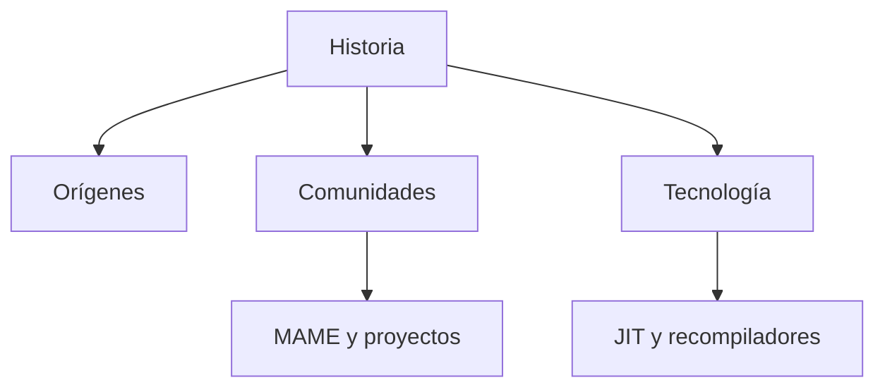
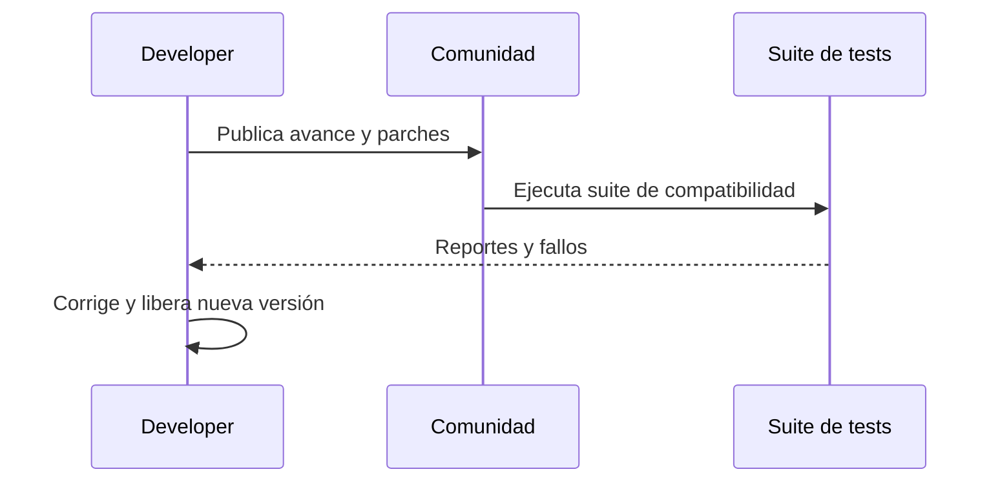

# 📜 Historia y evolución de los emuladores

**Breadcrumb:** [Inicio](index.md) > Historia > Historia y evolución de los emuladores  
**Creado:** 2025-09-10 · **Última actualización:** 2025-10-22  
**Tiempo estimado de lectura:** 12 min  
**Etiquetas:** `#historia` `#preservación` `#comunidad` `#emulación` `#retro`

---

## Tabla de contenidos
- [Introducción](#introducción)
- [Orígenes y primeros proyectos](#orígenes-y-primeros-proyectos)
  - [Tinkering temprano](#tinkering-temprano)
  - [Emulación en investigación](#emulación-en-investigación)
  - [Primeros emuladores públicos](#primeros-emuladores-públicos)
- [Consolidación en los 90s](#consolidación-en-los-90s)
  - [Comunidades y fanzines](#comunidades-y-fanzines)
  - [Desarrollo de herramientas](#desarrollo-de-herramientas)
  - [Casos notables](#casos-notables)
- [Modernización y precisión](#modernización-y-precisión)
  - [Recompiladores y JIT](#recompiladores-y-jit)
  - [Sincronización y timing](#sincronización-y-timing)
  - [Modelos de validación](#modelos-de-validación)
- [Impacto cultural y preservación](#impacto-cultural-y-preservación)
  - [Archivos digitales](#archivos-digitales)
  - [Museos y exposiciones](#museos-y-exposiciones)
  - [Educación e investigación](#educación-e-investigación)
- [Conclusiones y perspectivas](#conclusiones-y-perspectivas)
- [Notas y referencias](#notas-y-referencias)

---

## Introducción

La historia de los emuladores de videojuegos es una mezcla de ingeniería inversa, afición técnica y una labor de preservación cultural. Desde experimentos académicos y hobbyistas en los años 70 y 80 hasta proyectos de comunidad maduros en los 2000s y 2010s, la emulación ha permitido que software originalmente atado a hardware obsoleto siga siendo accesible. Este artículo explora los hitos principales, las motivaciones detrás de los desarrollos y cómo la evolución técnica respondió a desafíos concretos: timing, sincronización, y la fidelidad de audio/gráfica.

La emulación no es solo reproducir instrucciones de CPU; implica comprender y replicar comportamiento de chips gráficos (PPU/GPU), controladores de entrada, y efectos secundarios de hardware (por ejemplo, glitches dependientes del tiempo). A lo largo de décadas, los proyectos han pasado de intérpretes simples a recompiladores dinámicos (JIT), y de aproximaciones heurísticas a modelos exactos validados mediante herramientas y pruebas de regresión. Además, la comunidad ha jugado un rol central, documentando hardware, publicando tests y manteniendo repositorios de BIOS y herramientas (cuando la ley lo permite).

En términos culturales, la emulación ha posibilitado conservación, investigación académica y accesibilidad a títulos que de otro modo estarían perdidos. A su vez, ha generado debates legales (ver [Artículo 5](articulo-5.md)) y éticos sobre la distribución de ROMs, archivado y la responsabilidad de preservación. A lo largo del artículo se referenciarán fuentes históricas y estudios técnicos, incluidas páginas comunitarias y artículos académicos [1][2][3].

---

## Orígenes y primeros proyectos

### Tinkering temprano
Los experimentos iniciales de emulación estaban centrados en ejecutar instrucciones de un tipo de CPU en otro sistema, muchas veces con fines de investigación. Se documentaron intentos de recreación funcional en universidades y laboratorios.

### Emulación en investigación
En entornos académicos se exploró la emulación para estudiar arquitecturas y compatibilidad. Algunos primeros trabajos describen técnicas de traducción binaria y simuladores de hardware.

### Primeros emuladores públicos
A principios de los 90s surgieron proyectos comunitarios que buscaban ejecutar juegos de arcades y consolas en PC; esto marcó el inicio de una comunidad dedicada a compartir conocimiento técnico.

---

## Consolidación en los 90s

### Comunidades y fanzines
Foros, listas de correo y fanzines fueron cruciales para la difusión de documentación técnica y BIOS. Proyectos como MAME (arcade) ayudaron a profesionalizar la archivística.

### Desarrollo de herramientas
Herramientas de debugging, desensambladores y documentación de señales permitieron avanzar la precisión de emulación.

### Casos notables
Proyectos como MAME, FCEUX y otros se convirtieron en referentes — MAME por su objetivo de preservación de arcade y FCEUX por su utilidad para NES.

---

## Modernización y precisión

### Recompiladores y JIT
La llegada de recompiladores dinámicos aumentó el rendimiento sin sacrificar precisión. Técnicas como traducción de bloques y cache de código son detalladas en [Artículo 2](articulo-2.md).

### Sincronización y timing
Emular timings y ciclos por instrucción es crucial para reproducir efectos visuales o de audio dependientes del hardware. Las pruebas de sincronización fueron estandarizadas por la comunidad.

### Modelos de validación
Regresiones automatizadas y suites de tests (romhacks específicos y tests de timing) se usan para validar comportamientos entre versiones de emuladores.

---

## Impacto cultural y preservación

### Archivos digitales
Repositorios determinan políticas de acceso y conservación. La preservación digital garantiza que futuros investigadores puedan estudiar títulos originales.

### Museos y exposiciones
Museos usan emuladores para exhibir títulos sin depender del hardware frágil. Ejemplos de exposiciones usan emulación para mostrar historia interactiva.

### Educación e investigación
La emulación es herramienta educativa para enseñar arquitectura de computadores y diseño de sistemas embebidos.

---

## Conclusiones y perspectivas

La emulación ha pasado de ser una curiosidad técnica a una disciplina con impacto cultural. Las tendencias actuales apuntan a mayor precisión, colaboración con instituciones de preservación y estudio de aspectos legales. Las investigaciones sobre timing y modelos formales pueden ayudar a alcanzar fidelidad prácticamente indistinguible del hardware original.

---

## Diagramas Mermaid

Conceptual (flowchart):

Proceso (sequence):

---

## Tablas

Comparativa (alineación mixta):

| Emulador | Plataforma | Precisión | Rendimiento |
|:---|:---:|---:|---:|
| MAME | Arcade | Alta | Medio |
| FCEUX | NES | Media | Alta |
| bsnes | SNES | Muy alta | Medio-Bajo |
| Dolphin | GameCube/Wii | Alta | Alto |

Datos (5 filas):

| Año | Hito | Proyecto | Impacto | Referencia |
|---:|---|---|---:|---|
| 1980s | Primeros simuladores | (varios) | investigación | [R1] |
| 1995 | MAME inicia | MAME | preservación | [R2] |
| 2000 | JIT más comunes | varios | rendimiento | [R3] |
| 2010 | bsnes busca precisión | bsnes | precisión | [R4] |
| 2020 | Emulación en museos | varios | difusión | [R5] |

Resumen/conclusiones:

| Punto | Conclusión |
|---|---|
| Rol cultural | Alta importancia para preservación |
| Tecnología | Evolución hacia modelos más precisos |
| Comunidad | Motor principal del progreso |

---

## Bloques colapsables

Información adicional

La conservación de documentación técnica (datasheets, patentes) es clave para reconstruir hardware y mejorar exactitud de emuladores. Ver [glosario](glosario.md) para términos como BIOS, ROM, JIT.

Ejemplo detallado

Caso: cómo se reprodujo un glitch gráfico de SNES mediante análisis de señales y sincronización de PPU. Se describen pasos de debugging y pruebas de regresión.

Datos históricos / Contexto

Listado de fechas y equipos relevantes en la historia de la emulación, con enlaces a repositorios históricos.

---

## Alertas (2 tipos mínimos)

### ⚠️ Alerta de seguridad
- Evita descargar ROMs desde sitios no verificados; pueden incluir archivos ejecutables maliciosos.

> Nota: Esta es una alerta de tipo seguridad.

### ℹ️ Alerta informativa
- Algunas comunidades requieren que no publiques ROMs con copyright. Respeta licencias y términos.

> Nota: Esta es una alerta informativa/ético-legal.

---

## Citas destacadas

> "La emulación es tan buena como la documentación que la comunidad puede recolectar." — Archivo comunitario

> "Preservación digital requiere no solo emular, sino entender el contexto histórico." — Museo de Tecnología

> "El JIT transformó la viabilidad práctica de emuladores en PC comunes." — Informe técnico

---

## Enlaces internos 
- [Arquitectura técnica](articulo-2.md)
- [Emulación de consolas clásicas](articulo-3.md)
- [Optimizaciones modernas](articulo-4.md)
- [Legalidad y ética](articulo-5.md)
- [Glosario](glosario.md)

## Enlaces externos 
- https://en.wikipedia.org/wiki/Emulator
- https://www.mamedev.org/ (MAME)
- https://www.nesdev.org/ (Documentación técnica NES)

---

## Notas y referencias
[1] R1 — Historia temprana: "Early Computer Emulation Studies", 1985.  
[2] R2 — MAME project history (mamedocs).  
[3] R3 — Artículo sobre JIT en emuladores, 2002.

Ver lista completa en [referencias.md](referencias.md).

---

### Navegación
← Anterior: [↑ Volver arriba](index.md) · Siguiente → [Arquitectura técnica](articulo-2.md)