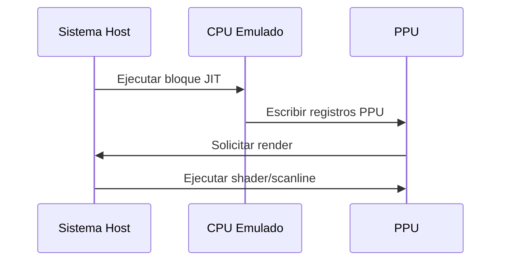

# ⚙️ Arquitectura técnica y componentes

**Breadcrumb:** [Inicio](index.md) > Técnica > Arquitectura técnica y componentes  
**Creado:** 2025-09-12 · **Última actualización:** 2025-10-20  
**Tiempo estimado de lectura:** 14 min  
**Etiquetas:** `#técnico` `#cpu` `#gpu` `#jit` `#memoria`

---

## Tabla de contenidos
- [Introducción](#introducción)
- [Componentes principales](#componentes-principales)
  - [CPU emulación](#cpu-emulación)
  - [GPU/PPU emulación](#gpuppu-emulación)
  - [Audio y sincronización](#audio-y-sincronización)
- [Modelos de traducción](#modelos-de-traducción)
  - [Intérprete](#intérprete)
  - [Recompilador estático](#recompilador-estático)
  - [JIT / Recompilador dinámico](#jit--recompilador-dinámico)
- [Sistemas auxiliares](#sistemas-auxiliares)
  - [Sistema de archivos y BIOS](#sistema-de-archivos-y-bios)
  - [Input y drivers virtuales](#input-y-drivers-virtuales)
  - [Integración con GPU host](#integración-con-gpu-host)
- [Herramientas de validación](#herramientas-de-validación)
  - [Suites de tests](#suites-de-tests)
  - [Logging y trazas](#logging-y-trazas)
  - [Reproducción determinística](#reproducción-determinística)
- [Prácticas y optimizaciones](#prácticas-y-optimizaciones)
- [Notas y referencias](#notas-y-referencias)

---

## Introducción

Este artículo describe la arquitectura típica de un emulador moderno, desgranando los componentes esenciales: emulación de CPU, emulación de GPU/PPU, manejo de audio, sincronización, y los distintos enfoques de traducción de código (intérprete vs recompilador estático vs JIT). También se exploran sistemas auxiliares como BIOS y drivers virtuales, y herramientas para validar la precisión del emulador. El objetivo es proporcionar una visión técnica práctica que permita entender por qué ciertos emuladores son más precisos o más rápidos que otros y cómo se equilibran requisitos de rendimiento y fidelidad.

Se incluyen ejemplos de implementación conceptual en pseudocódigo, diagramas de flujo, y secuencias de proceso que ilustran la interacción entre CPU emulada y subsistemas (GPU, audio). Además, se presentan casos de optimización comunes —ejemplo: cache de traducción, fusión de bloques básicos, mitigación de interrupciones— y su impacto real en latencia y sincronización.

---

## Componentes principales

### CPU emulación
- Fundamento: interpretar o traducir instrucciones del CPU original a instrucciones del host.
- Subcomponentes: decodificador, ejecutor de instrucciones, unidad de estado.

#### Subsecciones
- Pipeline de ejecución
- Manejo de interrupciones
- Acceso a memoria (MMU/mapper)

### GPU/PPU emulación
- Replicar rasterizado, paletas y modos gráficos.
- Emulación de efectos por scanline y latencias.

#### Subsecciones
- Emulación por scanline
- Empleo de shaders en el host
- Reproducción de efectos especiales

### Audio y sincronización
- Emulación de APU y generación de buffers de audio.
- Sincronización entre audio y vídeo, y problemas de jitter.

#### Subsecciones
- Buffering y sample rates
- Latencia de salida de audio
- Sincronización frame-locked

---

## Modelos de traducción

### Intérprete
Traduce y ejecuta instrucción a instrucción. Ventajas: simplicidad y control. Desventajas: rendimiento.

### Recompilador estático
Precompila bloques con heurísticas. Bueno para entornos controlados.

### JIT / Recompilador dinámico
Dinamiza recompilación en tiempo de ejecución, caché de bloques, y optimizaciones específicas.

---

## Sistemas auxiliares

### Sistema de archivos y BIOS
- Emulación de BIOS requiere imágenes originales; en algunos casos la comunidad usa dumps legales.
- Virtual filesystem para juegos con mapping de ROMs.

### Input y drivers virtuales
- Mapeo de controladores físicos a puertos emulados.
- Soporte para hotplug y remapeo.

### Integración con GPU host
- Uso de OpenGL/Vulkan/DirectX para renderizado acelerado y shaders personalizados.

---

## Herramientas de validación

### Suites de tests
- Tests de paquete (test ROMs) para validar timing y comportamiento.

### Logging y trazas
- Herramientas para comparar trazas entre hardware y emulador.

### Reproducción determinística
- Grabación de estado y reproducción para debugging.

---

## Prácticas y optimizaciones

- Cache de traducción y flush selectivo.
- Inline de instrucciones críticas.
- Uso de SIMD y optimizaciones por plataforma.
- Técnicas para evitar stalls en host.

---

## Diagramas Mermaid

Conceptual (flowchart):

```mermaid
flowchart LR
  CPU_EMU[CPU Emulado] --> MMU[MMU/Mapper]
  CPU_EMU --> APU[Audio (APU)]
  CPU_EMU --> PPU[PPU/GPU Emulado]
  PPU --> RENDER[Render Host (Vulkan/OpenGL)]
  APU --> AUDIO_OUT[Buffer de Audio]
```

Proceso (sequence):



---

## Tablas

Comparativa (alineación mixta):

| Técnica | Precisión | Rendimiento | Uso típico |
|:---|:---:|---:|---|
| Intérprete | Alta (depende) | Bajo | Debugging |
| JIT | Alta | Alto | Emuladores de consola modernos |
| Recompilador estático | Media | Medio-Alto | Plataformas específicas |

Datos (5 filas):

| Subcomponente | Problema | Optimización | Impacto | Ejemplo |
|---|---|---|---:|---|
| Decodificador | Branching | Cache de bloques | +30% | JIT |
| PPU | Scanline effects | Batch rendering | +25% | SNES |
| APU | Jitter | Buffer adaptativo | -latencia | NES |
| MMU | Mapper variados | Tabla mapeada | +compatibilidad | NES mappers |
| I/O | Polling | Event-driven | +eficiencia | Controllers |

Resumen/conclusiones:

| Ángulo | Recomendación |
|---|---|
| Rendimiento | Usar JIT con caching responsable |
| Precisión | Mantener pruebas de regresión |
| Desarrollo | Modularizar subsistemas |

---

## Bloques colapsables

<details>
<summary>Información adicional</summary>

Pseudocódigo de ejemplo para un pequeño JIT: cómo convertir un bloque de 6502 a x86-64 y cachearlo.

</details>

<details>
<summary>Ejemplo detallado</summary>

Ejemplo de optimización: fusión de accesos a memoria contigua para reducir llamadas a MMU virtual.

</details>

<details>
<summary>Datos históricos / Contexto</summary>

Cómo evolucionó la adopción de JIT en emuladores de consola desde 2000 a 2015.

</details>

---

## Alertas (2 tipos)

### ⚠️ Alerta de rendimiento
- Compilar en modo debug puede degradar drásticamente el rendimiento. Usa builds optimizadas para evaluar velocidad real.

### 🛡️ Alerta de compatibilidad
- Aplicar optimizaciones agresivas puede romper compatibilidad; mantener test-suite para evitar regresiones.

---

## Citas

> "El JIT fue el cambio de paradigma que hizo viable la emulación de sistemas complejos en PCs domésticos." — Informe técnico

> "Sin una MMU correctamente modelada, muchos juegos presentan glitches imposibles de predecir." — Documento de desarrollo

> "Los shaders permiten mapear comportamientos del PPU al GPU moderno para mejorar performance sin perder fidelidad." — Blog de desarrollo

---

## Enlaces internos 
- [Historia y evolución](articulo-1.md)
- [Emulación de consolas clásicas](articulo-3.md)
- [Emuladores modernos y optimizaciones](articulo-4.md)
- [Legalidad y ética](articulo-5.md)
- [Glosario](glosario.md)

## Enlaces externos 
- https://www.nesdev.org/ (documentación técnica)
- https://www.romhacking.net/ (comunidad técnica)
- https://dolphin-emu.org/ (ejemplo de emulador complejo)

---

## Notas y referencias
Referencias técnicas y papers listados en [referencias.md](referencias.md).

---

### Navegación
← Anterior: [Artículo 1](articulo-1.md) · Siguiente → [Artículo 3](articulo-3.md) · ↑ [Volver arriba](index.md)