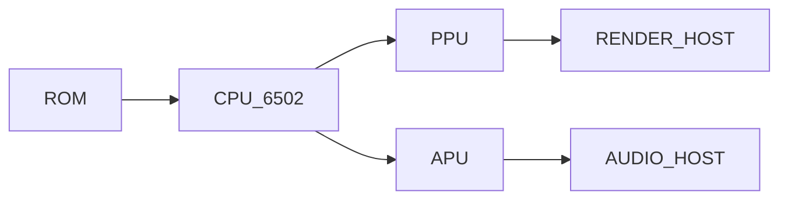
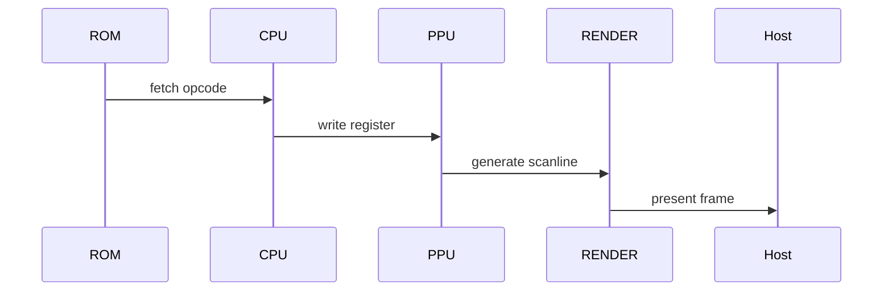

# 🕹️ Emulación de consolas clásicas (NES / SNES)

**Breadcrumb:** [Inicio](index.md) > Consolas clásicas > Emulación de consolas clásicas  
**Creado:** 2025-08-30 · **Última actualización:** 2025-10-18  
**Tiempo estimado de lectura:** 16 min  
**Etiquetas:** `#NES` `#SNES` `#compatibilidad` `#ppuhacks`

---

## Tabla de contenidos
- [Introducción](#introducción)
- [Emulación NES](#emulación-nes)
  - [Arquitectura 6502 y mappers](#arquitectura-6502-y-mappers)
  - [PPU y efectos por scanline](#ppu-y-efectos-por-scanline)
  - [Casos de compatibilidad](#casos-de-compatibilidad)
- [Emulación SNES](#emulación-snes)
  - [SPC700 y audio](#spc700-y-audio)
  - [PPU multimodo y efectos especiales](#ppu-multimodo-y-efectos-especiales)
  - [Render pipeline y shaders](#render-pipeline-y-shaders)
- [Herramientas y emuladores recomendados](#herramientas-y-emuladores-recomendados)
  - [FCEUX / Nestopia](#fceux--nestopia)
  - [bsnes / higan](#bsnes--higan)
  - [Utils y depuración](#utils-y-depuración)
- [Comparativas y rendimiento](#comparativas-y-rendimiento)
- [Conclusión](#conclusión)
- [Notas y referencias](#notas-y-referencias)

---

## Introducción

La emulación de consolas clásicas como NES y SNES es un campo de estudio distintivo por su relación estrecha entre hardware sencillo pero con timing crítico, y técnicas creativas aplicadas por desarrolladores. Aunque las arquitecturas de estas consolas son menos complejas que las modernas, reproducir efectos visuales y de audio exactos exige cuidado: por ejemplo, el PPU del NES genera sprites por scanline con prioridades y glitches explotables; en SNES, modos gráficos y chips adicionales (como SuperFX o SA-1) introducen retos de compatibilidad.

Este artículo estudia la arquitectura (6502 / Ricoh 2A03 para NES y 65c816 para SNES), los mappers de memoria, la PPU, la APU (SPC700), y las técnicas empleadas por emuladores para replicar comportamiento. También ofrece comparativas prácticas entre emuladores populares y guía sobre debug y optimización. Se incluyen diagrams Mermaid, tablas comparativas y ejemplos de casos donde pequeñas diferencias de timing cambian la jugabilidad.

---

## Emulación NES

### Arquitectura 6502 y mappers
El CPU 6502 (variante Ricoh) y los mappers (MMC1, MMC3, etc.) determinan cómo se organiza la memoria. Emular mappers correctamente es clave para compatibilidad.

#### Subsections
- MMC1: bank switching básico
- MMC3: IRQ por scanline
- CHR/RAM vs CHR-ROM

### PPU y efectos por scanline
PPU trabaja por scanline; muchos efectos visuales se basan en cambios durante el render.

#### Subsections
- Sprites y prioridades
- Scroll por scanline (parallax)
- Glitches explotables

### Casos de compatibilidad
- Juegos que emplean IRQs de mapper y timing preciso (ej: ciertos títulos de Konami).
- Técnicas de testeo y ROMs de validación.

---

## Emulación SNES

### SPC700 y audio
SPC700 es la CPU de audio; sus efectos y sample rates requieren modelado fino.

#### Subsections
- Formato de samples
- DSP y efectos
- Sincronización APU/PPU

### PPU multimodo y efectos especiales
La SNES dispone de múltiples modos gráficos, cada uno con comportamientos distintos.

#### Subsections
- Modos 7, 5, 4
- Efectos de mosaico y color math
- Chips especiales (SuperFX, SA-1)

### Render pipeline y shaders
Mapear efectos del PPU a shaders modernos puede mejorar rendimiento sin perder fidelidad.

#### Subsections
- Emulación por scanline en host GPU
- Uso de shaders para blending
- Problemas de precisión colorimétrica

---

## Herramientas y emuladores recomendados

### FCEUX / Nestopia
Emuladores NES con buen balance entre debugging y ejecución.

### bsnes / higan
Orientados a precisión, bsnes (parte de higan) busca comportarse como hardware real.

### Utils y depuración
- Debbugers de CPU y PPU
- Tracing y comparativas frame a frame

---

## Comparativas y rendimiento

Comparativa (alineación mixta):

| Emulador | Precisión | Funcionalidades | Recomendado para |
|:---|:---:|---:|---|
| FCEUX | Media | Herramientas debugging | Speedruns / debugging |
| Nestopia | Media-Alta | Interfaz amigable | Uso casual |
| bsnes/higan | Muy alta | Precisión, sync | Investigación / preservación |

Tabla de datos (5 filas):

| Emulador | Plataforma | Mappers soportados | JIT | Shaders |
|---|---|---:|---:|---:|
| FCEUX | Windows/Linux | Muchos | No | Limitado |
| Nestopia | Multi | Variados | Parcial | Sí |
| bsnes | Multi | Completo | Parcial | Sí |
| Mesen | Windows | Completo | Sí | Sí |
| higan | Multi | Completo | No | No |

Resumen:

| Aspecto | Recomendación |
|---|---|
| Retrocompatibilidad | bsnes/higan para estudio |
| Juegos speedrun | FCEUX o Mesen por herramientas |

---

## Diagramas Mermaid

Conceptual:

Proceso (sequence):

---

## Bloques colapsables

Información adicional

Mapas de memoria típicos y cómo implementarlos en un emulador básico.

Ejemplo detallado

Walkthrough: implementar soporte básico para MMC3 y cómo testear IRQs por scanline.

Datos históricos

Cronología de lanzamientos de emuladores NES/SNES y su evolución técnica.

---

## Alertas (mínimo 2)

### ⚠️ Alerta de compatibilidad
- Algunos hacks de ROMs rompen tests de compatibilidad; mantén copias originales para debugging.

### ✅ Alerta de uso
- Para speedrunning y debugging, utiliza builds con herramientas de logging.

---

## Citas

> "El PPU del NES hace posible efectos que solo se comprenden observando el hardware en tiempo real." — Documento técnico

> "El chip SuperFX cambió lo que la SNES podía mostrar; emularlo fielmente fue un desafío." — Artículo histórico

> "La emulación de audio es tan crítica como la gráfica para experiencias auténticas." — Estudio de audio en emulación

---

## Enlaces internos 
- [Historia](articulo-1.md)
- [Arquitectura técnica](articulo-2.md)
- [Optimizaciones modernas](articulo-4.md)
- [Legalidad y ética](articulo-5.md)
- [Glosario](glosario.md)

## Enlaces externos 
- https://www.nesdev.org/ (NES development)
- https://wiki.superfamicom.org/ (SNES docs)
- https://www.romhacking.net/ (tools & docs)

---

## Notas y referencias
Consultar [referencias.md](referencias.md) para fuentes completas. IDs relevantes: [R2], [R4], [R6].

---

### Navegación
← Anterior: [Artículo 2](articulo-2.md) · Siguiente → [Artículo 4](articulo-4.md) · ↑ [Volver arriba](index.md)