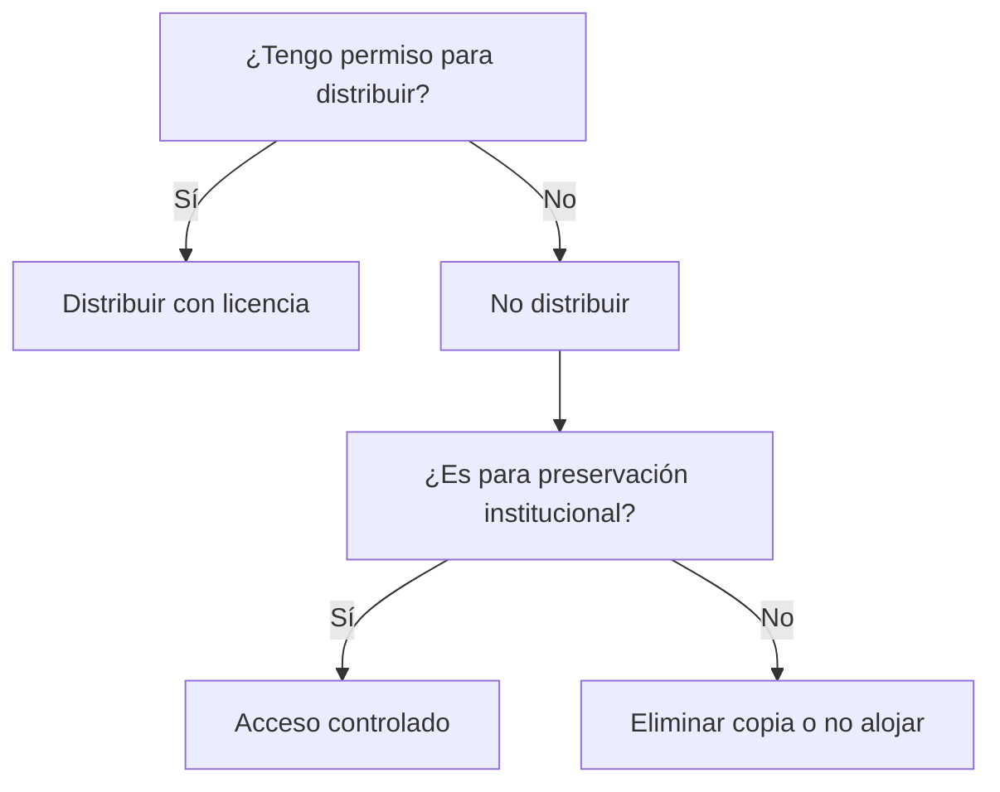

# ⚖️ Legalidad y ética de los emuladores

**Breadcrumb:** [Inicio](index.md) > Legalidad > Legalidad y ética de los emuladores  
**Creado:** 2025-08-01 · **Última actualización:** 2025-10-22  
**Tiempo estimado de lectura:** 10 min  
**Etiquetas:** `#legal` `#ética` `#copyright` `#preservación`

---

## Tabla de contenidos
- [Introducción](#introducción)
- [Aspectos legales básicos](#aspectos-legales-básicos)
  - [Derechos de autor y ROMs](#derechos-de-autor-y-roms)
  - [BIOS y firmware](#bios-y-firmware)
  - [Excepciones y preservación](#excepciones-y-preservación)
- [Modelos de uso responsable](#modelos-de-uso-responsable)
  - [Archivado y acceso controlado](#archivado-y-acceso-controlado)
  - [Licencias y liberaciones](#licencias-y-liberaciones)
  - [Políticas de comunidades](#políticas-de-comunidades)
- [Casos judiciales y precedentes](#casos-judiciales-y-precedentes)
  - [Demandas históricas](#demandas-históricas)
  - [Sentencias y su impacto](#sentencias-y-su-impacto)
  - [Guías de compliance](#guías-de-compliance)
- [Conclusión](#conclusión)
- [Notas y referencias](#notas-y-referencias)

---

## Introducción

Los emuladores per se no son ilegales; en muchos países, el acto de emular es una ingeniería legítima. Las controversias surgen por la distribución y uso de ROMs y BIOS propietarios. Este artículo resume principios legales comunes, prácticas responsables para preservación y guía para evitar problemas legales. También incluye ejemplos, FAQs y recomendaciones para investigadores y desarrolladores.

---

## Aspectos legales básicos

### Derechos de autor y ROMs
- En general, copiar y distribuir ROMs sin permiso viola derechos de autor.
- Uso personal privado puede estar regulado por excepciones locales (p. ej. copia privada), pero no universal.

### BIOS y firmware
- BIOS propietarios suelen estar sujetos a copyright y no deben distribuirse sin permiso.

### Excepciones y preservación
- Instituciones de preservación pueden, en algunos marcos, realizar copias para conservación.

---

## Modelos de uso responsable

### Archivado y acceso controlado
- Instituciones pueden mantener archivos con acceso restringido para investigación.

### Licencias y liberaciones
- Algunos fabricantes han liberado firmware o juegos en dominio o bajo licencias libres (ej: recopilaciones).

### Políticas de comunidades
- Las comunidades de emulación suelen fomentar no distribuir ROMs con copyright y centrarse en documentación.

---

## Casos judiciales y precedentes

### Demandas históricas
- Casos notables contra sitios de ROMs han presionado a retirar contenido, aunque los emuladores en sí rara vez son el foco legal.

### Sentencias y su impacto
- Precedentes varían por jurisdicción; consultar asesoría legal local.

### Guías de compliance
- Mantener documentación, evitar hosting de ROMs, y colaborar con entidades de preservación.

---

## Diagramas Mermaid (mapa de decisión)

---

## Tablas

Comparativa (alineación mixta):

| Acción | Legalidad típica | Recomendación |
|:---|---:|---|
| Emular localmente con copia propia | Varía | Verificar excepciones |
| Distribuir ROMs | Ilegal en muchos países | No recomendado |
| Preservación institucional | Posible con permisos | Coordinar con titulares |

Datos (5 filas):

| Jurisdicción | Excepción copia privada | Protecciones | Notas | Ref |
|---|---:|---|---|---|
| USA | Limitada | DMCA | Interposición frecuente | [R7] |
| EU | Depende país | Copyright directive | Variaciones locales | [R8] |
| JP | Estricta | Copyright | Protección fuerte | [R9] |
| BR | Excepciones | Ley local | Casos recientes | [R10] |
| ES | Excepciones para copia privada | Ley nacional | Consultar abogados | [R11] |

Resumen/conclusiones:

| Aspecto | Recomendación práctica |
|---|---|
| Desarrollo de emuladores | Publicar código, no ROMs |
| Uso educativo | Preferir ROMs con permiso o dominio público |
| Preservación | Colaborar con instituciones y propietarios |

---

## Bloques colapsables

Información adicional

Cómo documentar un proyecto para reducir riesgos legales: políticas de contribución, disclaimers y zonas de contenido (no incluir ROMs).

Ejemplo detallado

Caso práctico: cómo una universidad archivó títulos con permiso y creó un entorno de acceso controlado para investigadores.

Datos históricos

Cronología de acciones legales relevantes contra repositorios de ROMs.

---

## Alertas (2 tipos)

### ⚖️ Alerta legal
- No hospedes ni distribuyas imágenes de ROM/Bios con copyright.

### ⚠️ Alerta operativa
- Evita instrucciones que faciliten la descarga ilegal de contenido; enfócate en preservación y estudios técnicos.

---

## Citas

> "La emulación tiene valor científico; su práctica debe convivir con respeto a la ley." — Informe académico

> "Las instituciones son clave para la preservación legal y ética." — Directiva cultural

> "La comunidad debe evitar ser cómplice de la piratería." — Código de conducta

---

## Enlaces internos 
- [Historia y preservación](articulo-1.md)
- [Arquitectura técnica](articulo-2.md)
- [NES/SNES](articulo-3.md)
- [Optimizaciones](articulo-4.md)
- [Glosario](glosario.md)

## Enlaces externos 
- https://www.copyright.gov/ (US Copyright Office)
- https://eur-lex.europa.eu/ (Legislación EU)
- https://www.ifpi.org/ (Informes industria)

---

## Notas y referencias
Ver [referencias.md](referencias.md) para información detallada sobre casos y documentos legales (IDs R7-R11).

---

### Navegación
← Anterior: [Artículo 4](articulo-4.md) · Siguiente → [↑ Volver arriba](index.md)