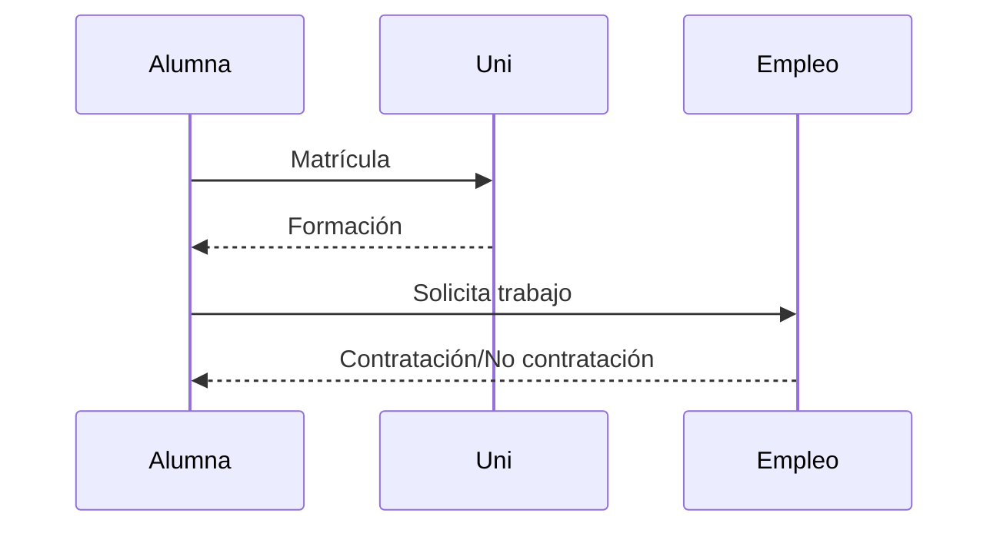

# Panorama histórico 🕰️

**Breadcrumb:** [Inicio](index.md) > Panorama > Panorama histórico  
**Creado:** 2025-10-22 — **Última actualización:** 2025-10-22  
**Tiempo de lectura:** 12 min — **Etiquetas:** #historia #pioneras #contexto

## Tabla de contenidos
- [Introducción](#introducción)
- [Orígenes y pioneras](#orígenes-y-pioneras)
  - [Ada Lovelace](#ada-lovelace)
  - [Hertha Ayrton](#hertha-ayrton)
  - [Edith Clarke](#edith-clarke)
- [Siglo XX: expansión y guerra](#siglo-xx-expansión-y-guerra)
  - [Contribuciones en tiempos de guerra](#contribuciones-en-tiempos-de-guerra)
  - [Computación temprana](#computación-temprana)
  - [Barreras institucionales](#barreras-institucionales)
- [Movimiento contemporáneo](#movimiento-contemporáneo)
  - [Educación y matriculación]
  - [Organizaciones y redes]
  - [Políticas públicas]
- [Conclusiones y recursos](#conclusiones-y-recursos)

## Introducción

La historia de las mujeres en la ingeniería es extensa y a menudo subrepresentada en relatos convencionales. Desde la figura pionera de Ada Lovelace en el siglo XIX hasta las ingenieras contemporáneas que lideran proyectos de infraestructura y software, las mujeres han contribuido de forma decisiva a avances tecnológicos. Esta sección ofrece una panorámica histórica que examina hitos, figuras claves y cambios sociales que afectaron la participación femenina en disciplinas técnicas.

Durante el siglo XIX y buena parte del XX, las mujeres enfrentaron barreras legales y culturales para acceder a la educación técnica y a empleos en ingeniería. Aun así, muchas encontraron caminos alternativos: trabajo técnico en fábricas, roles en investigación, y contribuciones fundamentales en computación y telecomunicaciones. A lo largo del siglo XX, los conflictos bélicos crearon demandas técnicas que abrieron puertas temporales a las mujeres; después de las guerras, la institucionalización y profesionalización de la ingeniería mantuvo obstáculos, pero también surgieron movimientos y redes que promovieron la inclusión. En las últimas décadas, políticas de igualdad, becas y organizaciones profesionales han aumentado la visibilidad y la matriculación de mujeres en programas de ingeniería.

Este artículo cita fuentes históricas y modernas (véase [Referencias](referencias.md)).

Enlaces internos: [Barreras y género](articulo-2.md), [Avances técnicos](articulo-3.md), [Modelos a seguir](articulo-4.md), [Glosario](glosario.md), [Referencias](referencias.md).

Enlaces externos: https://en.wikipedia.org/wiki/Ada_Lovelace, https://www.ieee.org/, https://unesdoc.unesco.org/

## Orígenes y pioneras

Breve repaso de figuras clave.

### Ada Lovelace

Ada Lovelace (1815–1852) es reconocida por su trabajo sobre la máquina analítica de Charles Babbage y por describir algoritmos que la máquina podría ejecutar —considerada por muchos como la primera programadora.[1]

### Hertha Ayrton

Hertha Ayrton (1854–1923) fue ingeniera e inventora británica conocida por trabajos en electricidad y por patentes en disipadores de arco eléctrico.[2]

### Edith Clarke

Edith Clarke (1883–1959) fue la primera mujer ingeniera eléctrica profesional en Estados Unidos y una de las primeras profesoras de ingeniería eléctrica en la Universidad de Texas. Su trabajo en análisis de líneas de transmisión y el uso de tablas logarítmicas fue influyente.[3]

## Siglo XX: expansión y guerra

### Contribuciones en tiempos de guerra

Durante ambas guerras mundiales, muchas mujeres desempeñaron roles técnicos, desde producción en fábricas hasta trabajos de codificación y análisis técnico. Estos roles demostraron capacidad técnica y alteraron percepciones sociales, aunque muchas mujeres fueron desplazadas tras el conflicto.

### Computación temprana

Mujeres como Grace Hopper y las programadoras de ENIAC desempeñaron papeles cruciales en el desarrollo de lenguajes y prácticas de programación temprana.[4]

### Barreras institucionales

Las universidades y colegios técnicos impusieron barreras —desde requisitos de admisión hasta políticas internas— que limitaron la participación femenina hasta bien entrado el siglo XX.

## Movimiento contemporáneo

### Educación y matriculación

En muchas regiones, la matriculación de mujeres en ingeniería ha aumentado, aunque aún existe brecha de género en ciertas especialidades como ingeniería eléctrica y mecánica.

### Organizaciones y redes

Organizaciones como IEEE Women in Engineering, Society of Women Engineers (SWE) y asociaciones locales han creado mentorías y programas que mejoran la retención.

### Políticas públicas

Iniciativas gubernamentales y universitarias han puesto foco en becas, campañas y objetivos de diversidad para aumentar la presencia femenina.

## Diagramas

Conceptual (flowchart):

Procesos (sequence):

## Tablas

Comparativa (alineación mixta):

| Aspecto | Antes | Ahora |
|:---|:---:|---:|
| Acceso a educación | Muy limitado | Mejorado|
| Representación en profesiones | Baja | En aumento|
| Políticas de inclusión | Escasas | Más comunes|

Tabla de datos (5 filas):

| Año | % mujeres en STEM | Observación |
|---:|---:|---|
| 1980 | 10% | Datos históricos |
| 1990 | 18% | Incremento gradual |
| 2000 | 25% | Programas iniciales |
| 2010 | 28% | Más iniciativas |
| 2020 | 32% | Foco en diversidad |

Resumen / conclusiones:

| Punto | Resumen |
|---|---|
| Mensaje principal | La participación crece, pero persisten brechas. |

## Bloques colapsables

Información adicional

Datos extendidos y enlaces a archivos PDF y artículos históricos.

Ejemplo detallado

Caso de estudio sobre la participación femenina en una universidad técnica.

Datos históricos

Cronología ampliada por década.

## Alertas GitHub
> **Nota:** Revisa las estadísticas locales antes de extrapolar conclusiones.

> [!WARNING] Las cifras pueden variar según la región y la fuente.

## Citas destacadas
> “La historia tecnológica no está completa sin las mujeres que la construyeron.”

> “Reconocer aportes olvidados es parte de la reparación histórica.”

> “La educación inclusiva transforma el ecosistema profesional.”

## Notas y Referencias
[1] Sobre Ada Lovelace: https://en.wikipedia.org/wiki/Ada_Lovelace
[2] Hertha Ayrton: https://en.wikipedia.org/wiki/Hertha_Ayrton
[3] Edith Clarke: https://en.wikipedia.org/wiki/Edith_Clarke
[4] Grace Hopper y ENIAC: https://en.wikipedia.org/wiki/Grace_Hopper

---

← [Anterior (Índice)](index.md) — [Siguiente →](articulo-2.md)
[↑ Volver arriba](#panorama-histórico-🕰️)
