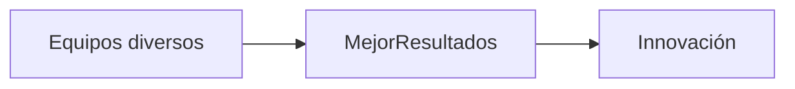
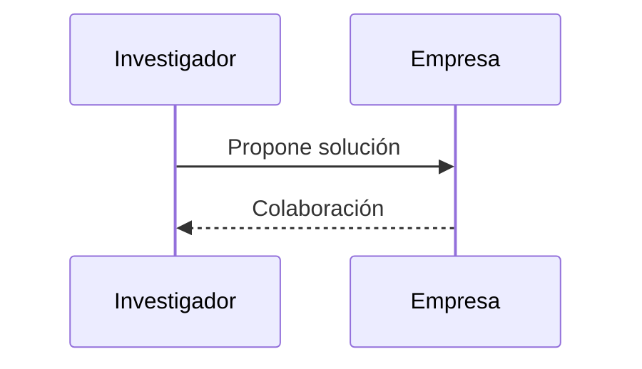

# Avances técnicos y contribuciones 🛠️

**Breadcrumb:** [Inicio](index.md) > Avances > Avances técnicos  
**Creado:** 2025-10-22 — **Última actualización:** 2025-10-22  
**Tiempo de lectura:** 10 min — **Etiquetas:** #tecnología #innovación #casos

## Tabla de contenidos
- [Introducción](#introducción)
- [Áreas con impacto](#áreas-con-impacto)
  - [Software y computación]
  - [Ingeniería civil y ambiental]
  - [Ingeniería biomédica]
- [Proyectos emblemáticos](#proyectos-emblemáticos)
  - [Proyectos de infraestructura]
  - [Startups fundadas por mujeres]
  - [Investigación académica]
- [Retos técnicos actuales](#retos-técnicos-actuales)
- [Conclusiones y recursos](#conclusiones-y-recursos)

## Introducción

Las mujeres han liderado proyectos técnicos en software, infraestructuras y ciencia aplicada. Este artículo presenta avances concretos, casos de estudio y analiza el impacto de equipos diversos en la innovación.

Enlaces internos: [Panorama histórico](articulo-1.md), [Barreras y género](articulo-2.md), [Modelos a seguir](articulo-4.md), [Glosario](glosario.md), [Referencias](referencias.md).

Enlaces externos: Women in Engineering - IEEE (https://wie.ieee.org), UNESCO reports.

## Áreas con impacto

### Software y computación

Mujeres han contribuido en ecosistemas de software, desde lenguajes de programación hasta algoritmos. Equipos diversos tienden a producir código con menos sesgos.

### Ingeniería civil y ambiental

Liderazgo en proyectos de diseño, sostenibilidad y resiliencia climática.

### Ingeniería biomédica

Alta representación en investigación y desarrollo de dispositivos médicos.

## Proyectos emblemáticos

### Proyectos de infraestructura

Ingenieras lideran el diseño de sistemas de agua y transporte más sostenibles.

### Startups fundadas por mujeres

Ejemplos regionales y globales de emprendimientos tecnológicos con fundadoras mujeres.

### Investigación académica

Publicaciones en top journals y colaboraciones interdisciplinarias.

## Diagramas

Conceptual (flowchart):

Proceso (sequence):

## Tablas

Comparativa (alineación mixta):

| Área | Ejemplo | Impacto |
|:---|:---:|---:|
| Software | Algoritmos inclusivos | Alto |
| Civil | Infraestructura resiliente | Medio |

Tabla de datos (5 filas):

| ID | Proyecto | Año | País |
|---:|---|---:|---|
| 1 | Red de agua sostenible | 2018 | Perú |
| 2 | Plataforma educativa | 2020 | México |
| 3 | Dispositivo médico | 2019 | España |
| 4 | Startup IA | 2021 | Argentina |
| 5 | Proyecto solar | 2022 | Chile |

Resumen / conclusiones:

| Punto | Resumen |
|---|---|
| Impacto | La diversidad impulsa soluciones más robustas. |

## Bloques colapsables

Información adicional

Enlaces a papers y recursos técnicos.

Ejemplo detallado

Estudio de caso técnico completo.

Datos históricos

Evolución de proyectos liderados por mujeres.

## Alertas GitHub
> **Nota:** Revisa licencias y permisos al usar datos de proyectos.

## Notas y Referencias
Ver [Referencias](referencias.md) para fuentes.

---

← [Anterior](articulo-2.md) — [Siguiente →](articulo-4.md)
[↑ Volver arriba](#avances-técnicos-y-contribuciones-🛠️)
