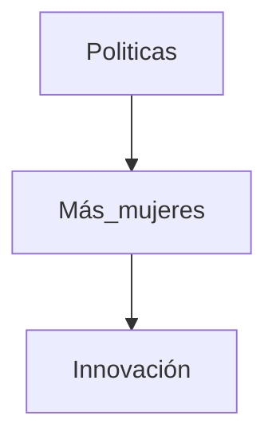
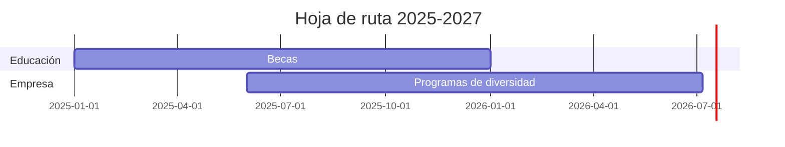

# Futuro y políticas 🚀

**Breadcrumb:** [Inicio](index.md) > Futuro > Futuro y políticas  
**Creado:** 2025-10-22 — **Última actualización:** 2025-10-22  
**Tiempo de lectura:** 9 min — **Etiquetas:** #políticas #futuro #inclusión

## Tabla de contenidos
- [Introducción](#introducción)
- [Políticas públicas eficaces](#políticas-públicas-eficaces)
  - [Becas y financiación]
  - [Cupos y metas]
  - [Iniciativas educativas]
- [Tendencias futuras](#tendencias-futuras)
  - [Automatización y sesgo]
  - [Nuevas áreas STEM]
  - [Trabajo remoto y flexibilidad]
- [Conclusiones y recursos](#conclusiones-y-recursos)

## Introducción

Para sostener la inclusión de mujeres en ingeniería se requieren políticas públicas y privadas coordinadas. Este artículo analiza medidas que han mostrado impacto y discute tendencias que definirán el futuro del sector.

Enlaces internos: [Panorama histórico](articulo-1.md), [Barreras y género](articulo-2.md), [Referencias](referencias.md), [Glosario](glosario.md).

Enlaces externos: OCDE, UNESCO, artículos académicos sobre políticas de igualdad.

## Políticas públicas eficaces

### Becas y financiación

Programas de becas dirigidos a mujeres en ingeniería han demostrado aumentar la matrícula y la retención.

### Cupos y metas

Algunos países han implementado metas de representación en universidades y empresas.

### Iniciativas educativas

Reforma curricular, formación docente y materiales inclusivos.

## Tendencias futuras

### Automatización y sesgo

Es crucial que los equipos que diseñan IA y automatización sean diversos para evitar perpetuar sesgos.

### Nuevas áreas STEM

Campos emergentes como la ingeniería ambiental, IA aplicada a la salud, y energías renovables ofrecen oportunidades para liderazgo femenino.

### Trabajo remoto y flexibilidad

Modelos laborales híbridos pueden facilitar la participación, pero requieren políticas de equidad.

## Diagramas

Conceptual (flowchart):

Gantt (plan de políticas):

## Tablas

Comparativa (alineación mixta):

| Política | Alcance | Efectividad |
|:---|:---:|---:|
| Becas | Nacional | Alta |
| Metas | Sector público | Media |

Tabla de datos (5 filas):

| ID | Política | País | Año |
|---:|---|---:|---|
| 1 | Becas STEM | Chile | 2019 |
| 2 | Metas uni | España | 2020 |
| 3 | Red de mentoría | México | 2021 |
| 4 | Programa empresa | Perú | 2022 |
| 5 | Iniciativa AI | Argentina | 2023 |

## Bloques colapsables

Información adicional

Recopilación de políticas por país.

Ejemplo detallado

Diseño de una beca universitaria.

Datos históricos

Evolución de políticas en la última década.

## Notas y Referencias
Véase [Referencias](referencias.md) para fuentes y estudios.

---

← [Anterior](articulo-4.md) — [Siguiente →](index.md)
[↑ Volver arriba](#futuro-y-políticas-🚀)
