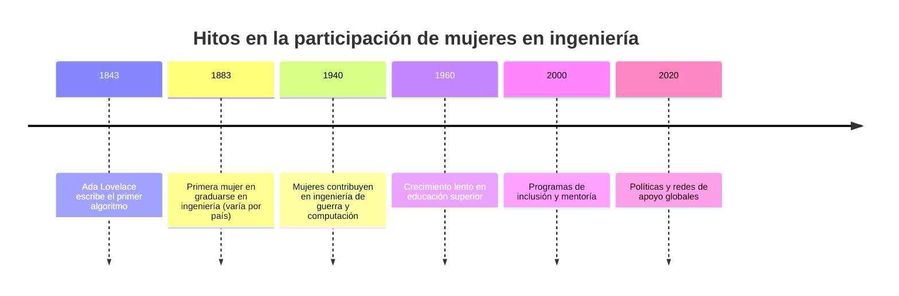
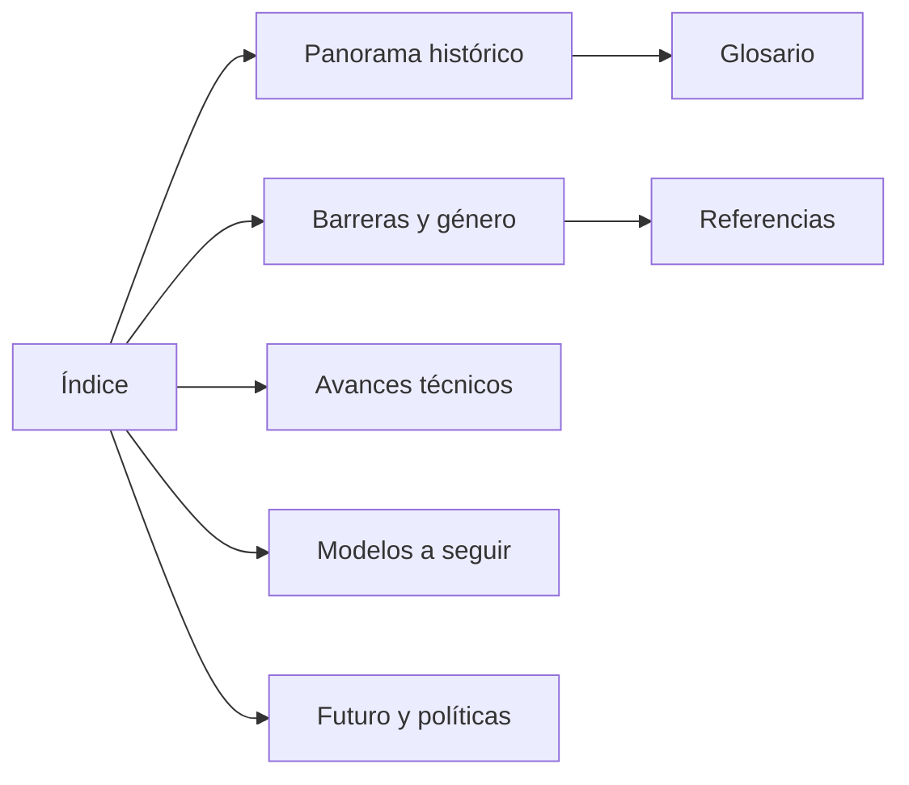

# Mujeres en la Ingeniería 🌐

  
  <h2>Visibilizando historias, retos y logros</h2>

## Descripción

Esta mini‑Wiki reúne artículos sobre la participación, contribuciones y desafíos de las mujeres en la ingeniería. Incluye artículos interconectados, un glosario, referencias y recursos visuales.

## Índice visual — Artículos destacados
| Artículo | Resumen | Emoji |
|---|---|:--:|
| [Panorama histórico](articulo-1.md) | Historia y pioneras | 🕰️ |
| [Barreras y género](articulo-2.md) | Obstáculos y estadísticas | 📊 |
| [Avances técnicos](articulo-3.md) | Mujeres en áreas STEM | 🛠️ |
| [Modelos a seguir](articulo-4.md) | Biografías y casos | 👩‍🔬 |
| [Futuro y políticas](articulo-5.md) | Inclusión y soluciones | 🚀 |

## Estadísticas del proyecto
- Total artículos: 5
- Palabras estimadas: ~6,000
- Diagramas Mermaid: 10+

## Últimas actualizaciones
- 2025-10-22 — Estructura inicial creada

## Timeline general del tema

## Mapa conceptual

## Navegación
- [Glosario](glosario.md)
- [Referencias](referencias.md)
- [Recursos/imagenes](recursos/imagenes/)

---

## FAQ (resumen)

¿Qué debo entregar y dónde?

Entregar la carpeta `mi-wiki` dentro de `entregas/fernanda.paredes/AEC-MD/`.

¿Puedo añadir más artículos?

Sí — añade nuevos archivos `.md` y enlázalos desde `index.md`.

## Autor
Fernanda Paredes — fernanda@example.com

[↑ Volver arriba](#mujeres-en-la-ingeniería-🌐)
