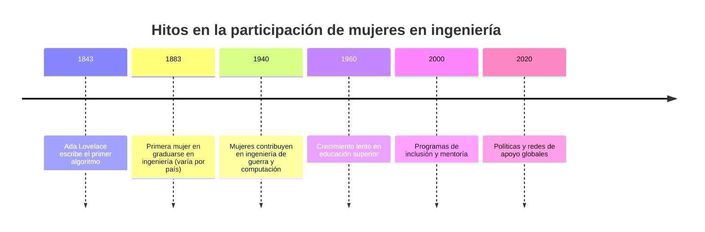
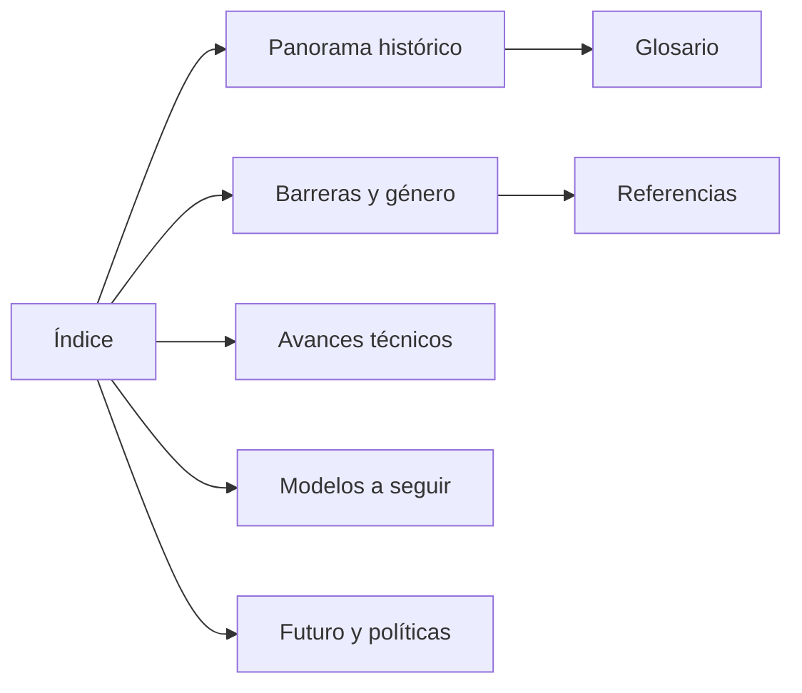

## Descripción

Esta mini‑Wiki reúne artículos sobre la participación, contribuciones y desafíos de las mujeres en la ingeniería. Incluye artículos interconectados, un glosario, referencias y recursos visuales.

## Índice visual — Artículos destacados
| Artículo | Resumen | 
|---|---|
| [Panorama histórico](articulo-1.md) | Historia y pioneras |
| [Barreras y género](articulo-2.md) | Obstáculos y estadísticas | 
| [Avances técnicos](articulo-3.md) | Mujeres en áreas STEM | 
| [Modelos a seguir](articulo-4.md) | Biografías y casos | 
| [Futuro y políticas](articulo-5.md) | Inclusión y soluciones | 

## Estadísticas del proyecto
- Total artículos: 5
- Palabras estimadas: ~6,000
- Diagramas Mermaid: 10+

## Últimas actualizaciones
- 2025-10-22 — Estructura inicial creada

## Timeline general del tema

## Mapa conceptual

## Navegación
- [Glosario](glosario.md)
- [Referencias](referencias.md)
- [Recursos/imagenes](recursos/imagenes/)

---

## FAQ (resumen)

¿Por qué es importante fomentar la participación de mujeres en la ingeniería?

La ingeniería impulsa la innovación y el desarrollo tecnológico. La inclusión de mujeres aporta diversidad de pensamiento, mejora la creatividad en la resolución de problemas y reduce sesgos en el diseño de soluciones tecnológicas que afectan a toda la sociedad.

¿Cuántas mujeres hay actualmente en carreras o profesiones de ingeniería?

A nivel global, las mujeres representan entre el 20 % y el 30 % del total de estudiantes de ingeniería, aunque varía según el país y la especialidad. En áreas como ingeniería biomédica o ambiental la proporción es más alta, mientras que en ingeniería mecánica o eléctrica sigue siendo menor.

Qué barreras enfrentan las mujeres que eligen estudiar ingeniería?

Algunas de las principales barreras son:

Estereotipos de género que asocian la ingeniería con los hombres.

Falta de modelos femeninos en posiciones de liderazgo técnico.

Brecha salarial y menor acceso a oportunidades de promoción.

Ambientes de trabajo poco inclusivos o con sesgos inconscientes.

## Autor
Fernanda Paredes — fernanda@example.com

