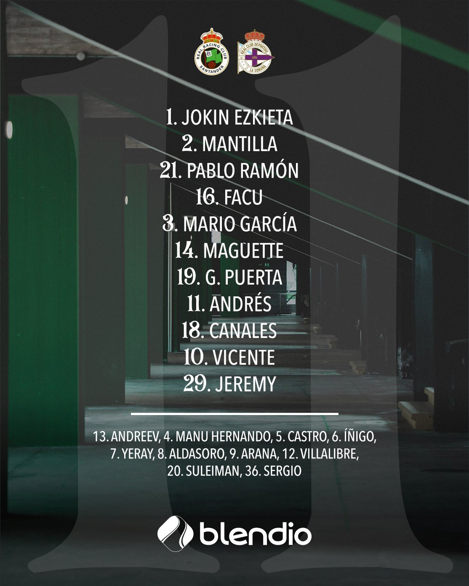

# Gran victoria ante el Deportivo para ser líderes

## El Sardinero apretó como nunca para ayudar al equipo

La animación fue de las mejores de la temporada, rugiendo más que de costumbre para dar ánimo a los jugadores

## Gran planteamiento de Jose Alberto

El once incial vino con modificaciones a raíz de las rojas a Michelin y Sangalli el anterior fin de semana ante el Sporting.

Un gol tempranero de los rivales causó la inquietud de los aficionados pero antes del descanso igualó nuestro uruguayo favorito. Tras un paso por los vestuarios la inercia estuvo de parte de los verdiblancos y Jeremy consiguió anotar la sexta diana del curso para dar la victoria a los nuestros.

[Volver al índice](./index.md)