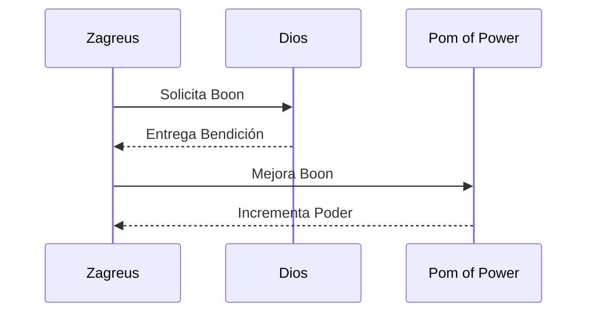

<h1 align="center">⚡ Boons de los Dioses – Guía Completa</h1>

  <em>“El poder de los dioses fluye por tus venas, joven Zagreus.”</em>

---

📍 **Ruta:** [🏠 Inicio](./index.md) › [📜 Guías](./guias.md) › **Boons de los Dioses**  
📅 **Creado:** 20 de octubre de 2025 • 🛠️ **Actualizado:** 24 de octubre de 2025  
⏱️ **Tiempo estimado de lectura:** 8 minutos  
🏷️ **Etiquetas:** `#Hades` `#Boons` `#Dioses` `#Guía` `#Estrategia`

---

## 📚 Tabla de Contenidos
- [🌩️ Introducción](#🌩️-introducción)
- [⚙️ Tipos de Boons](#⚙️-tipos-de-boons)
  - [Ataque](#ataque)
  - [Especial](#especial)
  - [Dash](#dash)
  - [Cast](#cast)
  - [Call](#call)
- [🧿 Dioses Principales](#🧿-dioses-principales)
  - [Zeus ⚡](#zeus-⚡)
  - [Ares 🔥](#ares-🔥)
  - [Afrodita 💕](#afrodita-💕)
- [🔗 Sinergias y Boons Dúo](#🔗-sinergias-y-boons-dúo)
- [🏺 Rarezas y Mejoras](#🏺-rarezas-y-mejoras)
- [📊 Comparativas y Datos](#📊-comparativas-y-datos)
- [📖 Referencias y Notas](#📖-referencias-y-notas)

---

## 🌩️ Introducción

Los **Boons de los Dioses** son la piedra angular del progreso en *Hades*, el aclamado roguelike de **Supergiant Games**.  
Durante tus intentos de escapar del inframundo, **Zagreus** recibirá **bendiciones divinas** de los dioses del Olimpo, cada una potenciando habilidades específicas como el ataque, la defensa o los efectos de control.  

Cada Boon representa una **alianza temporal** entre el príncipe del Inframundo y una deidad olímpica, otorgando poderes tan devastadores como impredecibles.  
El sistema está diseñado para promover la experimentación y la sinergia: *no existen combinaciones malas, solo elecciones estratégicas.*  

Estas bendiciones pueden presentarse en diferentes **niveles de rareza** (Común, Raro, Épico, Heroico), y al combinarlas adecuadamente, desbloquearás los legendarios **Boons Dúo**, donde dos dioses cooperan para ofrecerte poder puro.  
> 💬 *“La elección de un dios determina el curso de tu victoria.”*  

Para una comprensión completa, revisa también los artículos relacionados:  
[🗡️ Armas](./armas.md), [💀 Jefes](./jefes.md), [🏛️ Personajes](./personajes.md), [🔮 Mejoras](./mejoras.md), y [🎯 Estrategias Avanzadas](./estrategias.md).

---

## I. Tipos de Boons

### Ataque
Los Boons de **ataque** modifican el golpe principal de Zagreus.  
- Ejemplo: *Zeus* → `Tus ataques liberan rayos en cadena`.  
- Ideal para builds ofensivos.

> [!TIP]
> Combina ataques de Zeus con el Dash de Poseidón para un control total.
---

### Especial
El ataque **especial** suele potenciar el segundo golpe del arma.  
- *Ares*: `Tu especial inflige Ruina.`  
- *Afrodita*: `Inflige Encanto y reduce daño enemigo.`
---
### Dash
Los Boons de **Dash** otorgan evasión activa o efectos adicionales.  
- *Poseidón*: empuja enemigos al esquivar.  
- *Deméter*: deja una neblina que ralentiza.
---
### Cast
El **Cast** lanza un proyectil mágico.  
- *Artemisa*: críticos potentes.  
- *Dionisio*: daño por veneno acumulativo.
---
### Call
El **Call** es una habilidad definitiva con carga.  
- *Atenea*: invulnerabilidad temporal.  
- *Zeus*: lanza una tormenta devastadora.

---

## II. Dioses Principales

#### Afrodita
 hace entrega de bendiciones que infligen el estado alterado "Débil" o "Hechizado" en los oponentes, además de mejorar las posibilidades de supervivencia de Zagreo.

#### Ares
 hace entrega de bendiciones que infligen el estado alterado "Condena", crea Vortices Cercenadores, o aumenta el daño de tus ataques hacia los oponentes.

#### Artemisa
 hace entrega de bendiciones que proporcionan ataques Críticos y mejora tus habilidades de Cast.

#### Atenea
 hace entrega de bendiciones que permiten a las habilidades reflejar proyectiles y mejorar varias opciones defensivas.

#### Chaos
 hace entrega de bendiciones que proporcionan una variedad de bonificaciones, que a su vez, infligen un efecto negativo durante una cantidad determinada de encuentros.

#### Deméter
 hace entrega de bendiciones que añaden "Escarcha" a las habilidades, mejoran la curación, e infligen diversos efectos negativos.

#### Dioniso
 hace entrega de bendiciones que infligen "Resaca", crean Niebla Festiva, y mejoran las probabilidades de supervivencia de Zagreo.

#### Hermes
 hace entrega de habilidades que aumentan tu movilidad, velocidad de ataque, evasión, capacidades de tu acelerón y recuperación del ataque arrojadizo.

#### Poseidón
 hace entrega de bendiciones que aplican Empuje a las habilidades y aumentan las recompensas de los enfrentamientos.

#### Zeus
 otorga beneficios que agregan rayos en cadena a las habilidades o hacen que los rayos golpeen a los enemigos cercanos.

---

### Sinergias y Boons Dúo

Cuando Zagreus recibe Boons de dos dioses, puede desbloquear los **Boons Dúo**, efectos únicos que suelen combinar aspectos de los dos Dioses respectivamente. Por ejemplo:

| Combinación | Nombre del Boon Dúo | Efecto |
|--------------|--------------------|--------|
| Zeus + Poseidón | **Tormenta Marina** | Rayos que empujan enemigos |
| Ares + Afrodita | **Ruina del Corazón** | Ruina inflige daño doble a enemigos encantados |
| Deméter + Dionisio | **Niebla Etílica** | Congela y envenena simultáneamente |

> 💬 *“Dos dioses, una sinfonía de destrucción.”*

---

### 🏺 Rarezas y Mejoras

| Rareza  |  Color  | Bonificación |
| :------ | :-----: | -----------: |
| Común   |  Blanco |            — |
| Raro    |   Azul  |         +20% |
| Épico   | Púrpura |         +40% |
| Heroico |  Dorado |         +60% |

[!NOTE]
Los Keepsakes de cada dios aumentan las probabilidades de obtener Boons raros o de nivel superior.

---
## IV. 📊 Comparativas y Datos

### Tabla Comparativa

| Dios     |     Tipo     | Dificultad | Escalado | Recomendado Para |
| :------- | :----------: | ---------: | :------: | ---------------: |
| Zeus     |   ⚡ Ataque   |      Media |   Alto   |    Principiantes |
| Ares     | 🔥 Maldición |       Alta |   Medio  |         Expertos |
| Afrodita |  💕 Encanto  |       Baja |   Alto   |          Defensa |
| Poseidón |  🌊 Control  |      Media |   Medio  |    Crowd Control |

---
### Tabla de Datos

| Boon              | Dios     | Tipo     | Rareza Máx | Sinergia Recomendada |
| ----------------- | -------- | -------- | ---------- | -------------------- |
| Tormenta Divina   | Zeus     | Ataque   | Heroico    | Poseidón             |
| Ruina Carmesí     | Ares     | Especial | Épico      | Afrodita             |
| Corazón Encantado | Afrodita | Dash     | Raro       | Ares                 |
| Ola Impetuosa     | Poseidón | Cast     | Épico      | Zeus                 |
| Niebla Helada     | Deméter  | Call     | Heroico    | Dionisio             |
---

### Tabla de Resumen

| Conclusión             | Detalle  |
| ---------------------- | -------- |
| Mejor para daño rápido | Zeus     |
| Mejor control de masas | Poseidón |
| Mejor defensa          | Afrodita |
| Más técnico            | Ares     |
| Más equilibrado        | Deméter  |
---
## 💠 Información Expandida

 
📘 Información adicional
 Los Boons evolucionan con cada run; los dioses evitan ofrecer habilidades redundantes o incompatibles. 
 
 
🎯 Ejemplo detallado
 Un build Zeus + Poseidón con ataques eléctricos que empujan puede limpiar salas en segundos. 
 
 
🏺 Contexto histórico
 El concepto de “boon” proviene de las bendiciones divinas de *Hesíodo* y *Homero*, reinterpretadas con un toque moderno. 

## 🧭 Conclusiones y Estrategia Final

Dominar los Boons de los Dioses no depende de la suerte, sino de la sinergia estratégica.
Aprender a combinar las bendiciones correctas, potenciar sus rarezas y aprovechar las debilidades de los enemigos marcará la diferencia entre una run exitosa o una caída ante Hades mismo.

Consejos finales:

Siempre prioriza Boons que sinergicen con tu arma principal.

Usa los Keepsakes para forzar apariciones divinas.

No temas experimentar; algunas combinaciones pueden ser inesperadamente poderosas.

💬 “El verdadero poder no proviene del Olimpo, sino de tu voluntad de desafiarlo.”
---
## 📖 Referencias y Notas

“Los dioses del Olimpo ofrecen poder, pero nunca sin precio.” — Narrador de Hades
“Cada bendición es una tentación.” — Nyx
“Elige con sabiduría, joven príncipe.” — Hermes

Referencias

[1] Hades Wiki (Gamepedia)

[2] Supergiant Games – Hades

[3] Steam Community – Hades Guides

---
## 🗺️ Navegación

- [🏠 Volver al inicio](./index.md)
- [🗡️ Armas](./armas.md)
- [💀 Jefes del Inframundo](./jefes.md)
- [🏛️ Personajes](./personajes.md)
- [🔮 Mejoras de runs y recursos](./mejoras.md)
- 📚 [Referencias](./referencias.md)
---

  <em>“Hola, Zag, ¿cómo estás? Mira, tienes que venir con nosotros, ¡te hemos estado guardando un lugar! ¡A ver qué puedo hacer para que la vida te sea más fácil mientras tanto!</em> – <strong>Dionysus<strong>
    
  © 2025 | Wiki de HADES – por [Javier Paguaga]

