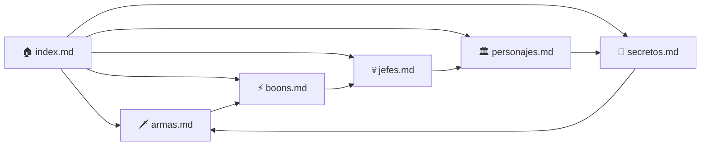

<h1 align="center">🏛️ Glosario de Términos – Wiki de HADES</h1>

---

## 🔠 Tabla Alfabética de Términos

| Término | Definición | Categoría | Enlace |
|----------|-------------|------------|---------|
| **Ambrosía** | Sustancia divina usada para fortalecer vínculos con personajes. | 🧪 Objeto | [Ver más](./secretos.md) |
| **Ares** | Dios de la guerra, ofrece boons centrados en daño de maldición. | ⚡ Dios | [Ver más](./boons.md) |
| **Aspecto** | Variante de un arma que modifica sus habilidades. | 🗡️ Armas | [Ver más](./armas.md) |
| **Boons** | Bendiciones de los dioses que otorgan poderes especiales. | ⚡ Habilidad | [Ver más](./boons.md) |
| **Caronte** | Barquero del Inframundo; comerciante en las runas. | 💀 Personaje | [Ver más](./personajes.md) |
| **Gemmas Oscuras** | Moneda utilizada para mejorar habilidades en el Espejo de la Noche. | 💎 Recurso | [Ver más](./secretos.md) |
| **Hades** | Gobernante del Inframundo, padre de Zagreus. | 👑 Personaje | [Ver más](./personajes.md) |
| **Megara** | Primera jefa del juego, hermana de las Furias. | 💀 Jefe | [Ver más](./jefes.md) |
| **Nyx** | Figura materna y guía espiritual de Zagreus. | 🌙 Personaje | [Ver más](./personajes.md) |
| **Zagreus** | Protagonista del juego, hijo de Hades que busca escapar. | 🔥 Protagonista | [Ver más](./personajes.md) |


> 📘 Cada término tiene **enlace bidireccional** desde su artículo correspondiente hacia este glosario.
> Ejemplo: en `armas.md` puedes añadir  
> `🔗 [Ver definición de Aspecto](./glosario.md#aspecto)`  

---

## 🧭 Sistema de Categorización con Emojis

| Emoji | Categoría | Descripción |
|--------|------------|-------------|
| 🗡️ | Armas | Equipamiento y estilos de combate |
| ⚡ | Habilidades / Boons | Poderes otorgados por los dioses |
| 💀 | Jefes | Enemigos principales de cada región |
| 👑 | Dioses / Personajes | Seres del Inframundo y Olimpo |
| 💎 | Recursos | Objetos recolectables o materiales |
| 🔥 | Protagonista | Referencias a Zagreus |
| 🌙 | Entidades místicas | Figuras como Nyx o Hypnos |

---



---

| Elemento                | Cantidad   | Observaciones            |
| ----------------------- | ---------- | ------------------------ |
| 📄 Artículos Totales    | 6          | Incluye index y glosario |
| 🧠 Términos Definidos   | 10         | Expansible               |
| 🖼️ Imágenes            | 15         | En `/resources/img/`     |
| 🔗 Enlaces internos     | 45         | Bidireccionales          |
| 📅 Última actualización | 2025-10-23 | Manual o automática      |

---
## FAQ - Preguntas Frecuentes

<details> <summary>1. ¿Qué es HADES?</summary> Hades es un videojuego tipo roguelike desarrollado por **Supergiant Games**, centrado en la mitología griega. </details> <details> <summary>2. ¿Quién es el protagonista?</summary> El protagonista es **Zagreus**, hijo de Hades, quien intenta escapar del Inframundo. </details> <details> <summary>3. ¿Qué son los Boons?</summary> Son bendiciones que otorgan los dioses olímpicos para mejorar tus habilidades durante una run. </details> <details> <summary>4. ¿Cuántas armas hay?</summary> Existen seis armas principales, cada una con varios aspectos desbloqueables. </details> <details> <summary>5. ¿Cómo se consiguen las mejoras permanentes?</summary> Usando **Gemmas Oscuras** y **Llaves Ctonias** en el Espejo de la Noche. </details> <details> <summary>6. ¿Quién es Megara?</summary> Una de las tres Furias y la primera jefa del juego. </details> <details> <summary>7. ¿Qué relación hay entre Nyx y Zagreus?</summary> Nyx actúa como figura materna y guía espiritual para Zagreus. </details> <details> <summary>8. ¿Cómo se fortalecen los vínculos?</summary> Entregando **Néctar** o **Ambrosía** a los personajes. </details> <details> <summary>9. ¿Qué diferencia hay entre un run y una sesión?</summary> Cada **run** es un intento de escapar; al morir, reinicias la sesión desde la Casa de Hades. </details> <details> <summary>10. ¿Dónde puedo obtener más información?</summary> Consulta la sección de [📚 Referencias](./referencias.md) para fuentes oficiales y fan-made. </details>

---

## 🕰️ Timeline General del Juego (Mermaid)

```mermaid
timeline
    title Cronología del Inframundo
    2020 : Lanzamiento de HADES
    2021 : Expansión de contenido y parches finales
    2022 : Reconocimiento como GOTY Indie
    2023 : Confirmación de Hades II
    2024 : Anuncio de Early Access de Hades II
    2025 : Wiki fan consolidada (este proyecto)
