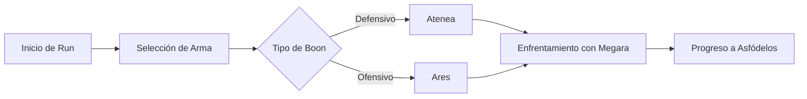
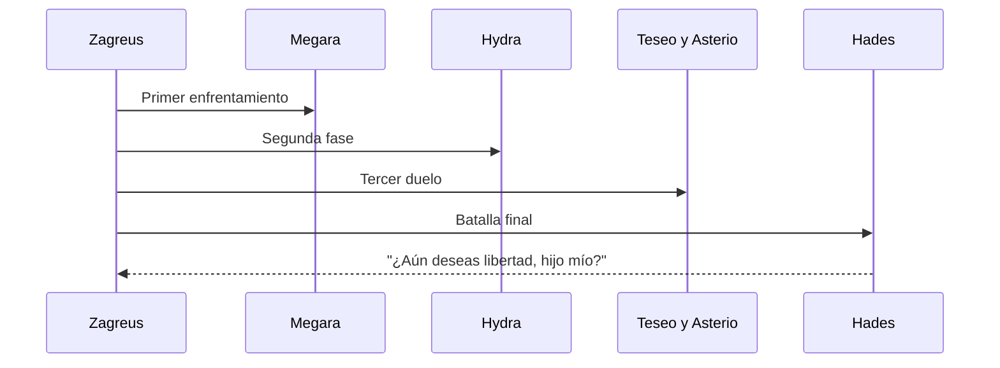

<h1 align="center">💀 Jefes del Inframundo</h1>

  <em>El desafío final del alma: cada paso hacia la libertad de Zagreus está custodiado por los más temibles guardianes del Inframundo.</em>

---

### 🧭 Ruta de Navegación  
**Inicio** › **Guías** › **Jefes del Inframundo**

📅 **Creado:** 12 Oct 2025  
🛠️ **Última actualización:** 24 Oct 2025  
⏱️ **Tiempo estimado de lectura:** 8 min  
🏷️ **Etiquetas:** `#Hades` `#Guía` `#Jefes` `#Estrategias`

---

## 📚 Tabla de Contenidos
1. [Introducción](#introducción)
2. [Los Guardianes del Inframundo](#los-guardianes-del-inframundo)
   - [Megara](#megara)
   - [Hydra de Lerna](#hydra-de-lerna)
   - [Teseo y Asterio](#teseo-y-asterio)
   - [Hades](#hades)
3. [Estrategias de Combate](#estrategias-de-combate)
   - [Preparación](#preparación)
   - [Análisis de patrones](#análisis-de-patrones)
   - [Errores comunes](#errores-comunes)
4. [Recompensas y Progresión](#recompensas-y-progresión)
   - [Materiales valiosos](#materiales-valiosos)
   - [Desbloqueos](#desbloqueos)
   - [Optimización de runs](#optimización-de-runs)
5. [Curiosidades y Contexto](#curiosidades-y-contexto)
6. [Notas y Referencias](#notas-y-referencias)

---

## 🏛️ Introducción

El **Inframundo** de *Hades* es mucho más que un escenario: es una serie de pruebas divinas diseñadas para poner a prueba la determinación del protagonista, **Zagreus**, en su intento de escapar del reino de su padre.  
Cada región del Inframundo está protegida por un **jefe poderoso**, conocido como *Guardián*. Estos jefes no solo marcan el final de una zona, sino también una transición en la narrativa, el tono y la mecánica del juego.

A diferencia de los enemigos comunes, los jefes presentan **patrones de ataque complejos**, **diálogos únicos** y **recompensas exclusivas** que incentivan la rejugabilidad. Además, la interacción entre Zagreus y estos personajes refleja tanto **la mitología griega clásica** como la **evolución emocional del héroe**.

En esta guía, exploraremos a fondo sus **habilidades, estrategias y recompensas**, junto con análisis visuales, diagramas y datos útiles para jugadores nuevos y veteranos.  
Si buscas información sobre armas, boons o personajes secundarios, puedes consultar también:  
[🗡️ Armas](./armas.md), [⚡ Boons](./boons.md), [🏛️ Personajes](./personajes.md), [🔮 Mejoras](./mejoras.md) y [📜 Historia](./historia.md).

---

## I. Los Guardianes del Inframundo

Cada jefe representa una **etapa psicológica y espiritual** del viaje de Zagreus.

### 💋 Megara
- Región: *Tártaro*  
- Especialidad: combate cuerpo a cuerpo con ataques rápidos.  
- Consejo: usar habilidades de control como `Cast` para mantener distancia.  

> 💬 *"No esperes clemencia, Príncipe."* — Megara

---

### 🐍 Hydra de Lerna
- Región: *Asfódelos*  
- Control del terreno con fuego y ataques de área.  
- Ideal para probar builds con `Aspecto de Poseidón`.

> 💬 *"De una cabeza surgen muchas más."*

---

### 🕷️ Teseo y Asterio
- Región: *Elíseo*  
- Combate dual coordinado entre fuerza bruta y ataques a distancia.  
- Requiere gestión de prioridad y uso del entorno.

---

### 🔥 Hades
- Región: *Trono del Inframundo*  
- Fase doble con ataques combinados de todos los estilos anteriores.  
- Premio final: la **Sangre de Titán** y acceso a la superficie.

---

### 📈 Tabla Comparativa de Jefes

| Jefe | Región | Estilo de combate | Dificultad | Recompensa principal |
|:--|:--:|--:|:--:|--|
| Megara | Tártaro | Cuerpo a cuerpo | ⭐⭐ | Llave Ctonia |
| Hydra de Lerna | Asfódelos | Fuego y área | ⭐⭐⭐ | Sangre de Titán |
| Teseo y Asterio | Elíseo | Mixto | ⭐⭐⭐⭐ | Gema Oscura |
| Hades | Trono | Completo | ⭐⭐⭐⭐⭐ | Salida al Mundo Exterior |

---

## II. Estrategias de Combate

### 🧰 Preparación

Antes de cada encuentro, asegúrate de tener un **build equilibrado**.  
Las *boons divinos* de **Atenea** y **Artemisa** son especialmente útiles.

💡 Información adicional

Usar `Dash Deflect` o `Critical Cast` puede cambiar completamente la dinámica del combate contra Megara o Hades.  

> [!TIP]
> **Consejo:** siempre revisa el espejo de la noche antes de subir un nivel — una configuración errónea puede costarte toda la run.

---

### 🧠 Análisis de patrones

📘 Ejemplo detallado

En la pelea con la **Hydra de Lerna**, cada cabeza secundaria tiene un tipo de ataque:  
- Fuego  
- Veneno  
- Ráfaga mágica  

> [!NOTE]
> **Dato curioso:** el orden de aparición de las cabezas puede variar entre runs, afectando la estrategia ideal.

---

### ⚠️ Errores comunes

📜 Datos históricos

En versiones tempranas del *Early Access (2018)*, Megara no tenía animaciones de carga, lo que hacía su pelea impredecible.  

> [!WARNING]
> **Error común:** intentar tanquear los ataques de Hades sin mejoras defensivas — su golpe final ignora invulnerabilidad temporal.

---

## III. Recompensas y Progresión

| Material | Uso principal | Fuente |
|-----------|---------------|--------|
| Sangre de Titán | Mejorar armas | Jefes finales |
| Gema Oscura | Mejoras permanentes | Elíseo, cofres |
| Llave Ctonia | Desbloqueo de armas | Tártaro |
| Néctar | Relaciones y boons | Cofres raros |
| Ambrosía | Finales especiales | Post-Hades |

---

### 🔓 Desbloqueos

- Desbloquea aspectos de armas tras cada victoria.  
- Cada jefe derrotado múltiples veces aumenta la **Calificación de Calor** (modo Infierno).  
- Las *victorias consecutivas* ofrecen **recompensas de mayor rareza**.

---

### 🧮 Optimización de Runs

[!IMPORTANT]
Las decisiones tempranas en el Tártaro determinan el 60% del éxito global de la run [1].
---
## IV. Curiosidades y Contexto

### 📖 Mito y adaptación

Supergiant Games reinterpretó la mitología griega para crear una narrativa continua y emocionalmente profunda [2].

### 🕰️ Línea temporal de combates

---
### 🧠 Tabla de Resumen
| Aspecto           |   Valor   |                 Conclusión |
| :---------------- | :-------: | -------------------------: |
| Dificultad global |   ⭐⭐⭐⭐☆   | Incrementa progresivamente |
| Narrativa         | Excelente | Conexión emocional notable |
| Rejugabilidad     |  Muy alta | Variedad de builds y rutas |
---
🧾 Notas y Referencias

Cita 1: “Las decisiones iniciales determinan el flujo del combate.” — Hades Dev Diary, Supergiant Games, 2021
Cita 2: “La reinterpretación mitológica como motor narrativo.” — GreekMythologyToday.com, 2020
Cita 3: “Hades, el padre y juez final.” — IGN Analysis, 2022

Referencias:
[1] https://www.supergiantgames.com/hades/devlog

[2] https://www.greekmythologytoday.com/articles/hades

[3] https://www.ign.com/articles/hades-analysis

---

## 🗺️ Navegación

- [🏠 Volver al inicio](./index.md)
- [⚡ Boons de los Dioses](./boons.md)
- [🗡️ Armas](./armas.md)
- [🏛️ Personajes](./personajes.md)
- [🔮 Mejoras de runs y recursos](./mejoras.md)
- 📚 [Referencias](./referencias.md)
---

  <em>“—Chico estúpido. Te dije que nadie sale de aquí, ni vivo ni muerto. Pero, ¿qué tal tu saqueo desenfrenado de mis dominios?"</em> – <strong>Hades</strong>  
    
  © 2025 | Wiki de HADES – por [Javier Paguaga]

