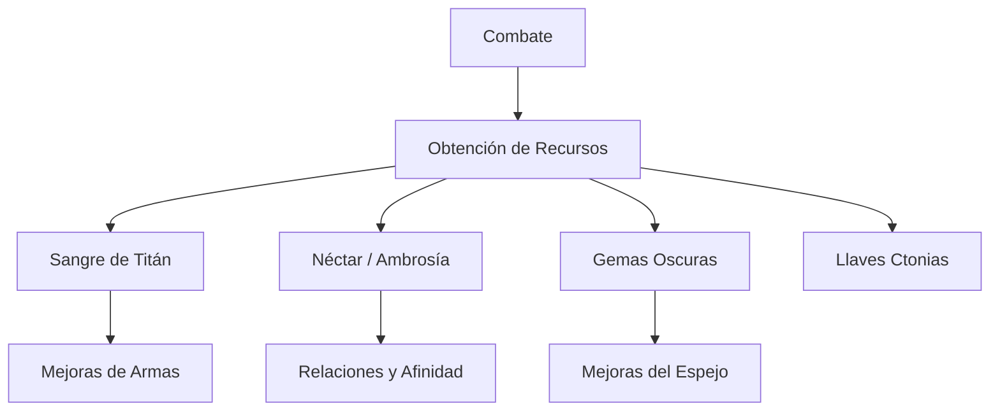
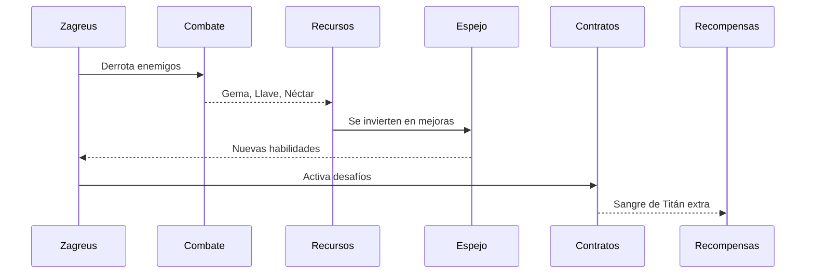

<h1 align="center">🔮 Mejoras y Recursos del Inframundo</h1>

  

  <strong>Inicio</strong> › <strong>Guías</strong> › <strong>Recursos y Mejoras</strong>

  🗓️ Creado: 24 de octubre de 2025 • 🔁 Actualizado: 24 de octubre de 2025  
  ⏱️ Tiempo estimado de lectura: 9 minutos  
  🏷️ Etiquetas: <code>#HADES</code> <code>#Recursos</code> <code>#Mejoras</code> <code>#Guía</code>

---

## 📖 Tabla de Contenidos
- [Introducción](#introducción)
- [Recursos Fundamentales](#recursos-fundamentales)
  - [Sangre de Titán (Titan Blood)](#sangre-de-titán-titan-blood)
  - [Néctar y Ambrosía](#néctar-y-ambrosía)
  - [Gemas Oscuras y Llaves Ctonias](#gemas-oscuras-y-llaves-ctonias)
- [Mejoras Permanentes](#mejoras-permanentes)
  - [El Espejo de la Noche](#el-espejo-de-la-noche)
  - [Contratos del Inframundo](#contratos-del-inframundo)
  - [El Salón de Trofeos](#el-salón-de-trofeos)
- [Rutas de Obtención Eficientes](#rutas-de-obtención-eficientes)
  - [Métodos de Farmeo Recomendados](#métodos-de-farmeo-recomendados)
  - [Bonificaciones y Sinergias](#bonificaciones-y-sinergias)
  - [Errores Comunes](#errores-comunes)
- [Interacciones Avanzadas](#interacciones-avanzadas)
  - [Afinidad y Recompensas](#afinidad-y-recompensas)
  - [Eventos Especiales](#eventos-especiales)
  - [Gestión de Recursos](#gestión-de-recursos)
- [Conclusiones y Recomendaciones](#conclusiones-y-recomendaciones)
- [Notas y Referencias](#notas-y-referencias)

---

## 🏛️ Introducción

El Inframundo de *HADES* no solo es un campo de batalla, sino un ecosistema cuidadosamente diseñado que recompensa la **exploración, persistencia y gestión estratégica de recursos**.  
Cada elemento recolectado, desde una simple **gema oscura** hasta la preciada **Sangre de Titán**, tiene un propósito dentro del ciclo de escape del príncipe Zagreus.  

Las **mejoras** en *HADES* funcionan en dos niveles principales:  
1. **Progresión personal**, centrada en habilidades y mejoras permanentes.  
2. **Desarrollo relacional**, que influye en las recompensas a través de vínculos y afinidades.  

Entender la **interconexión entre recursos y mejoras** es esencial para dominar las partidas, optimizar runs y desbloquear el contenido más avanzado.  
Este artículo detalla cada recurso clave, sus usos, estrategias de obtención y cómo integrarlos en tu progreso general.  

> “En el Inframundo, cada sacrificio tiene su recompensa. Lo importante es saber **cuándo y en qué invertir**.”  
> — *Nyx, la Noche Encarnada*

---

## I. Recursos Fundamentales

### Sangre de Titán (Titan Blood)
La **Sangre de Titán** es el recurso más valioso para mejorar las *Armas Infernalas (Infernal Arms)*.  
Se obtiene principalmente al derrotar jefes en niveles de calor específicos del **Pacto de Castigo (Pact of Punishment)**.

**Usos Principales:**
- Desbloqueo de aspectos de armas.
- Mejora de daño base y efectos pasivos.
- Requisito para logros y finales secretos.

| Nivel de Arma | Coste en Sangre | Mejora |
|:--------------:|:---------------:|:--------|
| I | 1 | +10% daño base |
| II | 2 | Efecto especial activado |
| III | 3 | Nuevo aspecto desbloqueado |
| IV | 5 | Potenciador definitivo |

> 💡 **Consejo:** guarda las primeras gotas de Sangre de Titán para el *Aspecto de Zagreus*, más flexible y equilibrado.

---

### Néctar y Ambrosía
Estos líquidos divinos representan el **vínculo emocional y la afinidad** con los dioses y aliados del Inframundo.

| Recurso | Uso | Relación |
|----------|------|-----------|
| **Néctar** | Regalar a NPCs para mejorar la afinidad. | Abre nuevas líneas de diálogo. |
| **Ambrosía** | Nivel avanzado de afinidad. | Otorga *Companions* (ayudantes divinos). |

**Fuentes Comunes:**
- Cofres de recompensa.
- Intercambios con Caronte.
- Recompensas de misiones de la Casa de Hades.

---

### Gemas Oscuras y Llaves Ctonias
Ambos recursos sostienen la progresión base del jugador.

**Gemas Oscuras (Darkness Gems):**
Usadas para el **Espejo de la Noche**, donde se activan habilidades pasivas como:
- `Sombra Infernal`: aumenta daño por ataque tras esquivar.
- `Sed de Sangre`: restaura salud al vencer enemigos.

**Llaves Ctonias (Chthonic Keys):**
Sirven para desbloquear nuevas armas y habilidades espejo adicionales.

> ⚠️ **Advertencia:** no malgastes llaves al inicio; prioriza abrir el **Espejo de la Noche** antes que las armas.

---

### Diagrama Conceptual – Recursos Principales

---
## II. Mejoras Permanentes

### El Espejo de la Noche

Interfaz central para aplicar mejoras de personaje permanentes.
Permite alternar configuraciones y estrategias de build. sea en:

1.Aspectos Clave: cada habilidad espejo tiene versiones alternativas.

2.Estrategia de Inversión: combina regeneración con ataque.

3.Optimización de Run: ajusta según tu arma equipada.

---

### Contratos del Inframundo

Sistema avanzado que aumenta la dificultad a cambio de mejores recompensas.

Ejemplo de Modificadores:
| Modificador          | Efecto                         | Recompensa extra     |
| :------------------- | :----------------------------- | :------------------- |
| Calor del Inframundo | Incrementa dificultad general. | +10% Sangre de Titán |
| Juramento de Dolor   | Enemigos más rápidos.          | +Néctar o Ambrosía   |
| Escasez Divina       | Menos bendiciones.             | +25% Gemas Oscuras   |

---
### El Salón de Trofeos

Una vitrina visual que muestra los logros alcanzados.

 
🏆 Información adicional
 Algunos trofeos desbloquean narraciones únicas y líneas de diálogo especiales, reforzando el lore del Inframundo. 

---
Diagrama de Proceso – Ciclo de Mejora

## III. Rutas de Obtención Eficientes

### Métodos de Farmeo Recomendados

Enfócate en runs cortos con alta eficacia.

Aprovecha bonificaciones divinas (Poseidón y Artemisa suelen ser sinérgicos).

Usa artefactos legendarios como el Anillo de Persefone para aumentar drop rates.

---

### Bonificaciones y Sinergias

| Bendición           | Sinergia Ideal            | Efecto combinado              |
| ------------------- | ------------------------- | ----------------------------- |
| Zeus + Ares         | Daño en cadena + sangrado | Golpes eléctricos que escalan |
| Atenea + Artemisa   | Defensa + crítico         | Daño seguro y constante       |
| Dionisio + Afrodita | Veneno + debilitación     | Control total del enemigo     |

---

### Errores Comunes

 
⚠️ Ejemplo detallado
 Muchos jugadores gastan Ambrosía prematuramente o distribuyen mal las Gemas Oscuras. Prioriza primero las habilidades espejo antes de buscar afinidad total. 

---

## IV.  Interacciones Avanzadas

### Afinidad y Recompensas

El sistema de afinidad permite obtener Companions que ayudan en batalla.
Personajes como Megara o Thanatos ofrecen ventajas únicas.

---

### Eventos Especiales

 
📜 Datos históricos
 En versiones tempranas del juego (EA 2018), la Ambrosía solo servía para diálogo. Con la actualización 1.0, se integraron las recompensas de afinidad avanzada. 

---

### Gestión de Recursos

💡 Consejo: usar el Intercambiador de Recursos de Caronte te permite convertir Gemas Oscuras en Néctar o Llaves cuando el inventario esté desbalanceado.

---

### 📊 Tabla Comparativa – Recursos vs. Usos

| Recurso         |    Tipo    | Uso Principal      | Rareza |
| :-------------- | :--------: | :----------------- | -----: |
| Sangre de Titán |    Épico   | Mejora armas       |  ⭐⭐⭐⭐⭐ |
| Néctar          |    Raro    | Afinidad básica    |    ⭐⭐⭐ |
| Ambrosía        |    Épico   | Afinidad avanzada  |   ⭐⭐⭐⭐ |
| Gemas Oscuras   |    Común   | Habilidades espejo |     ⭐⭐ |
| Llaves Ctonias  | Poco común | Desbloqueos        |     ⭐⭐ |

---

🧩 Tabla de Datos – Recompensas por Nivel de Calor

| Nivel de Calor | Jefe               | Recompensa      | Cantidad |
| -------------- | ------------------ | --------------- | -------- |
| 0              | Megara             | Sangre de Titán | 1        |
| 2              | Theseus & Asterius | Ambrosía        | 1        |
| 4              | Hades              | Llave Ctonia    | 2        |
| 6              | Megara             | Néctar          | 1        |
| 8              | Hades              | Sangre de Titán | 2        |

---

📚 Tabla de Resumen

| Categoría             | Prioridad | Recomendación                |
| --------------------- | --------- | ---------------------------- |
| Recursos básicos      | Alta      | Acumular Gemas Oscuras       |
| Afinidad              | Media     | Distribuir Néctar sabiamente |
| Armas                 | Alta      | Invertir Sangre de Titán     |
| Decoración / Estética | Baja      | Solo si sobran recursos      |

---

### 📜 Citas Destacadas

“Nada se desperdicia en el Inframundo, todo se transforma.” — Hades

“La paciencia es el arma más afilada del príncipe.” — Achilles

“Un regalo no siempre busca amistad; a veces compra silencio.” — Nyx

---

## 📖 Conclusiones y Recomendaciones

El dominio de los recursos en HADES exige equilibrar inversión y estrategia.
Comprender cuándo mejorar, a quién regalar, y cómo priorizar el gasto, separa a un simple escapista de un verdadero conquistador del Inframundo.

Resumen esencial:

Inicia con mejoras espejo antes de gastar en afinidad.

Guarda Sangre de Titán para los aspectos finales.

Alterna runs de recolección con runs de historia.

“Escapar del Inframundo no es el fin, sino el principio del dominio sobre él.”

## 🗺️ Navegación

- [🏠 Volver al inicio](./index.md)
- [⚡ Boons de los Dioses](./boons.md)
- [💀 Jefes del Inframundo](./jefes.md)
- [🏛️ Personajes](./personajes.md)
- [🗡️ Armas](./armas.md)
- 📚 [Referencias](./referencias.md)
---

  <em>“En las profundidades de los insondables pozos del Tártaro yacen los restos de los Titanes, quienes antaño gobernaron todo entre el cielo y la tierra. Aún quedan pocos vestigios de ellos, debido a la minuciosidad con la que fueron derrotados en la guerra librada por sus descendientes, los dioses que ahora residen en el Olimpo.</em> – <strong>Codex</strong>  
    
  © 2025 | Wiki de HADES – por [Javier Paguaga]

