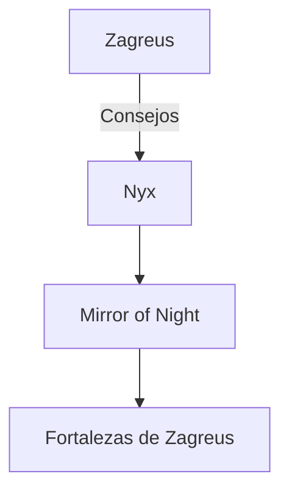
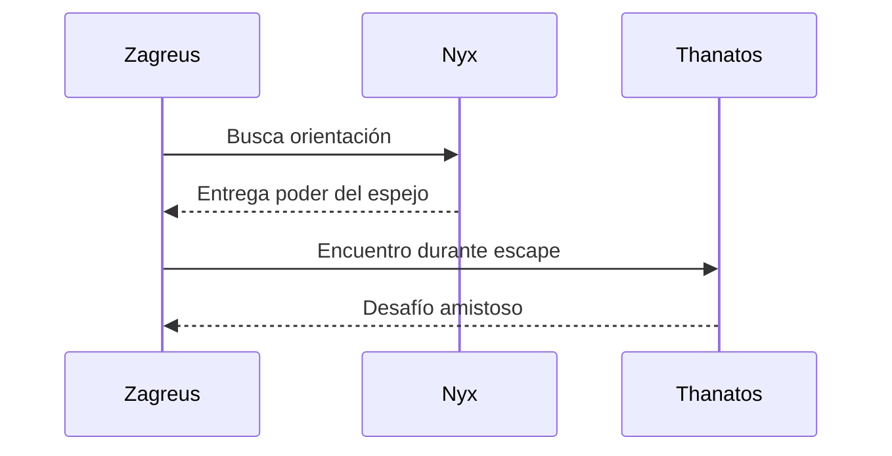

<h1 align="center">🏛️ Personajes Principales de *HADES*</h1>

<p align="center">
  <em>Inicio > Personajes > Protagonistas y Dioses</em>
</p>

---

📅 **Creado:** 10 de octubre de 2025  
🕓 **Última actualización:** 24 de octubre de 2025  
⏱️ **Tiempo de lectura estimado:** 8 minutos  
🏷️ **Etiquetas:** #Hades #Mitología #Videojuegos #Roguelike #Personajes

---

## 🧭 Tabla de Contenidos
- [Introducción](#introducción)
- [Zagreus: El Protagonista](#zagreus-el-protagonista)
  - [Orígenes](#orígenes)
  - [Motivaciones](#motivaciones)
  - [Relación con otros personajes](#relación-con-otros-personajes)
- [Dioses del Inframundo](#dioses-del-inframundo)
  - [Hades y su dominio](#hades-y-su-dominio)
  - [Nyx: La noche eterna](#nyx-la-noche-eterna)
  - [Thanatos y Megara](#thanatos-y-megara)
- [El Viaje de Zagreus](#el-viaje-de-zagreus)
  - [Etapas del escape](#etapas-del-escape)
  - [Interacciones divinas](#interacciones-divinas)
  - [Evolución del personaje](#evolución-del-personaje)
- [Curiosidades y Relaciones](#curiosidades-y-relaciones)
  - [Vínculos y recompensas](#vínculos-y-recompensas)
  - [Detalles ocultos](#detalles-ocultos)
  - [Conexiones con la mitología griega](#conexiones-con-la-mitología-griega)
- [Notas y Referencias](#notas-y-referencias)

---

## 🏹 Introducción

El juego *Hades*, desarrollado por **Supergiant Games**, presenta una rica narrativa mitológica centrada en el joven **Zagreus**, hijo de **Hades**. Su travesía por escapar del Inframundo no solo es una lucha física, sino también una exploración de su identidad, sus orígenes y las relaciones con los dioses del Olimpo y del Inframundo.

A través de sus múltiples intentos de fuga, Zagreus forja vínculos con personajes emblemáticos como **Nyx**, su madre adoptiva, o **Thanatos**, su aliado más cercano. Cada muerte representa una oportunidad de aprendizaje y crecimiento.  
La historia se entreteje con mecánicas roguelike y un desarrollo progresivo de diálogos, donde las decisiones del jugador moldean las relaciones y desbloquean recompensas únicas.

Este artículo profundiza en los personajes principales, sus roles en la trama y su impacto en la experiencia de juego. Si deseas información sobre las armas divinas, visita [🗡️ Armas](./armas.md); para los dones olímpicos, consulta [⚡ Boons](./boons.md); o explora [💀 Jefes](./jefes.md) para conocer los desafíos del Inframundo.

---

## I. Zagreus: El Protagonista

### 🔥 Orígenes
Zagreus es el hijo rebelde de Hades, destinado a desafiar las leyes del Inframundo.  
Su existencia es el punto de unión entre lo mortal y lo divino.

> “El fuego de su alma no puede ser apagado, ni siquiera por el mismísimo río Estigia.” — *Nyx*

---

### ⚔️ Motivaciones
Zagreus busca descubrir la verdad sobre su madre, **Perséfone**, y su propio origen. Su deseo de libertad es tanto físico como existencial.

```text
“Si el Inframundo es mi hogar, ¿por qué me siento prisionero en él?”
```
---
### 💞 Relación con otros personajes

Sus vínculos fortalecen sus habilidades y desbloquean recompensas.
Por ejemplo:

Con Thanatos, obtiene mayor poder al derrotar enemigos juntos.

Con Nyx, accede a mejoras en la Mirror of Night.

Con Megara, explora un lazo entre rivalidad y afecto.

Para más detalles sobre recompensas, consulta [🔮 Mejoras de runs y recursos](./mejoras.md)
.

---

## II. 👑 Dioses del Inframundo

### 🪓 Hades y su dominio

Hades es el gobernante absoluto del Inframundo, un dios inflexible cuyo mandato no admite errores.

💬 “Nadie abandona mi reino sin mi permiso.” — Hades

Tabla comparativa: Autoridad en el Inframundo

| Personaje    | Rol        | Nivel de Autoridad | Naturaleza |
| :----------- | :--------- | :----------------: | ---------: |
| **Hades**    | Gobernante |      🔱 Máxima     |  Severidad |
| **Nyx**      | Consejera  |       🌓 Alta      |  Sabiduría |
| **Thanatos** | Ejecutor   |      ⚖️ Media      |   Justicia |
| **Megara**   | Guardiana  |      ⚔️ Media      |      Orden |

---

### 🌌 Nyx: La noche eterna

Nyx es la madre de todos los sueños y sombras. En el juego, guía a Zagreus desde las sombras.

[!NOTE]
Nyx representa la calma y la sabiduría frente a la ira de Hades.

---

### 💀 Thanatos y Megara

Thanatos encarna la muerte inevitable, mientras Megara mantiene el orden de las Furias.
Ambos equilibran la dualidad de castigo y compasión.

Tabla de datos: Relaciones de confianza
| Personaje | Nivel de Confianza | Recompensa            | Afinidad    |
| --------- | ------------------ | --------------------- | ----------- |
| Nyx       | Alta               | Consejos nocturnos    | Maternal    |
| Thanatos  | Muy alta           | Poder compartido      | Amistad     |
| Megara    | Media              | Claves del Inframundo | Rivalidad   |
| Hades     | Baja               | Desafíos constantes   | Paternal    |
| Perséfone | Muy alta           | Final verdadero       | Amor filial |

## III. El Viaje de Zagreus

### 🧩 Etapas del escape

Cada intento de fuga pasa por varios niveles:

Tártaro

Asfódelos

Elíseo

Templo Estigio



---

### ⚡ Interacciones divinas

Los dioses olímpicos ofrecen boons para asistirlo.
Visita ⚡ Boons
 para ver la lista completa.

[!TIP]
No todos los boons son compatibles; algunos pueden generar efectos contradictorios.

---

### 🌠 Evolución del personaje

A medida que Zagreus fortalece sus lazos, desbloquea mejoras en el Mirror of Night.
Los diálogos y recompensas permanentes son parte del encanto narrativo del juego.

---

## IV. 🔮 Curiosidades y Relaciones
<details> <summary>📘 Información adicional</summary>

Zagreus está inspirado en antiguas deidades órficas, representando el renacimiento y la inmortalidad del alma.

</details> <details> <summary>⚙️ Ejemplo detallado</summary>

Durante los encuentros con Thanatos, las conversaciones afectan la afinidad y desbloquean líneas únicas de diálogo.

</details> <details> <summary>🏺 Datos históricos</summary>

En la mitología, Zagreus fue considerado una reencarnación de Dionisio, símbolo del renacer tras la destrucción.

</details>

---
Tabla resumen: Relaciones Clave
| Personaje | Tipo de Relación | Impacto en la historia     |
| --------- | ---------------- | -------------------------- |
| Nyx       | Maternal         | Consejos y guía espiritual |
| Thanatos  | Amistad          | Competencia y lealtad      |
| Megara    | Rivalidad        | Obstáculo emocional        |

---

💬 “Ningún dios puede escapar de su destino, pero algunos se atreven a desafiarlo.”

[!WARNING]
Las decisiones de diálogo pueden alterar las recompensas permanentes. Guarda antes de cada conversación clave.

---

<p align="center">
  <em>“Al diablo con este lugar</em> – <strong>Zagreus</strong>  
  <br/><br/>
  © 2025 | Wiki de HADES – por [Javier Paguaga]
</p>
