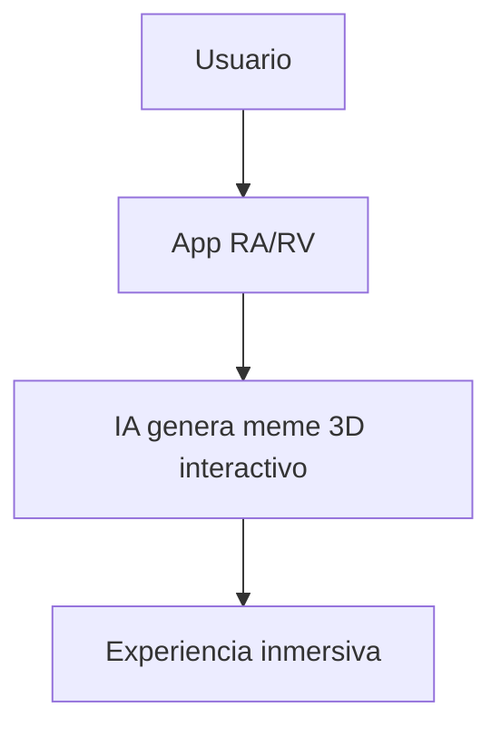

# 🚀 Futuro de los Memes Inteligentes

**Breadcrumb:** [Inicio](index.md) > Futuro > Futuro de los Memes Inteligentes  
**Fecha de creación:** 22/10/2025 | **Última actualización:** 22/10/2025  
**Tiempo estimado de lectura:** 9 min  
**Etiquetas:** #futuro #IA #memes #innovación

---

## 📑 Tabla de Contenidos
1. [Introducción](#introducción)
2. [Tendencias tecnológicas](#tendencias-tecnológicas)
3. [Integración con realidad aumentada y virtual](#integración-con-realidad-aumentada-y-virtual)
4. [Memes adaptativos y personalizados](#memes-adaptativos-y-personalizados)
5. [Impacto social y educativo](#impacto-social-y-educativo)
6. [Conclusión](#conclusión)

---

## Introducción

El futuro de los memes generados por **Inteligencia Artificial** apunta a una **interacción más inteligente, creativa y personalizada**. No solo se trata de imágenes o videos, sino de experiencias digitales que se adaptan a cada usuario, combinando humor, cultura y tecnología de forma dinámica. Este artículo explora las tendencias y posibilidades que marcarán el rumbo de los memes inteligentes.

---

## Tendencias tecnológicas

Las tecnologías emergentes permitirán memes más sofisticados y adaptativos:

| Tecnología | Aplicación | Ejemplo |
|------------|------------|---------|
| IA generativa avanzada | Creación de memes complejos | GANs, DALL·E |
| Modelos multimodales | Integrar texto, imagen y audio | ChatGPT + Imagen |
| Personalización | Memes adaptados a gustos individuales | Algoritmos de recomendación |

### Sub-secciones
- **Creatividad asistida**: IA ayuda a proponer ideas originales.  
- **Interacción con usuarios**: Respuestas en tiempo real y humor contextual.  
- **Automatización ética**: Supervisión humana para contenido seguro.

---

## Integración con realidad aumentada y virtual

La RA y RV permitirán que los memes se experimenten de manera **inmersiva**:

### Sub-secciones
- **RA social**: Compartir memes en entornos aumentados.  
- **RV inmersiva**: Juegos y escenarios interactivos.  
- **Innovación educativa**: Aprendizaje mediante humor y memes.

---

## Memes adaptativos y personalizados

La IA permitirá que los memes se ajusten a **preferencias individuales**, historial de interacción y tendencias culturales:

### Sub-secciones
- **Algoritmos de recomendación**: Sugerencias personalizadas de memes.  
- **Humor contextual**: Memes que entienden el contexto del usuario.  
- **Experiencias interactivas**: Cambios dinámicos según respuestas y feedback.

Ejemplo detallado

Un meme generado por IA podría cambiar el texto o la imagen dependiendo del país, idioma o incluso estado de ánimo detectado del usuario, aumentando el engagement y la viralidad.

---

## Impacto social y educativo

Los memes inteligentes no solo serán entretenimiento, sino también herramientas **educativas y de concienciación social**:

| Área | Aplicación | Beneficio |
|------|-----------|----------|
| Educación | Explicar conceptos complejos | Más fácil de entender |
| Salud | Concienciación y prevención | Mayor alcance |
| Comunicación | Mensajes sociales y políticos | Viralidad responsable |

### Sub-secciones
- **Gamificación**: Aprender mediante humor y memes.  
- **Concienciación social**: Difusión de información importante.  
- **Cultura digital inclusiva**: Adaptación para distintas comunidades.

---

## Conclusión

El futuro de los memes inteligentes combina **creatividad, IA y tecnología interactiva** para ofrecer experiencias únicas y personalizadas. A medida que las herramientas evolucionen, los memes se convertirán en un lenguaje universal, educativo y cultural, capaz de conectar a personas de todo el mundo mediante humor y tecnología.

---

## 🚨 Alertas

> **Aviso:** Memes inteligentes pueden recopilar datos personales; se debe respetar privacidad y ética.  

> **Nota:** Supervisión humana seguirá siendo clave para mantener contenido seguro y respetuoso.

---

## 🔗 Enlaces internos y relacionados

- [Historia de los Memes con IA](articulo-1.md)  
- [Cómo se crean los Memes con IA](articulo-2.md)  
- [Ética y Derechos de Autor](articulo-3.md)  
- [Impacto Cultural Global](articulo-4.md)  
- [Glosario de términos](glosario.md)

---

## 🔗 Enlaces externos

1. [OpenAI Blog](https://openai.com/blog)  
2. [Midjourney](https://www.midjourney.com)  
3. [Tendencias IA y entretenimiento](https://www.technologyreview.com/)  

---

## 🔝 Navegación

[← Impacto Cultural Global](articulo-4.md) | [↑ Volver arriba](#futuro-de-los-memes-inteligentes)
