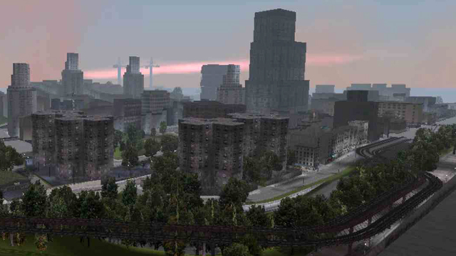
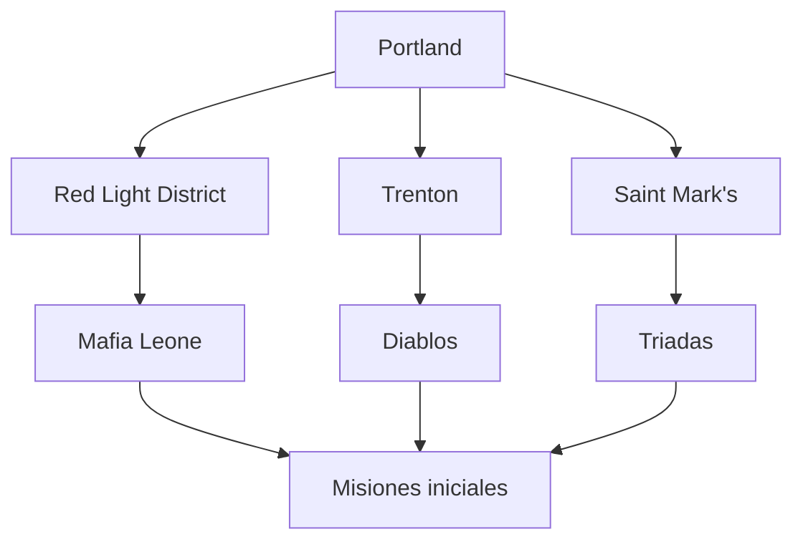
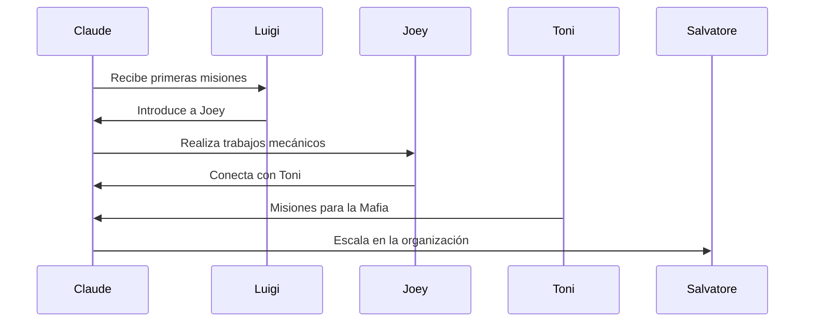

# ⚓ Portland

Creado en: 22/10/2025
Última actualización: 26/10/2025
Tiempo estimado de lectura: 4 min 45 sec

> [!CAUTION]
> Es posible que contenga spoilers

#### Tabla de Contenidos
1. [Intrdoucción](#introducción)
2. [🧱 Estructura y Zonas Principales](#-estructura-y-zonas-principales)
    - [Saint Mark's](#saint-marks)
    - [Red Light District](#red-light-district)
    - [Chinatown](#chinatown)
    - [Portland Harbor](#portland-harbor)
    - [Harwood y Trenton](#harwood-y-trenton)
3. [🚇 Infraestructura y Movilidad](#-infraestructura-y-movilidad)
    - [Portland Train](#portland-train)
    - [Puente Callahan](#puente-callahan)
    - [Calles y tráfico](#calles-y-tráfico)
4. [🎨 Estética y Ambientación](#-estética-y-ambientación)
    - [Diseño Visual](#diseño-visual)
    - [Sonido ambiental](#sonido-ambiental)
    - [NPCs e interacción](#npcs-e-interacción)
5. [🧭 Función narrativa](#-función-narrativa)
6. [Conclusiones y Referencias](#conclusiones-y-referencias)

## Introducción
Portland es la primera de las tres islas que conforman [Liberty City](https://gta.fandom.com/wiki/Liberty_City_(3D_Universe)) en [Grand Theft Auto III](https://es.wikipedia.org/wiki/Grand_Theft_Auto_III), el icónico videojuego de Rockstar Games lanzado en 2001. Inspirada en gran medida por los barrios industriales y portuarios del Brooklyn neoyorquino, Portland presenta un entorno urbano sombrío, decadente y plagado de crimen, que sirve como el escenario inicial para las aventuras del protagonista, Claude. La isla está dividida en varios distritos, cada uno con su propia personalidad: desde el bullicioso Red Light District, repleto de clubes nocturnos y actividades ilícitas, hasta el industrial Trenton, hogar de fábricas y almacenes oxidados.

| Elemento              | Descripción                            | Influencia Criminal     |
|:----------------------|:----------------------------------------|-------------------------:|
| **Red Light District**    | Zona de clubes          | Alta                     |
| **Trenton**  | Área industrial con fábricas           | Media                    |
| **Saint Mark's**          | Barrio residencial controlado por la Mafia | Muy alta              |

Portland es también el territorio de varias facciones criminales, como la Mafia Leone, los Yakuza y los diabólicos Diablos, lo que convierte a la isla en un campo de batalla constante por el control del crimen organizado. Su atmósfera lluviosa, calles estrechas y arquitectura deteriorada refuerzan el tono oscuro y peligroso del juego. A pesar de su tamaño relativamente pequeño, Portland está repleta de detalles, secretos y misiones que marcan el inicio de la transformación de Claude en una figura clave del inframundo de Liberty City. 

> Es una ciudad que, aunque ficticia, ha dejado una huella imborrable en la historia de los videojuegos.

----

## 🧱 Estructura y Zonas Principales
 

Portland está dividido en varios barrios con funciones y estilos distintos:

### Saint Mark's
 Zona residencial dominada por la mafia Leone. Calles estrechas, arquitectura italiana y negocios familiares.

### Red Light District
Área de entretenimiento nocturno con clubes, bares y actividad criminal. Es uno de los sectores más activos del juego.
> Es aquí donde el jugador incia sus aventuras conla mafia Leone

### Chinatown 
Barrio asiático con arquitectura típica, mercados y presencia de la banda Triads.

### Portland Harbor 
Zona portuaria industrial con almacenes, grúas y tráfico de mercancías. Representa el corazón económico del distrito.

### Harwood y Trenton
Áreas industriales con fábricas, chatarrerías y talleres mecánicos. Reflejan el abandono y la decadencia urbana.

---- 
## 🚇 Infraestructura y Movilidad

> [!NOTE]
> Algunos o todos estos elementos no serán accesible sin progresar antes en la historia del juego

 
<strong>📚 Datos históricos / Contexto</strong>

Portland está inspirada en zonas industriales de Nueva York, especialmente Brooklyn y el Bronx. Su diseño refleja la decadencia urbana de principios de los 2000, con edificios deteriorados, calles estrechas y una fuerte presencia de crimen organizado. Fue la primera área desarrollada por Rockstar para GTA III, y sirvió como laboratorio para probar las nuevas mecánicas 3D del juego.

### Portland Train
Un tren elevado que recorre parte del distrito, añadiendo verticalidad y realismo al entorno.
> Fue el primer tren accesible al jugador en la saga, hasta su regreso en *Grand Theft Auto San Andreas* en 2005 y *Grand Theft Auto IV* en 2008

### Puente Callahan 
Conecta Portland con [Staunton Island](./articulo-2.md), aunque está bloqueado al inicio del juego por razones narrativas.

### Calles y tráfico
 El trazado vial es irregular, con muchas curvas cerradas, callejones y desniveles que dificultan la conducción y favorecen la exploración a pie.

| Distrito           | Banda Principal     | Tipo de Territorio | Nivel de Peligro | Vehículos Comunes     |
|--------------------|---------------------|---------------------|------------------|------------------------|
| *Red Light District* | Mafia Leone         | Comercial           | Alto             | Sentinel, Kuruma       |
| *Trenton*            | Diablos             | Industrial          | Medio            | Mule, Yankee           |
| *Saint Mark's*       | Triadas             | Residencial         | Alto             | Perennial, Esperanto   |
| *Harwood*            | Independiente       | Mixto               | Bajo             | Manana, Idaho          |
| *Chinatown*          | Triadas             | Comercial           | Medio            | Bobcat, Moonbeam       |

---- 

## 🎨 Estética y Ambientación
### Diseño visual
Colores apagados, neblina constante y arquitectura envejecida refuerzan el tono oscuro y criminal del juego.

### Sonido ambiental
 Sirenas, trenes, gritos y música callejera crean una atmósfera viva y caótica.

 
<strong>📌 Información adicional</strong>

Portland es la isla más pequeña pero más densa en términos de actividad criminal. Su diseño urbano incluye zonas portuarias, barrios marginales y fábricas abandonadas. Es el punto de partida del juego, donde Claude comienza su ascenso en el mundo del crimen. La isla está dividida en distritos como Harwood, Chinatown y Saint Mark’s, cada uno con su propia estética y peligros. La atmósfera lluviosa y gris refuerza el tono sombrío del juego.

### NPCs e interacción
Los NPCs de Portland reflejan la realidad de la isla con trabajadores, vagos, ladrones y criminales por doquier. Representan la faceta más baja de Liberty City.

----

## 🧭 Función narrativa
Portland no solo introduce al jugador en el mundo de GTA III, sino que establece el tono de la historia: crimen organizado, traición y supervivencia en una ciudad hostil. Cada barrio tiene misiones específicas que reflejan su cultura y conflictos internos.

 
<strong>🧪 Ejemplo detallado</strong>

Una de las primeras misiones en Portland es “Luigi’s Girls”, donde Claude debe escoltar a una trabajadora del club hasta su destino. Aunque parece simple, la misión introduce mecánicas clave: conducción, protección de NPCs y enfrentamientos con bandas rivales. Además, el jugador empieza a familiarizarse con el mapa, los puntos de interés y las rutas seguras para evitar emboscadas.

---
## Conclusiones y referencias
| Aspecto Clave         | Observación                                                                 |
|------------------------|------------------------------------------------------------------------------|
| *Estilo visual*          | Oscuro, decadente, con lluvia frecuente                                     |
| *Introducción narrativa* | Primer contacto con el crimen organizado                                    |
| *Dificultad inicial*   | Alta, por enemigos agresivos y calles estrechas                             |
| *Misiones clave*         | Trabajo para la Mafia, sabotajes, asesinatos                                |
| *Impacto en la trama*    | Establece la reputación de Claude en Liberty City                           |

[← Anterior](./index.md.md)
[Siguiente Artículo →](./articulo-2.md)

[Volver al inicio ↑](#-portland)
### 🔎 Ver también
- [Shoreside Vale](./articulo-3.md)
- [Influencia en el mundo de los sandboxes](./articulo-4.md)
- [Staunton Island](./articulo-2.md)