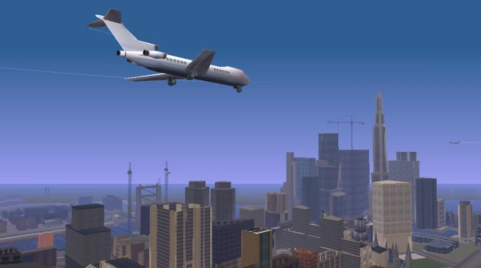
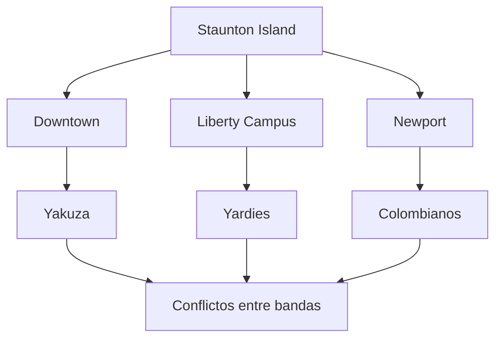
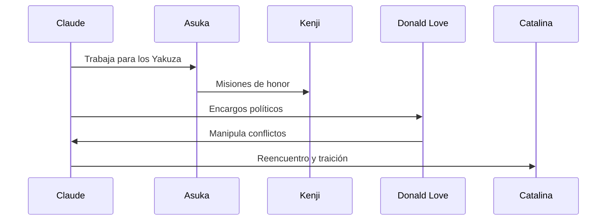

# 🏙️ Staunton Island
Creado en: 22/10/2025
Última actualización: 26/10/2025
Tiempo estimado de lectura: 4 min 52 sec

> [!CAUTION]
> Es posible que contenga spoilers

#### Tabla de Contenidos
1. [Introducción](#introducción)
2. [🏢 Diseño Urbano](#-diseño-urbano)
3. [🧱 Estructura y Barrios Principales](#️-estructura-y-barrios-principales)
    - [Beford Point](#bedford-point)
    - [Belleville Park](#belleville-park)
    - [Newport](#newport)
    - [Torrington y Rockford](#torrington-y-rockford)
    - [Aspatria y Fort Staunton](#aspatria-y-fort-staunton)
4. [🚇 Infraestructura y Movilidad](#-infraestructura-y-movilidad)
    - [Puente Callaghan](#puente-callahan)
    - [Tunel Porter](#túnel-porter)
    - [Calles y avenidas](#calles-amplias-y-avenidas)
    - [Transporte Publico](#transporte-público)
5. [🎨 Estética y Ambientación](#-estética-y-ambientación)
    - [Diseño Visual](#diseño-visual)
    - [Sonido ambiental](#sonido-ambiental)
6. [🧭 Función narrativa](#-función-narrativa)
7. [Conclusiones y Referencias](#conclusiones-y-referencias)

----

## Introducción
Staunton Island es la segunda isla que se desbloquea en [Grand Theft Auto III](https://es.wikipedia.org/wiki/Grand_Theft_Auto_III), y representa el corazón financiero y político de Liberty City. Inspirada por [Manhattan](https://es.wikipedia.org/wiki/Manhattan), Staunton ofrece un marcado contraste con la decadente [Portland](./articulo-1.md): sus rascacielos, avenidas amplias y arquitectura moderna reflejan poder, riqueza y ambición. Aquí se encuentran importantes instituciones como el Ayuntamiento, estadios deportivos, centros comerciales y sedes corporativas, lo que convierte a la isla en un epicentro de actividad urbana.

| Zona                  | Función Urbana                         | Presencia Criminal       |
|:----------------------|:----------------------------------------|--------------------------:|
| Downtown              | Centro financiero                      | Media                     |
| Liberty Campus        | Área educativa                         | Baja                      |
| Newport               | Zona comercial y residencial           | Alta                      |

La vida criminal en Staunton Island es igual de intensa, aunque más sofisticada. Bandas como los Yardies, los Colombianos y los Yakuza luchan por influencia en un entorno donde el dinero y la corrupción fluyen con facilidad. El protagonista, Claude, se ve envuelto en conflictos de mayor escala, con misiones que implican espionaje, sabotaje y enfrentamientos entre mafias internacionales. La isla también introduce vehículos más rápidos y armamento más avanzado, elevando el nivel de acción. Staunton Island es el punto de inflexión en la narrativa del juego, donde el mundo criminal se vuelve más complejo y peligroso, y donde Claude comienza a consolidar su reputación como un jugador clave en el submundo de Liberty City.

 
<strong>📌 Información adicional</strong>

Staunton Island representa el núcleo económico y político de Liberty City. Es más moderna y vertical que Portland, con rascacielos, centros comerciales y zonas universitarias. Aquí se intensifican los conflictos entre bandas, y el jugador accede a armamento más avanzado y vehículos de alto rendimiento. Es también donde se desarrollan las tramas más complejas del juego.

----

## 🏢 Diseño Urbano 
Staunton Island representa el corazón financiero y político de Liberty City. A diferencia de la decadente Portland, este distrito está lleno de rascacielos, parques bien cuidados y una arquitectura moderna que refleja poder, riqueza y corrupción institucional.

 
<strong>📚 Datos históricos / Contexto</strong>

Staunton Island está basada en Manhattan, con elementos de Wall Street, Central Park y zonas universitarias. Refleja el auge corporativo y la corrupción institucional. En GTA III, esta isla simboliza el paso de Claude de sicario a estratega, enfrentándose a mafias internacionales y figuras políticas. Su diseño fue clave para demostrar que los sandbox podían incluir narrativa compleja sin perder libertad de acción.

----

## 🧱 Estructura y Barrios Principales
Staunton Island está dividido en varios sectores que reflejan distintas funciones urbanas:

### Bedford Point
 Zona de negocios con rascacielos, oficinas corporativas y el Liberty Memorial Coliseum. Es el centro económico del distrito.

### Belleville Park
Área residencial de clase alta con espacios verdes, ideal para paseos y encuentros con personajes clave.

### Newport
 Barrio comercial con tiendas, casinos y tráfico constante. Aquí se encuentra el famoso Kenji’s Casino.

### Torrington y Rockford
 Sectores financieros y administrativos, con presencia de bancos, edificios gubernamentales y sedes de medios como Rise FM.

### Aspatria y Fort Staunton
Áreas más periféricas, con instalaciones deportivas y zonas en reconstrucción tras eventos narrativos del juego.

| Distrito         | Banda Principal | Tipo de Territorio | Nivel de Peligro | Vehículos Comunes     |
|------------------|------------------|---------------------|------------------|------------------------|
| Downtown         | Yakuza           | Financiero          | Medio            | Stinger, Infernus      |
| Liberty Campus   | Yardies          | Educativo           | Bajo             | Esperanto, Taxi        |
| Newport          | Colombianos      | Comercial           | Alto             | Cartel Cruiser         |
| Torrington       | Yakuza           | Corporativo         | Medio            | Stretch, Kuruma        |
| Bedford Point    | Variado          | Mixto               | Medio            | Cheetah, Banshee       |

----

## 🚦 Infraestructura y Movilidad

> [!NOTE]
> Algunos o todos estos elementos no serán accesible sin progresar antes en la historia del juego

### Puente Callahan
 Conecta Staunton con Portland, desbloqueado tras avanzar en la historia.

### Túnel Porter
 Une Staunton con [Shoreside Vale](./articulo-3.md), facilitando el acceso al último distrito.

### Calles amplias y avenidas
 A diferencia de Portland, Staunton tiene un trazado más ordenado, con avenidas que permiten una conducción más fluida.

### Transporte público
 Aunque no funcional en el juego, existen estaciones de metro y tren que refuerzan la ambientación urbana.

----

## 🌆 Estética y Ambientación
### Diseño visual
 Fachadas de vidrio, iluminación nocturna y arquitectura vertical dominan el paisaje.

### Sonido ambiental
 Tráfico constante, sirenas, música electrónica y diálogos corporativos crean una atmósfera de ciudad activa y despiadada.

----

## 🎭 Función Narrativa
Staunton Island representa el ascenso del protagonista en el mundo criminal. Aquí se enfrentan mafias más sofisticadas como los Yakuza, los Carteles Colombianos y los agentes corruptos del gobierno. Las misiones en este distrito son más complejas y peligrosas, reflejando el cambio de escala en la historia.

Staunton Island es el contraste perfecto con Portland: moderno, ambicioso y lleno de secretos. Su diseño urbano no solo enriquece la jugabilidad, sino que también refuerza la narrativa de poder y traición que define GTA III.

 
<strong>🧪 Ejemplo detallado</strong>

En la misión “Decoy”, Claude debe distraer a la policía mientras un convoy transporta drogas. El jugador debe conducir una furgoneta marcada como señuelo, evitando barricadas y helicópteros. Esta misión muestra cómo Staunton Island introduce tácticas más elaboradas, persecuciones intensas y una mayor presión estratégica.

---

## Conclusiones y Referencias
| Aspecto Clave         | Observación                                                                 |
|------------------------|------------------------------------------------------------------------------|
| Estilo visual          | Moderno, con rascacielos y avenidas amplias                                 |
| Evolución narrativa    | Claude se involucra en conflictos internacionales                            |
| Dificultad media       | Mayor acceso a armas y vehículos rápidos                                    |
| Misiones clave         | Espionaje, sabotaje, manipulación política                                  |
| Impacto en la trama    | Claude se convierte en figura clave del crimen organizado                   |

[← Anterior Artículo](./articulo-1.md)
[Siguiente Artículo →](./articulo-3.md)

[Volver al inicio ↑](#️-staunton-island)

### 🔎 Ver también
- [Portland Island](./articulo-1.md)
- [Influencia en el mundo de los sandboxes](./articulo-4.md)
- [Shoreside Vale](./articulo-3.md)