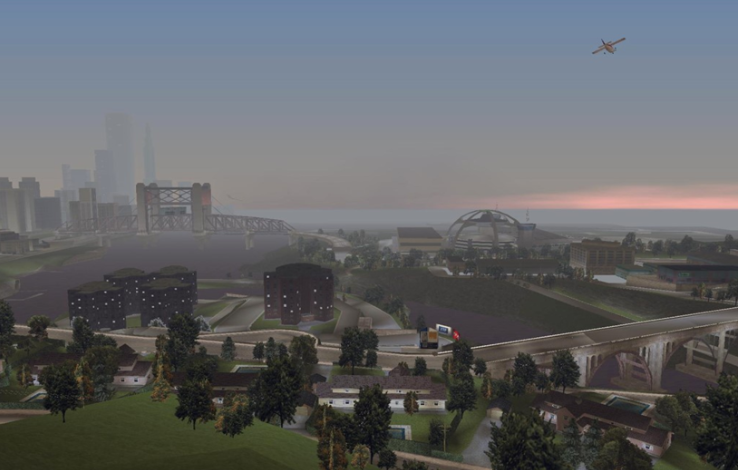
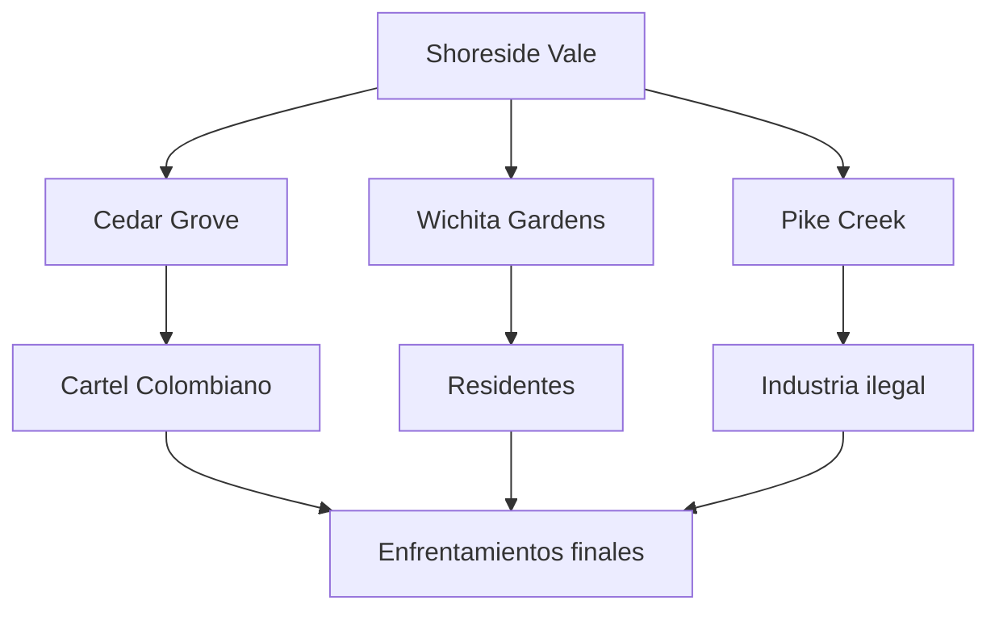
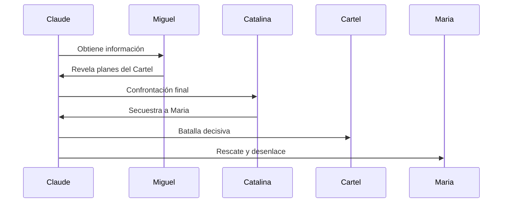

# 🏘️ Shoreside Vale
Creado en: 22/10/2025
Última actualización: 26/10/2025
Tiempo estimado de lectura: 4 min 31 sec

> [!CAUTION]
> Es posible que contenga spoilers

#### Tabla de Contenidos
1. [Introducción](#introducción)
2. [🏘️ Barrios y Zonas Clave](#️-barrios-y-zonas-clave)
    - [Wichita Gardens](#wichita-gardens)
    - [Cedar Grove](#cedar-grove)
    - [Francis Int. Airport](#francis-international-airport-fia)
3. [🛣️ Infraestructura y Accesibilidad](#️-infraestructura-y-accesibilidad)
    - [Tunel Porter](#túnel-porter)
    - [Puente Elevador](#puente-elevado-y-carreteras-sinuosas)
    - [Zonas Aisladas](#zonas-aisladas)
4. [🌄 Estética y Ambientación](#-estética-y-ambientación)
    - [Diseño Visual](#diseño-visual)
    - [Ambiente Sonoro](#ambiente-sonoro)
    - [Contraste norte y sur](#contraste-norte-y-sur)
5. [🎯 Función Narrativa](#-función-narrativa)
6. [Conclusiones y Referencias](#conclusiones-y-referencias)

---

## Introducción
Shoreside Vale es la tercera y última isla de Grand Theft Auto III, y ofrece un cambio radical en el paisaje urbano de Liberty City. Situada al oeste, esta zona suburbana y montañosa está inspirada en áreas residenciales como Nueva Jersey, con barrios tranquilos, parques, lagos y carreteras sinuosas que contrastan con el caos de Portland y Staunton Island. Sin embargo, bajo su apariencia apacible, Shoreside Vale esconde una red de crimen organizada y violencia que rivaliza con las otras islas.

| Área                  | Características                         | Actividad Criminal       |
|:----------------------|:----------------------------------------|--------------------------:|
| *Cedar Grove*           | Residencial de clase alta              | Baja                      |
| *Wichita Gardens*       | Zona residencial media                 | Media                     |
| *Pike Creek*            | Industrial y logística                 | Alta                      |

La región está dividida en tres áreas principales: Wichita Gardens, una zona residencial de clase media; Cedar Grove, un barrio más acomodado y aislado; y Pike Creek, un distrito industrial donde se llevan a cabo operaciones ilegales. Aquí operan los Carteles Colombianos, una de las facciones más peligrosas del juego, conocidos por su brutalidad y poder armamentístico. Shoreside Vale también presenta desafíos logísticos, como puentes bloqueados y rutas complejas, que obligan al jugador a adaptarse a un entorno menos urbano pero igualmente hostil. Esta isla representa el clímax de la historia de Claude, donde las traiciones se intensifican y los enfrentamientos finales definen su destino en el despiadado mundo de Liberty City.

 
<strong>📌 Información adicional</strong>

Shoreside Vale es la última isla desbloqueada en GTA III, y ofrece un entorno suburbano y montañoso. Aunque parece pacífica, es el bastión del Cartel Colombiano, la facción más peligrosa del juego. Incluye zonas como Cedar Grove, Wichita Gardens y Pike Creek, cada una con desafíos únicos. Es el escenario del clímax narrativo y el desenlace de la historia.

--- 

## 🏘️ Barrios y Zonas Clave

Shoreside Vale se divide en tres áreas principales, cada una con su propia identidad:

### Wichita Gardens
 Un complejo de viviendas públicas deterioradas, dominado por las bandas colombianas. Es la zona más peligrosa del distrito.

### Cedar Grove
 Barrio residencial de clase alta con casas grandes, calles arboladas y un ambiente tranquilo. Contrasta fuertemente con Wichita Gardens.

### Francis International Airport (FIA)
 El aeropuerto de Liberty City, una zona industrial y de tránsito que sirve como punto clave para misiones y tráfico aéreo.

| Distrito         | Banda Principal | Tipo de Territorio | Nivel de Peligro | Vehículos Comunes     |
|------------------|------------------|---------------------|------------------|------------------------|
| *Cedar Grove*      | Cartel Colombiano| Residencial          | Alto             | Cartel Cruiser         |
| *Wichita Gardens*  | Independiente    | Residencial          | Medio            | Idaho, Perennial       |
| *Pike Creek*       | Cartel Colombiano| Industrial           | Alto             | Mule, Yankee           |
| *Cochrane Dam*     | Sin banda        | Infraestructura      | Bajo             | Patriot, Barracks      |
| *Francis Intl. Airport* | Variado     | Transporte           | Medio            | Dodo, Coach            |

--- 

## 🛣️ Infraestructura y Accesibilidad

> [!NOTE]
> Algunos o todos estos elementos no serán accesible sin progresar antes en la historia del juego

### Túnel Porter
 Principal vía de acceso desde [Staunton Island](./articulo-2.md), desbloqueada en la última parte del juego.

### Puente elevado y carreteras sinuosas
 Shoreside Vale presenta una topografía más montañosa, con puentes, túneles y curvas cerradas que desafían la conducción.

### Zonas aisladas
 Algunas áreas están separadas por ríos o colinas, lo que refuerza la sensación de fragmentación urbana.

 
<strong>🧪 Ejemplo detallado</strong>

En la misión final “The Exchange”, Claude debe rescatar a Maria de Catalina. La misión incluye infiltración, combate intenso y una persecución en helicóptero. Shoreside Vale se convierte en un campo de batalla, donde cada decisión cuenta. El entorno montañoso y los caminos estrechos aumentan la dificultad, obligando al jugador a dominar el terreno.

---

## 🌄 Estética y Ambientación
### Diseño visual
 Menos densidad de edificios, más vegetación, y una paleta de colores más clara en comparación con los otros distritos.

### Ambiente sonoro
 Más silencioso, con sonidos de naturaleza, tráfico ligero y ocasionales disparos en zonas conflictivas.

### Contraste norte y sur
La parte norte de la isla está fuertemente dominada por el aeropuerto y zonas semi-industriales, mientras que la parte norte es una zona residencial apacible.

 
<strong>📚 Datos históricos / Contexto</strong>

Shoreside Vale está inspirada en los suburbios de Nueva Jersey, con influencias de zonas residenciales y parques estatales. Representa el contraste entre apariencia tranquila y violencia oculta. En términos de desarrollo, fue la última isla diseñada por Rockstar, y se utilizó para cerrar la narrativa con un entorno más abierto, ideal para persecuciones y enfrentamientos finales.

---

## 🎯 Función Narrativa
Shoreside Vale representa el clímax del juego. Aquí se desarrollan las misiones finales, incluyendo el enfrentamiento con Catalina y el Cartel Colombiano. Su diseño más abierto y menos urbano permite una jugabilidad distinta, con más énfasis en la exploración y el combate en espacios amplios.

Shoreside Vale cierra el viaje del jugador por [Liberty City](./index.md) con un entorno que mezcla tranquilidad aparente con violencia latente. Su diseño urbano refuerza la narrativa de aislamiento, poder y confrontación final.

## Conclusiones y Referencias
| Aspecto Clave         | Observación                                                                 |
|------------------------|------------------------------------------------------------------------------|
| *Estilo visual*          | Suburbano, montañoso, con zonas verdes y lagos                              |
| *Clímax narrativo*       | Enfrentamiento final con Catalina y el Cartel                               |
| *Dificultad alta*        | Terreno complejo y enemigos bien armados                                    |
| *Misiones clave*         | Rescate, infiltración, combate final                                         |
| *Impacto en la trama*    | Resolución del conflicto y cierre de la historia de Claude                  |

[← Anterior Artículo](./articulo-2.md)
[Siguiente Artículo →](./articulo-4.md)

[Volver al inicio ↑](#-shoreside-vale)

### 🔎 Ver también
- [Portland Island](./articulo-1.md)
- [Influencia en el mundo de los sandboxes](./articulo-4.md)
- [Staunton Island](./articulo-2.md)