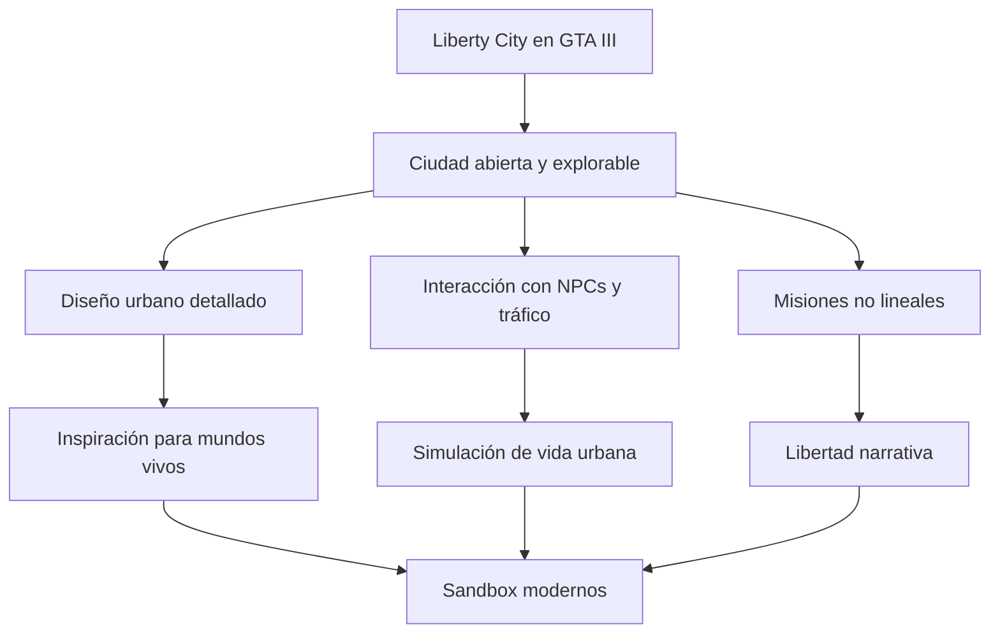
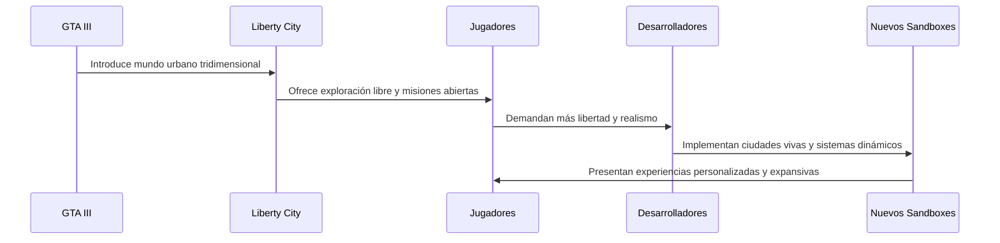

# 🎮 Influencia en el diseño de Sandboxes

#### Tabla de Contenidos
1. [Introducción](#introducción)
2. [🧭 Mundo Abierto Interconectado](#-mundo-abierto-interconectado)
3. [🎮 Integración de Narrativa y Espacio](#-integración-de-narrativa-y-espacio)
4. [🏙️ Realismo Urbano y Detalle Ambiental](#️-realismo-urbano-y-detalle-ambiental)
5. [🚓 Libertad de Acción y Caos Controlado](#-libertad-de-acción-y-caos-controlado)
6. [🧠 Diseño Modular y Escalado Narrativo](#-diseño-modular-y-escalado-narrativo)
7. [Conclusiones y Referencias](#conclusiones-y-referencias)

> [!CAUTION]
> Es posible que contenga spoilers

---

## Introducción
El lanzamiento de Grand Theft Auto III en 2001 marcó un antes y un después en la historia de los videojuegos, redefiniendo el concepto de mundo abierto y sentando las bases del género sandbox moderno. Por primera vez, los jugadores podían explorar una ciudad tridimensional viva, interactuar libremente con su entorno, y decidir cómo abordar las misiones, sin seguir una ruta lineal. Esta libertad narrativa y mecánica rompió con los esquemas tradicionales, permitiendo que la experiencia de juego se adaptara al estilo de cada jugador.

La estructura no lineal, el diseño urbano detallado y la integración de múltiples sistemas —como tráfico, clima, facciones criminales y diálogos dinámicos— inspiraron a decenas de desarrolladores a replicar y expandir el modelo sandbox. Títulos como Assassin’s Creed, Watch Dogs, Saints Row y Red Dead Redemption deben parte de su ADN a lo que GTA III introdujo. Además, el juego demostró que un entorno abierto podía ser tan narrativamente potente como cualquier historia lineal, siempre que se ofreciera contexto, ambientación y consecuencias. En definitiva, GTA III no solo revolucionó la forma de jugar, sino también la manera en que los mundos virtuales podían contar historias, fomentar la exploración y reflejar la complejidad de la vida urbana.

 
<strong>📌 Información adicional</strong>

Grand Theft Auto III fue desarrollado por Rockstar Games y lanzado en octubre de 2001. Fue el primer título de la saga en utilizar un entorno completamente tridimensional, lo que revolucionó la forma en que los jugadores interactuaban con los mundos virtuales. Su motor gráfico, RenderWare, permitió una simulación urbana fluida y dinámica, con ciclos de día y noche, clima cambiante y una ciudad que reaccionaba a las acciones del jugador. Además, la banda sonora con emisoras de radio ficticias añadió una capa de inmersión sin precedentes.

---
## 🧭 Mundo Abierto Interconectado
Liberty City fue uno de los primeros entornos urbanos tridimensionales completamente abiertos que permitía al jugador moverse libremente sin pantallas de carga entre zonas. Esta estructura influyó en títulos posteriores como Assassin’s Creed, Watch Dogs y Sleeping Dogs, que adoptaron ciudades interconectadas con transiciones fluidas.

Cada distrito ([Portland](./articulo-1.md), [Staunton Island](./articulo-2.md), [Shoreside Vale](./articulo-3.md)) tenía su propia identidad, economía y bandas, lo que ofrecía una sensación de mundo vivo y diverso.

El diseño incentivaba la exploración y el descubrimiento orgánico de misiones, secretos y conflictos.

 
<strong>📚 Datos históricos / Contexto</strong>

Antes de GTA III, los juegos de mundo abierto eran limitados en escala y libertad. Títulos como Driver o The Legend of Zelda: Ocarina of Time ofrecían exploración, pero no con la misma interactividad urbana. GTA III cambió eso al ofrecer una ciudad inspirada en Nueva York, con crimen organizado, tráfico, peatones y una narrativa no lineal. Su éxito comercial y crítico impulsó la evolución de los videojuegos hacia experiencias más abiertas, complejas y cinematográficas, influyendo en toda una generación de desarrolladores.

---

## 🎮 Integración de Narrativa y Espacio
El diseño urbano de Liberty City no era solo decorativo: estaba profundamente ligado a la narrativa. Las misiones se desarrollaban en lugares que reflejaban el tono y el conflicto del momento, como barrios mafiosos, zonas industriales o residenciales.

Esta integración inspiró juegos como [Red Dead Redemption](https://es.wikipedia.org/wiki/Red_Dead_Redemption) y [Cyberpunk 2077](https://es.wikipedia.org/wiki/Cyberpunk_2077), donde el entorno refuerza la historia y el desarrollo del personaje.

El uso de espacios urbanos para contar historias emergentes (como emboscadas, persecuciones o traiciones) se convirtió en una norma del género.

---

## 🏙️ Realismo Urbano y Detalle Ambiental
Aunque estilizada, Liberty City capturó la esencia de una ciudad postindustrial del noreste de EE. UU., con basura en las calles, tráfico impredecible y peatones con rutinas propias.

Este enfoque inspiró a desarrolladores a crear entornos más creíbles, como [The Elder Scrolls IV: Oblivion](https://es.wikipedia.org/wiki/The_Elder_Scrolls_IV:_Oblivion) y Mafia.

El detalle ambiental, como estaciones de tren, anuncios, y sonidos urbanos,  ayudó a establecer una atmósfera inmersiva que otros juegos replicaron.

---

## 🚓 Libertad de Acción y Caos Controlado
Liberty City ofrecía al jugador una libertad sin precedentes: robar vehículos, provocar el caos, ignorar misiones o seguir la historia. Esta filosofía de “haz lo que quieras” se convirtió en la piedra angular del diseño sandbox.

Juegos como Just Cause, Saints Row y Far Cry adoptaron esta libertad como base de su jugabilidad.

El sistema de “nivel de búsqueda” (wanted level) introdujo una mecánica de consecuencias que equilibraba el caos con el desafío.

 
<strong>🧪 Ejemplo detallado</strong>

Supongamos que el jugador se encuentra en Staunton Island y recibe una misión de Donald Love para eliminar a un líder de los Yardies. Puede optar por una emboscada directa con armas pesadas, o seguir al objetivo y esperar el momento perfecto para un ataque silencioso. Esta libertad de enfoque es una de las claves del diseño sandbox de GTA III. Además, durante la misión, el jugador puede escuchar una emisora de radio que comenta eventos recientes del juego, reforzando la sensación de un mundo vivo y conectado.

--- 

## 🧠 Diseño Modular y Escalado Narrativo
El desbloqueo progresivo de distritos en GTA III permitió escalar la dificultad, la complejidad de las misiones y la ambición del mundo. Esta estructura modular fue adoptada por muchos juegos sandbox para guiar al jugador sin limitar su libertad.

Títulos como Horizon Zero Dawn y Ghost of Tsushima usan zonas desbloqueables para mantener el ritmo narrativo y la progresión del jugador.

El diseño modular también facilitó la expansión de contenido en forma de DLCs o mundos abiertos más grandes.

## Conclusiones y Referencias
[← Anterior Artículo](./articulo-3.md)
[Siguiente Artículo →](./articulo-5.md)

[Volver al inicio ↑](#-influencia-en-el-diseño-de-sandboxes)

### 🔎 Ver también
- [Portland Island](./articulo-1.md)
- [Vida Urbana y Exploración](./articulo-5.md)
- [Staunton Island](./articulo-2.md)