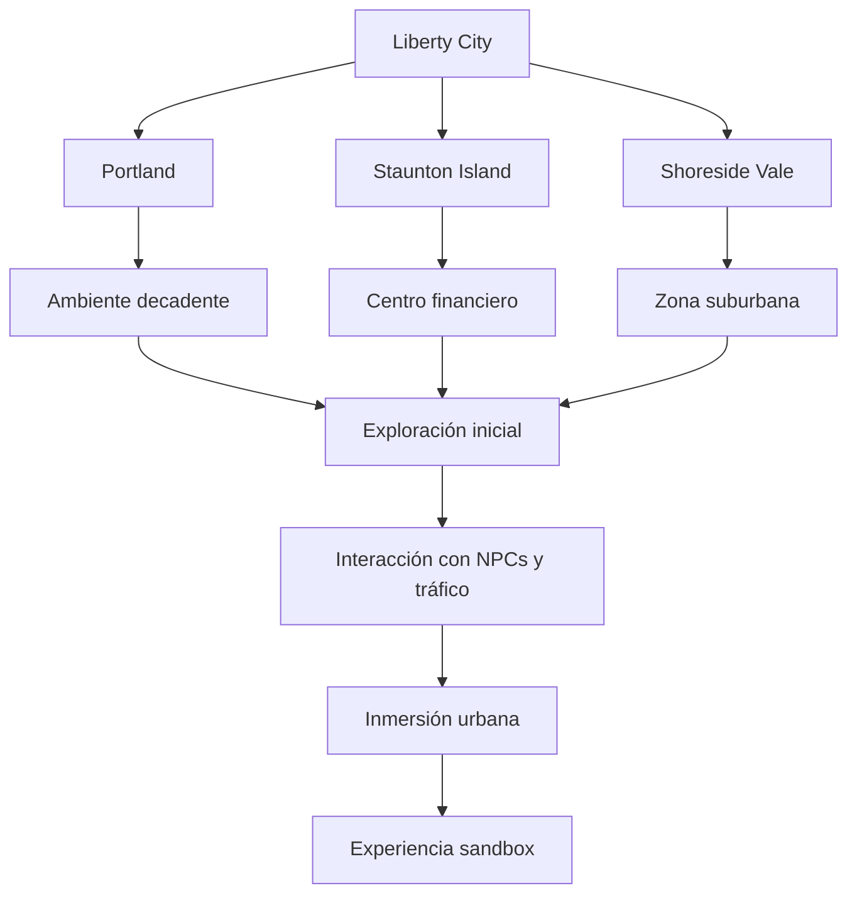
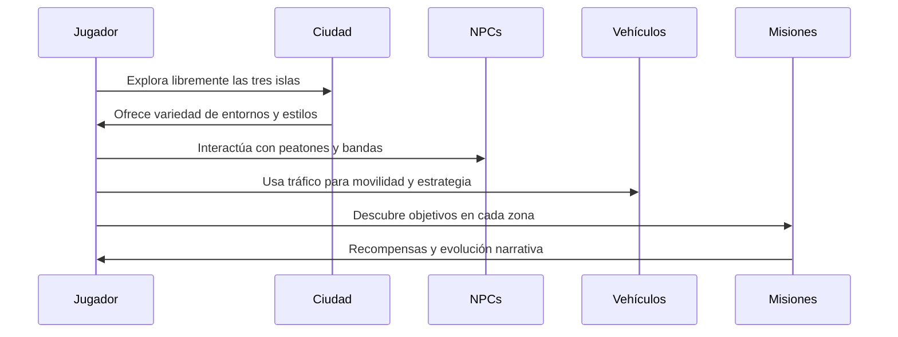

# 🚶‍♂️ Vida Urbana y Exploración
Creado en: 22/10/2025
Última actualización: 26/10/2025
Tiempo estimado de lectura: 5 min 38 sec

#### Tabla de Contenidos
1. [🌆 Una Ciudad que Nunca Duerme](#-una-ciudad-que-nunca-duerme)
2. [🗺️ Exploración por Distritos: Tres Mundos en Uno](#️-exploración-por-distritos-tres-mundos-en-uno)
    - [Portland](#portland)
    - [Staunton Island](#staunton-island)
    - [Shoreside Vale](#shoreside-vale)
3. [🚗 Vehículos, Rutas y Libertad de Movimiento](#-vehículos-rutas-y-libertad-de-movimiento)
    - [Vehiculos](#vehiculos)
    - [Calles y Corredores](#calles-y-corredores)
    - [GPS](#gps)
4. [💼 Actividades Alternativas y Vida Cotidiana](#-actividades-alternativas-y-vida-cotidiana)
    - [Misiones Secundarias](#misiones-secundarias)
    - [Minijuegos y desafios](#minijuegos-y-desafíos)
    - [Sorpresas en cada esquina](#sorpresas-en-cada-esquina)
5. [🧠 Narrativa Ambiental y Descubrimiento Orgánico](#-narrativa-ambiental-y-descubrimiento-orgánico)
    - [Elementos visuales](#elementos-visuales)
    - [Ambientacióm](#ambientación-con-objetos)
    - [Influencia](#influencia)

6. [Conclusiones y Referencias](#conclusiones-y-referencias)

> [!CAUTION]
> Es posible que contenga spoilers

---- 
## 🌆 Una Ciudad que Nunca Duerme

### Ambientación
Liberty City está diseñada para sentirse viva a toda hora. Desde el bullicio matutino en las calles de Portland hasta las luces de neón en el distrito financiero de Staunton Island, la ciudad simula un ciclo urbano constante. Peatones con rutinas propias, tráfico impredecible y sonidos ambientales —como sirenas, radios de autos y conversaciones callejeras— contribuyen a una atmósfera inmersiva que da la sensación de estar en una metrópolis real.

 
<strong>📌 Información adicional</strong>

La vida urbana en GTA III está diseñada para simular una ciudad que respira: peatones con rutinas, tráfico dinámico, clima cambiante y emisoras de radio que reaccionan a los eventos del juego. Cada isla tiene su propio ritmo y estilo de vida, lo que influye directamente en la jugabilidad. Por ejemplo, Portland es más hostil y caótica, mientras que Staunton Island ofrece una experiencia más estructurada y corporativa. Esta diversidad urbana permite que el jugador experimente distintos tipos de exploración, desde persecuciones callejeras hasta infiltraciones en zonas residenciales.

### NPCs
Los NPCs reaccionan al entorno huyen de ti, se enfrentan entre ellos o simplemente caminan con indiferencia.

### Clima
Las condiciones climáticas y el ciclo día-noche afectan la visibilidad, el comportamiento del tráfico y la ambientación general.

--- 

## 🗺️ Exploración por Distritos: Tres Mundos en Uno
Cada distrito de Liberty City ofrece una experiencia distinta:

 
<strong>🧪 Ejemplo detallado</strong>

Imagina que Claude está en Chinatown, Portland. Mientras camina por las calles, escucha una conversación entre peatones, ve un coche chocar por una maniobra brusca y observa cómo una banda rival patrulla la zona. Decide robar un vehículo y, al encender la radio, escucha una noticia que hace referencia a una misión reciente. Esta escena, completamente emergente, no está guionizada, pero refleja cómo la ciudad responde a las acciones del jugador y genera momentos únicos de exploración urbana.

### Portland
 Industrial y decadente, con callejones estrechos, fábricas y zonas portuarias. Ideal para misiones de bajo perfil y conflictos entre mafias.

### Staunton Island
 Centro financiero y político, con rascacielos, parques y casinos. Aquí se intensifican las misiones y la vigilancia policial.

### Shoreside Vale
 Suburbano y fragmentado, con zonas residenciales, un aeropuerto y barrios marginales. El terreno montañoso y los puentes lo hacen más complejo de navegar.

Explorar cada zona revela secretos, atajos, vehículos únicos y oportunidades para misiones secundarias.

| Zona de la ciudad     | Tipo de entorno     | Actividad principal     | Vehículos comunes       | Nivel de exploración |
|------------------------|----------------------|--------------------------|--------------------------|----------------------|
| Portland               | Industrial/decadente | Misiones iniciales       | Sentinel, Kuruma         | Alto                 |
| Staunton Island        | Financiero/moderno   | Conflictos entre mafias  | Infernus, Stretch        | Medio                |
| Shoreside Vale         | Suburbano/montañoso  | Clímax narrativo         | Cartel Cruiser, Patriot  | Medio                |
| Chinatown              | Comercial            | Enfrentamientos callejeros| Bobcat, Moonbeam        | Alto                 |
| Francis Intl. Airport  | Transporte/logística | Misiones de infiltración | Dodo, Coach              | Bajo                 |

---

## 🚗 Vehículos, Rutas y Libertad de Movimiento

### Vehiculos
La movilidad es clave en la vida urbana de Liberty City. El jugador puede robar y conducir una gran variedad de vehículos: taxis, deportivos, camiones, ambulancias y más. Cada tipo tiene su propia física, velocidad y utilidad.

> A diferencia de otras entradas en la saga, GTA 3 es el único que no presenta motocicletas como una opción de transporte.

### Calles y corredores
Las calles están llenas de rutas alternativas, rampas ocultas y túneles que permiten escapar de la policía o llegar más rápido a un destino.

### GPS
El sistema de navegación es libre puedes seguir el GPS de las misiones o simplemente conducir sin rumbo, descubriendo nuevas zonas.

--- 

## 💼 Actividades Alternativas y Vida Cotidiana
Más allá de las misiones principales, Liberty City ofrece múltiples formas de interactuar con su entorno:

### Misiones Secundarias
Misiones secundarias como taxista, paramédico, bombero o vigilante.

> Dejo las bases para minijuegos que perdurarían hasta la época de Grand Theft Auto Online y 5

### Minijuegos y desafíos
Minijuegos y desafíos como encontrar paquetes ocultos, realizar acrobacias o completar carreras callejeras.

### Sorpresas en cada esquina
Interacciones espontáneas puedes provocar peleas, ayudar a NPCs o simplemente observar cómo se desarrollan eventos aleatorios.

Estas actividades enriquecen la experiencia urbana y fomentan la exploración sin necesidad de seguir la historia principal.

---

## 🧠 Narrativa Ambiental y Descubrimiento Orgánico

### Elementos visuales
Liberty City cuenta historias sin necesidad de diálogos. La arquitectura, los grafitis, los anuncios publicitarios y la distribución de los espacios urbanos revelan tensiones sociales, decadencia económica y conflictos entre bandas.

> [!NOTE]
> Basada en Nueva York, se refleja en la ciudad el ambiente previo a los atentados del 11 de septiembre de 2001.

### Ambientación con objetos
Un callejón lleno de basura y autos quemados sugiere violencia reciente. Un club nocturno con autos de lujo estacionados afuera indica poder y corrupción.Un barrio con casas idénticas y niños jugando refleja una falsa sensación de seguridad. 
> Este enfoque de narrativa ambiental ha influido en muchos juegos posteriores, donde el entorno cuenta tanto como los personajes.

### Influencia
La vida urbana y la exploración en Liberty City no son solo mecánicas de juego: son una experiencia sensorial y narrativa que convirtió a GTA III en un referente del género sandbox. Cada rincón de la ciudad tiene algo que contar, y cada jugador puede descubrirlo a su manera.

 
<strong>📚 Datos históricos / Contexto</strong>

Antes de GTA III, los entornos urbanos en videojuegos eran limitados y poco interactivos. Liberty City cambió eso al ofrecer una ciudad tridimensional con sistemas interconectados: tráfico, facciones, misiones, clima y sonido ambiental. Inspirada en Nueva York, la ciudad fue diseñada para que cada rincón tuviera propósito y personalidad. Esta aproximación influyó en títulos posteriores como Assassin’s Creed, Watch Dogs y Sleeping Dogs, que adoptaron la idea de que explorar una ciudad podía ser tan emocionante como seguir una historia principal.

| Elemento urbano        | Función en el juego                          | Nivel de interacción     |
|:------------------------|:---------------------------------------------|---------------------------:|
| Distritos              | Dividen la ciudad en zonas temáticas         | Alto                      |
| Peatones               | Añaden vida y reacciones al entorno          | Medio                     |
| Tráfico vehicular      | Obstáculo y herramienta de movilidad         | Alto                      |
| Emisoras de radio      | Refuerzan la ambientación y narrativa        | Medio                     |
| Arquitectura urbana    | Define el estilo y tono de cada isla         | Bajo                      |

--- 

## Conclusiones y Referencias

| Aspecto clave                  | Observación                                                                 |
|--------------------------------|------------------------------------------------------------------------------|
| Diseño urbano                  | Refleja diversidad social, económica y criminal en cada isla                |
| Exploración libre              | Permite descubrir secretos, rutas alternativas y eventos dinámicos         |
| Interacción ambiental          | Peatones, tráfico y clima afectan la jugabilidad                           |
| Narrativa integrada            | La ciudad reacciona a las acciones del jugador y evoluciona con la historia|
| Impacto en el jugador          | Fomenta la inmersión y el sentido de pertenencia en un mundo vivo          |

[← Anterior Artículo](./articulo-4.md)
[Siguiente Artículo →](./glosario.md)

[Volver al inicio ↑](#️-vida-urbana-y-exploración)

### 🔎 Ver también
- [Portland Island](./articulo-1.md)
- [Influencia en el mundo de los sandboxes](./articulo-4.md)
- [Staunton Island](./articulo-2.md)