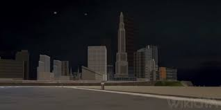

    <h1> Liberty City 🌆</h1>
    

---
#### Tabla de Contenidos
1. ✒️ [Descripción del proyecto](#-descripción-del-proyecto)
2. 📃 [Articulos Destacados](#-articulos-destacados)
3. 🧮 [Estadísticas del proyecto](#️-estadísticas-del-proyecto)
4. 👤 [Sobre el autor](#-sobre-el-autor)

## ✒️ Descripción del proyecto
**Liberty City**, el escenario principal de **Grand Theft Auto III**, no es solo una ciudad ficticia: es un personaje más dentro del universo del juego. Inspirada en la ciudad de Nueva York, esta metrópolis virtual se convirtió en un hito en la historia de los videojuegos por su atmósfera oscura, su estructura abierta y su narrativa envolvente.

Este proyecto tiene como objetivo explorar Liberty City desde múltiples perspectivas: su diseño urbano, la influencia cultural que refleja, su papel en la evolución del género sandbox, y cómo sus tres distritos: **Portland, Staunton Island** y **Shoreside Vale**, y como estos representan distintas las facetas del crimen, la corrupción y la vida urbana.

## 📃 Articulos destacados
| Articulo | Descripcion |
| :---: | --- |
| **[Portland](./articulo-1.md)** | La Ciudad de Portland, el primer barrio que visitamos en el juego cronologicamente |
| **[Influencia en Sandboxs](./articulo-4.md)** | El juego fue el primer GTA en 3D y marco un antes y un después para los juegos de mundo abierto |
| **[Glosario](./Glosario.md)** | Glosario con algunos términos útiles para entender mejor el sitio |

## 🧮 Estadísticas del proyecto
- Total de palabras:   666 
- Total de artículos:    666 
- Total de Diagramas:   666 

---
#### 👤 Sobre el autor
__José Melgares__: Estudiante de Ingeniería Informática en la Universidad Europea del Atlántico
> Toma el camino largo a casa

 
Última Actualización: **22/10/2025**