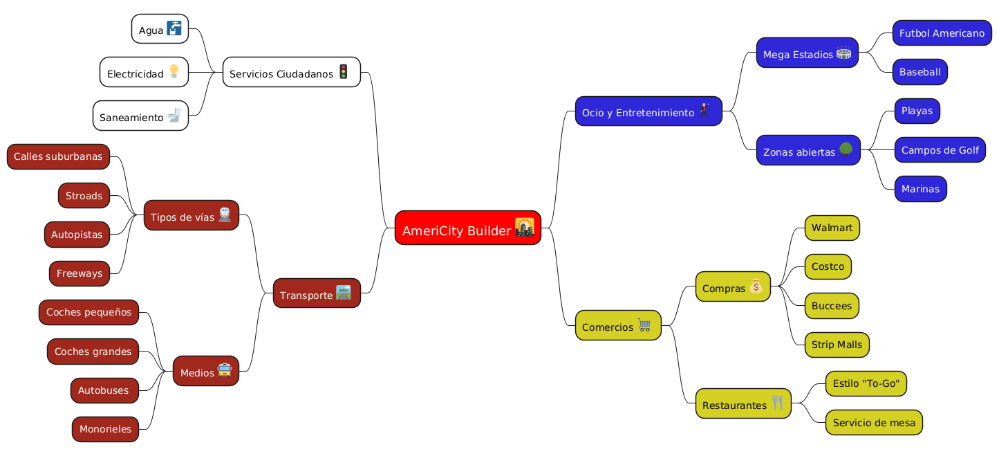
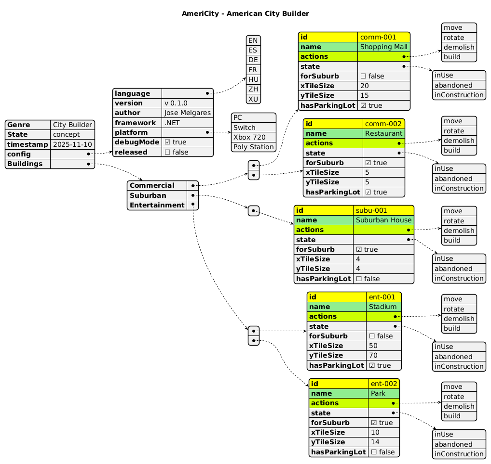
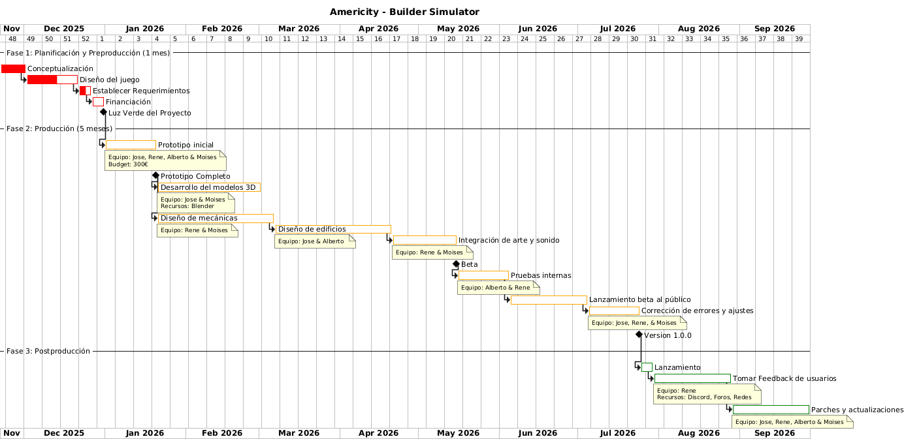
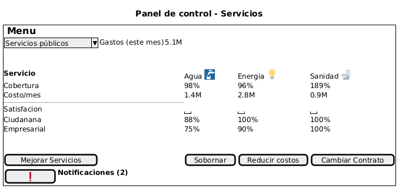

# Actividad de Evaluación Continua - PlantUML NoUML
En esta carpeta se encuentra la entrega de la actividad de evaluación de evaluación continua de PlantUML con la temática de un videojuego. El género del videojuego elegido es un **🏢 City Builder** con el título de **American City Builder Simulator**. En este juego el objetivo es contruir la mejor ciudad en estilo americano: autopistas gigantes, *stroads*, Walmarts gigantes, y mala accesibilidad peatonal. 

Abajo se muestran las imagenes de como se ve cada diagrama. Cabe destacar que se destacan las acciones relacionadas a la construcción y desarrollo de mapa, sin divagar en las misiones y elementos más pequeños del juego.

---

## Mapa Mental 

---

## Diagrama JSON

--- 

## Diagrama Gantt

## Wireframe

