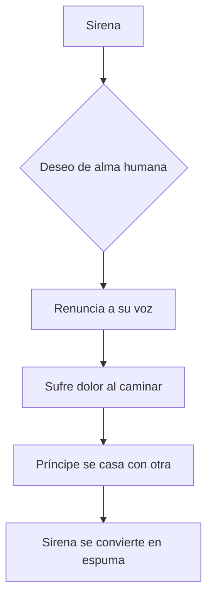

# 🧜‍♀️ La historia de La Sirenita

**[Inicio](index.md)**  
**Fecha de creación:** 22 de octubre de 2025  
**Última actualización:** 22 de octubre de 2025  
**Tiempo estimado de lectura:** ~9 min  
**Etiquetas:** cuento de hadas, Andersen, adaptación, mitología, cultura popular

---

## Tabla de Contenidos

1. [Introducción](#introducción)  
2. [Orígenes y contexto](#orígenes-y-contexto)  
   - [Biografía de Andersen](#biografía-de-andersen)  
   - [Inspiraciones literarias](#inspiraciones-literarias)  
   - [Publicación y recepción](#publicación-y-recepción)  
3. [Análisis del cuento original](#análisis-del-cuento-original)  
   - [Trama principal](#trama-principal)  
   - [Temas y simbolismos](#temas-y-simbolismos)  
   - [Final original](#final-original)  
4. [Conclusión](#conclusión)

---

## Introducción

*La Sirenita* es un cuento clásico escrito por **Hans Christian Andersen** y publicado por primera vez en **1837**. La historia narra la vida de una joven sirena que anhela poseer un alma humana y experimentar el amor verdadero. Este relato, aunque en apariencia una fábula infantil, encierra una profunda reflexión sobre el **sacrificio, la identidad, el deseo y la trascendencia espiritual**.

El cuento ha trascendido generaciones y adaptaciones, siendo reinterpretado en distintas formas —desde obras literarias y ballets hasta películas animadas y producciones teatrales—. Sin embargo, el mensaje original de Andersen dista mucho del final feliz popularizado por versiones modernas: su *Sirenita* no alcanza el amor terrenal, sino una redención espiritual a través del sufrimiento y la entrega.

---

## Orígenes y contexto

### Biografía de Andersen

Hans Christian Andersen (1805–1875) fue un escritor danés cuya obra transformó la literatura infantil del siglo XIX. Nació en **Odense, Dinamarca**, en el seno de una familia humilde. Su infancia estuvo marcada por la pobreza y por una intensa imaginación alimentada por cuentos populares y mitologías nórdicas.  

A lo largo de su vida, Andersen escribió más de 150 cuentos, entre los que destacan *El patito feo*, *El soldadito de plomo*, *La reina de las nieves* y, por supuesto, *La Sirenita*. Aunque hoy se le reconoce por su talento narrativo, en su época también sufrió rechazo y soledad, elementos que se reflejan con fuerza en muchos de sus personajes.

### Inspiraciones literarias

La historia de *La Sirenita* fue influenciada por **mitos escandinavos** sobre criaturas marinas que deseaban unirse al mundo humano. En las antiguas leyendas, las sirenas simbolizaban la dualidad entre la atracción y el peligro, entre lo celestial y lo terrenal.

Sin embargo, el cuento también puede leerse como una **metáfora de la vida del propio Andersen**. Algunos estudiosos interpretan que la Sirenita representa su sentimiento de no pertenecer plenamente a la sociedad, así como su amor no correspondido hacia hombres a quienes admiraba profundamente. De este modo, la historia adquiere una dimensión autobiográfica: la imposibilidad de ser amado en la forma deseada, y el anhelo de ser aceptado más allá de las apariencias.

### Publicación y recepción

Cuando fue publicado en 1837 dentro del volumen *Cuentos para niños*, el relato causó **impacto y desconcierto**. Su tono melancólico y su final trágico se apartaban de las fábulas moralizantes típicas de la época. Algunos críticos consideraron que el cuento era demasiado triste para los niños, mientras que otros elogiaron la sensibilidad poética de Andersen.

Con el paso del tiempo, *La Sirenita* se convirtió en una de las obras más leídas y adaptadas del autor. En la actualidad, es vista como un **clásico de la literatura universal**, capaz de conmover tanto a niños como a adultos por su profundidad emocional y su ambigüedad moral.

---

## Análisis del cuento original

### Trama principal

La historia relata la vida de una joven sirena que vive en un palacio submarino con su familia. Fascinada por el mundo de los humanos, anhela conocerlo y experimentar su forma de vida. Al cumplir quince años, obtiene permiso para salir a la superficie, donde ve a un príncipe del que se enamora profundamente.

Deseando estar a su lado, la sirenita acude a una **bruja del mar** que le ofrece una pócima para transformarse en humana, a cambio de **su voz**, el bien más preciado que posee. La bruja le advierte que caminar le causará un dolor insoportable, como si pisara cuchillos, y que si el príncipe se casa con otra, su corazón se romperá y se disolverá en espuma de mar.

Pese a todo, la sirenita acepta el trato. Vive en el mundo humano, cerca del príncipe, pero su amor no es correspondido. Finalmente, él se casa con otra mujer, y la sirenita, fiel a su destino, se convierte en espuma, desapareciendo con la aurora.

### Temas y simbolismos

*La Sirenita* no es solo una historia de amor trágico: es una **alegoría del sacrificio, la identidad y la redención**.  
- **El sacrificio personal**: la sirenita renuncia a su voz (su esencia) y soporta dolor físico para alcanzar un ideal inalcanzable.  
- **La búsqueda de un alma**: su deseo de obtener un alma inmortal refleja una aspiración espiritual, no meramente romántica.  
- **La transformación**: el paso de sirena a humana simboliza el tránsito entre mundos —del instinto a la conciencia, del deseo al espíritu—.  
- **El silencio**: perder la voz representa la dificultad de expresar el propio ser cuando se busca agradar a otros.

En conjunto, Andersen nos habla de la **condición humana**, de cómo el amor y la fe pueden implicar sufrimiento, pero también una forma más elevada de existencia.

### Final original

A diferencia de las adaptaciones modernas (como la de Disney), el cuento termina con la **muerte simbólica** de la protagonista. Al ver casarse al príncipe con otra, la sirenita elige no matarlo —aunque tenía la posibilidad de hacerlo para salvarse— y acepta su destino, disolviéndose en espuma.  

Sin embargo, Andersen introduce un giro espiritual: su espíritu no desaparece, sino que se convierte en una **“hija del aire”**, destinada a ganar un alma inmortal mediante buenas acciones. Es un final triste, pero también **redentor**, que sugiere que el amor y la bondad no mueren, sino que trascienden.

## Conclusión

*La Sirenita* de Andersen sigue siendo una obra fascinante por su capacidad de combinar lo mágico con lo humano. Es una historia sobre el anhelo de ser amado y comprendido, pero también sobre la aceptación del destino y la búsqueda de un significado más profundo en la existencia.  

Su mensaje final es claro: aunque el amor no siempre se concreta en la vida terrenal, el sacrificio sincero puede conducir a una forma más pura de eternidad.

