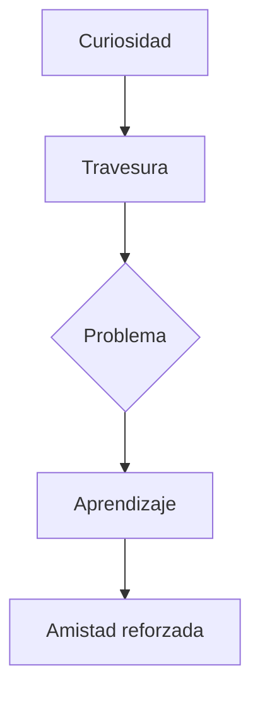

# 🐰 El Conejito Travieso

**[Inicio](index.md)**  
**Fecha de creación:** 20 de octubre de 2025  
**Última actualización:** 20 de octubre de 2025  
**Tiempo estimado de lectura:** ~6 min  
**Etiquetas:** cuento infantil, aventura, valores, amistad, naturaleza

---

## Tabla de Contenidos

1. [Introducción](#introducción)  
2. [El personaje principal](#el-personaje-principal)  
3. [Aventuras y travesuras](#aventuras-y-travesuras)  
4. [Lecciones y moralejas](#lecciones-del-bosque)  
5. [Conclusión](#conclusión)

---

## Introducción

Este cuento narra las aventuras de un **conejito curioso y travieso** que vive en un bosque lleno de vida, misterio y enseñanzas. A través de sus pequeñas travesuras, el protagonista descubrirá la importancia de la **amistad, la responsabilidad y el respeto por la naturaleza**.

Aunque su curiosidad lo lleva a situaciones complicadas, cada experiencia se convierte en una oportunidad para aprender y crecer. Este relato combina la ternura de la infancia con un mensaje universal: **la verdadera sabiduría nace de los errores y del deseo de mejorar**.

---

## El personaje principal

### Características del conejo

El conejito es **curioso, juguetón y valiente**. Siempre quiere saber qué hay más allá de su madriguera, qué sonidos nuevos se escuchan al amanecer o de dónde vienen los olores que trae el viento.  
Tiene un pelaje suave como la nieve y unos ojos brillantes llenos de inquietud. No puede quedarse quieto mucho tiempo: cada día es una oportunidad para descubrir algo nuevo.

Pese a su tamaño pequeño, su espíritu es enorme. No teme aventurarse, aunque a veces sus decisiones impulsivas lo metan en apuros.

### Familia y amigos

El conejo vive con su **familia numerosa** en una madriguera cálida y acogedora bajo las raíces de un viejo roble. Su madre, paciente y sabia, siempre le advierte que piense antes de actuar; su padre le enseña a cuidar el bosque y a respetar a todos los animales.

Entre sus amigos se encuentran:
- **Lina la ardilla**, veloz y prudente, que suele salvarlo de sus travesuras.
- **Toto el erizo**, que lo acompaña en sus exploraciones y le recuerda los peligros del bosque.
- **Nico el búho**, el más sabio de todos, que le ofrece consejos cuando el pequeño no sabe qué hacer.

### Su personalidad

El conejito es el reflejo de la **curiosidad infantil**: inocente, impulsivo y soñador. Su deseo de aprender lo empuja a explorar, pero también a equivocarse. Cada error, sin embargo, se convierte en una lección.

Aunque a veces desobedece, su corazón es noble. Siempre busca reparar sus errores y demostrar que ha aprendido algo nuevo. En el fondo, su travesura no es malicia, sino **deseo de entender el mundo** que lo rodea.

---

## Aventuras y travesuras

### Explorando el bosque

Un día soleado, el conejito decide aventurarse más lejos que nunca. Corre entre flores, escucha el canto de los pájaros y observa el brillo del río bajo la luz del sol.  
Cada rincón del bosque parece esconder un secreto: un tronco hueco lleno de setas, un zorro sigiloso que pasa sin hacer ruido, o un campo de zanahorias silvestres que parece un tesoro.

A medida que explora, siente una mezcla de emoción y temor: **la emoción de descubrir lo desconocido** y el **temor de estar demasiado lejos de casa**.

### Encuentros con otros animales

En sus aventuras, el conejito conoce a muchos animales del bosque. Algunos se convierten en sus amigos y aliados; otros lo ponen a prueba.

- Con **Lina la ardilla**, aprende la importancia de compartir.  
- Con **Toto el erizo**, descubre que la valentía no consiste en no tener miedo, sino en actuar a pesar de él.  
- Con **Nico el búho**, comprende que la sabiduría llega con el tiempo y la reflexión.

No todos los encuentros son amistosos. En una ocasión, se cruza con **el zorro**, que lo persigue hasta su madriguera. Gracias a su rapidez y a la ayuda de sus amigos, logra escapar. Esa experiencia lo hace entender que la curiosidad también requiere **precaución y respeto por los límites**.

### Una travesura peligrosa

Un día, el conejito se atreve a acercarse a la huerta de los humanos. La tentación de las zanahorias frescas es demasiado grande.  
Ignora las advertencias de su madre y se cuela entre las vallas. Come sin parar, feliz y orgulloso de su hazaña, hasta que escucha un ruido: ¡el granjero ha salido a buscarlo!

Asustado, corre lo más rápido que puede, esquivando herramientas y saltando sobre cubos. Finalmente logra escapar por un hueco en la cerca, pero no sin rasparse una pata.

Esa noche, en su madriguera, reflexiona sobre lo ocurrido. Entiende que su desobediencia no solo lo puso en peligro, sino que también preocupó a su familia. Promete ser más cuidadoso, aunque sabe que su curiosidad seguirá siendo parte de él.

## Lecciones del bosque

A lo largo de sus aventuras, el conejito aprende que:
- La **curiosidad** es buena, pero necesita prudencia.  
- La **amistad** es un refugio en los momentos difíciles.  
- La **responsabilidad** significa pensar antes de actuar.  
- El **respeto por la naturaleza** es esencial para vivir en armonía.  

Cada una de sus experiencias se convierte en una historia, y cada historia deja una huella en su corazón.

---

## Conclusión

El conejito travieso nos enseña que **equivocarse es parte del aprendizaje**. A través de sus travesuras, descubre el valor del perdón, la importancia de escuchar a los demás y el poder de la empatía.

Su historia no es solo una fábula infantil, sino una metáfora de la vida misma: un viaje de descubrimiento donde cada paso, incluso los más torpes, nos acercan a la sabiduría.

---

## Diagrama de aprendizaje del conejito

