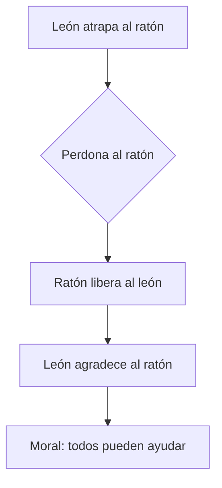

# 🦁 El León y el Ratón

**[Inicio](index.md)**  
**Fecha de creación:** 18 de octubre de 2025  
**Última actualización:** 18 de octubre de 2025  
**Tiempo estimado de lectura:** ~5 min  
**Etiquetas:** fábula, Esopo, amistad, valores, animales

---

## Tabla de Contenidos

1. [Introducción](#introducción)  
2. [Resumen de la fábula](#resumen-de-la-fábula)  
3. [Análisis moral](#análisis-moral)  
4. [Importancia cultural](#importancia-cultural)  
5. [Representaciones artísticas](#representaciones-artísticas)

---

## Introducción

La fábula **_El León y el Ratón_** es una de las más conocidas y queridas del sabio griego **Esopo**, quien vivió alrededor del siglo VI a.C. Este relato breve, pero profundo, nos recuerda que incluso los más pequeños pueden ofrecer una ayuda valiosa, y que **la bondad y la gratitud** trascienden el tamaño o la fuerza física.

Con su sencillez, esta fábula ha perdurado durante siglos, transmitiéndose de generación en generación y enseñando a niños y adultos el valor de la **humildad, la amistad y el respeto mutuo**. Su mensaje sigue siendo actual: nadie es tan poderoso que no necesite ayuda, ni tan pequeño que no pueda brindarla.

---

## Resumen de la fábula

### Encuentro entre León y Ratón

Una tarde calurosa en la sabana, un **león** dormía plácidamente bajo la sombra de un árbol. De repente, un **ratoncito** travieso empezó a correr por encima de él, sin darse cuenta del peligro. El rugido del león resonó por todo el bosque cuando despertó, atrapando al pequeño entre sus garras.

El ratón, temblando de miedo, le suplicó que lo perdonara, prometiendo que algún día le devolvería el favor. El león, divertido ante semejante idea, sonrió con indulgencia y lo dejó en libertad. Aquel acto de compasión marcaría el inicio de una inesperada amistad.

### Ayuda inesperada

Días después, el león cayó en una **trampa de cazadores**, enredado en una red resistente. Incapaz de liberarse, rugió con desesperación. El pequeño ratón, al escuchar sus lamentos, corrió hacia él y comenzó a **roer las cuerdas con sus diminutos dientes**.  
Poco a poco, logró cortar las ligaduras, hasta que el león recuperó su libertad. Agradecido y sorprendido, el rey de la selva comprendió que el ratón había cumplido su promesa.

### Moral de la historia

> “No desprecies la ayuda de nadie; incluso el más pequeño puede hacer grandes cosas.”

La moraleja de esta fábula enseña que **el valor no depende del tamaño ni de la fuerza**, sino del corazón y la voluntad de hacer el bien. La bondad genera gratitud, y la gratitud fortalece la amistad.

---

## Análisis moral

### Valor de la humildad

El león, símbolo de poder y autoridad, aprende una valiosa lección sobre la **humildad**. Al perdonar al ratón, descubre que la grandeza no se demuestra mediante la fuerza, sino a través de la **compasión y la empatía**.  
El ratón, por su parte, demuestra que hasta el ser más pequeño puede ser esencial cuando actúa con valor y determinación.

### Amistad y gratitud

La fábula también resalta el **poder de la amistad sincera**. El gesto del león al perdonar la vida del ratón genera una conexión que, más adelante, se transforma en gratitud mutua.  
Ambos personajes crecen interiormente: el león aprende a valorar a los demás, y el ratón se siente digno y valiente por haber correspondido al favor recibido.

### Justicia y perdón

El acto del león al liberar al ratón representa una forma de **justicia compasiva**: el uso del poder no para destruir, sino para proteger.  
Asimismo, el cuento enseña que **el perdón puede generar consecuencias positivas**, creando lazos duraderos y fortaleciendo la armonía entre los seres vivos.

---

## Importancia cultural

### Popularidad universal

Desde su origen en la antigua Grecia, *El León y el Ratón* ha sido adaptada en innumerables versiones. Autores como **Jean de La Fontaine** y **Félix María de Samaniego** reinterpretaron la fábula, manteniendo su esencia moral.  
Su mensaje universal ha permitido que sea contada en distintos idiomas y culturas, convirtiéndose en un símbolo del valor del pequeño frente al poderoso.

### Uso en educación

Esta fábula es una herramienta fundamental en la **educación moral infantil**. Se utiliza en escuelas para enseñar la empatía, la gratitud y la importancia de la cooperación. A través de su narrativa sencilla, los niños aprenden que todos tienen algo que ofrecer, sin importar su tamaño o condición.

### Representaciones artísticas

La historia ha inspirado **ilustraciones, obras de teatro, cortometrajes y animaciones**. En muchas de ellas, se destaca la ternura del ratón y la nobleza del león. La fábula también ha sido plasmada en mosaicos, relieves y libros ilustrados que mantienen viva la tradición de Esopo en la cultura popular.

