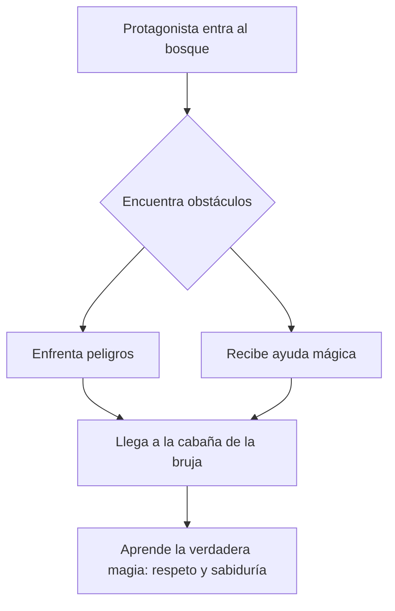

# 🧙‍♂️ La Bruja del Bosque

**[Inicio](index.md)**  
**Fecha de creación:** 21 de octubre de 2025  
**Última actualización:** 21 de octubre de 2025  
**Tiempo estimado de lectura:** ~7 min  
**Etiquetas:** cuento fantástico, magia, bosque, valores, misterio

---

## Tabla de Contenidos

1. [Introducción](#introducción)  
2. [El personaje de la bruja](#el-personaje-de-la-bruja)  
3. [El bosque encantado](#el-bosque-encantado)    
4. [Conclusión](#conclusión)

---

## Introducción

En este cuento fantástico, una **joven valiente** se adentra en un **bosque misterioso** donde habita una **bruja con poderes mágicos**. Lo que comienza como una historia de miedo y superstición, se convierte en una lección sobre **valentía, respeto y la importancia de mirar más allá de los prejuicios**.

A través del viaje de la protagonista, el relato reflexiona sobre los temores humanos hacia lo desconocido y la necesidad de comprender antes de juzgar. En el corazón del bosque, lo que parece peligroso puede ser sabio, y lo que se teme, puede convertirse en un aliado.

---

## El personaje de la bruja

### Apariencia y habilidades

La bruja del bosque es descrita como una **mujer sabia y enigmática**, de mirada profunda y voz serena. Su cabello, largo y gris como la niebla matinal, parece contener siglos de conocimiento.  
No es la típica figura malvada de los cuentos tradicionales: sus poderes provienen del **equilibrio con la naturaleza**, no de la oscuridad. Puede hablar con los animales, controlar los elementos del bosque y curar con hierbas y encantamientos.

En lugar de usar su magia para dominar, la emplea para **proteger el bosque** y mantener la armonía entre todas las criaturas que lo habitan.

### Origen del personaje

Las leyendas cuentan que la bruja ha vivido **durante siglos** en aquel bosque encantado, custodiando los secretos de la tierra y los antiguos espíritus del lugar. Algunos dicen que fue una vez una joven que aprendió la magia de los árboles; otros creen que es un espíritu encarnado en forma humana.

Sea cual sea su origen, todos coinciden en que **su poder está ligado al bosque mismo**: si él muere, ella desaparece. Por eso, dedica su vida a preservar el equilibrio natural frente a la avaricia de los humanos que intentan explotarlo.

### Relación con los habitantes del bosque

Al principio, la bruja es **temida por los aldeanos**. Se cuentan historias sobre su cabaña envuelta en hiedra y sobre luces extrañas que se ven entre los árboles al anochecer.  
Sin embargo, quienes se acercan a ella con respeto descubren su verdadera naturaleza: **una guardiana benevolente** que ayuda a los perdidos, cura a los enfermos y protege a los animales heridos.

Poco a poco, el miedo se transforma en respeto, y su figura se convierte en un símbolo de **sabiduría y equilibrio** entre el ser humano y la naturaleza.

---

## El bosque encantado

### Descripción del entorno

El bosque encantado es un lugar **antiguo y vivo**, donde cada árbol parece tener conciencia y cada sombra guarda un secreto.  
Sus senderos cambian según las intenciones de quien los recorre: los corazones puros encuentran caminos claros, mientras que los egoístas se pierden en la niebla.  
Entre los árboles se esconden criaturas mágicas —zorros parlantes, ciervos de luz, luciérnagas azules— que observan silenciosamente a los visitantes.

El aire está impregnado de magia, y el susurro del viento suena como una voz ancestral que cuenta historias olvidadas.

### Peligros y encantamientos

El bosque está protegido por **encantamientos naturales**. No todos los que entran logran salir. Existen trampas mágicas que despiertan si alguien actúa con codicia o malicia.  
Los caminos pueden cerrarse, los árboles moverse y los animales transformarse para probar la pureza del corazón de los intrusos.  

Estos peligros no son castigos, sino **lecciones**: cada obstáculo enseña algo sobre la paciencia, la humildad o la valentía. Solo aquellos que demuestran respeto por la vida y la naturaleza pueden avanzar sin daño.

### La aventura de la protagonista

La protagonista, una joven del pueblo cercano, se adentra en el bosque en busca de la bruja para **pedirle ayuda**: su aldea sufre una terrible sequía y los campos han dejado de florecer.  
Aunque la gente le advierte que nadie ha vuelto de ese bosque, ella decide enfrentarse al miedo por el bien de los suyos.

Durante su camino:
- Se pierde entre árboles que cambian de lugar.
- Enfrenta espejismos que reflejan sus miedos más profundos.
- Conoce criaturas mágicas que la ponen a prueba.

Gracias a su **corazón sincero y su coraje**, logra superar cada obstáculo. Al final, llega a la cabaña de la bruja, un lugar cubierto de enredaderas y rodeado de flores que brillan bajo la luna.  
Allí descubre que la bruja no es una enemiga, sino una **maestra ancestral**, quien le enseña que la verdadera magia nace del respeto por la naturaleza.

Con su ayuda, la joven aprende a invocar la lluvia mediante un ritual de armonía y agradecimiento, salvando así a su pueblo. Cuando regresa, ya no es la misma: ha encontrado sabiduría y una nueva forma de mirar el mundo.

## Conclusión

Este cuento fantástico representa el viaje de iniciación de una heroína que aprende a vencer sus temores y a mirar con el corazón.
La bruja, lejos de ser un símbolo del mal, encarna la sabiduría femenina y la conexión espiritual con la naturaleza.
El bosque, por su parte, actúa como espejo del alma humana: solo quienes se enfrentan a sí mismos pueden encontrar la verdad que buscan.

En definitiva, la historia nos enseña que la valentía no consiste en luchar contra la oscuridad, sino en atreverse a comprenderla.

## Diagrama del viaje de la protagonista

