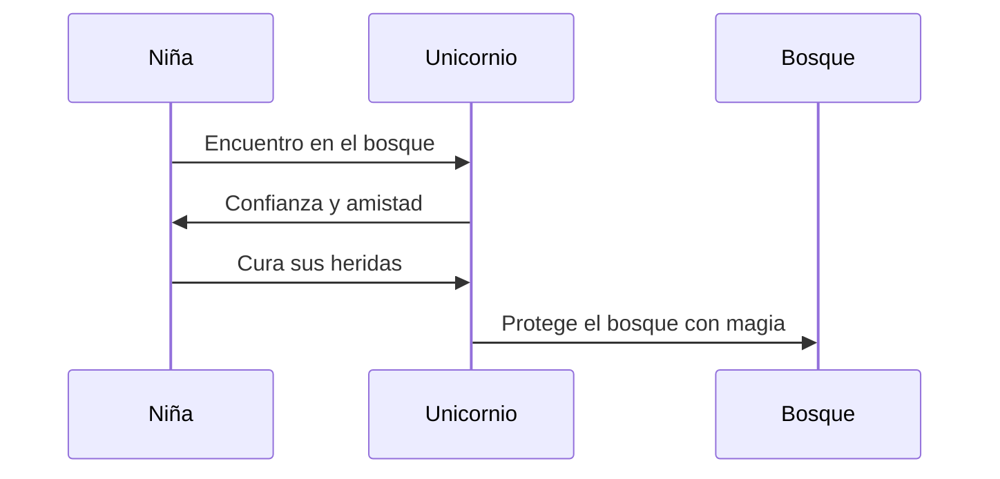

# 🦄 El Unicornio Mágico

**[Inicio](index.md)**  
**Fecha de creación:** 22 de octubre de 2025  
**Última actualización:** 22 de octubre de 2025  
**Tiempo estimado de lectura:** ~8 min  
**Etiquetas:** cuento fantástico, unicornio, magia, amistad, valores

---

## Tabla de Contenidos

1. [Introducción](#introducción)  
2. [El unicornio y su mundo](#el-unicornio-y-su-mundo)  
   - [Descripción del unicornio](#descripción-del-unicornio)  
   - [El reino encantado](#el-reino-encantado)  
   - [Los habitantes mágicos](#los-habitantes-mágicos)  
3. [La amistad mágica](#la-amistad-mágica)  
   - [Encuentro con la niña](#encuentro-con-la-niña)  
   - [Vínculo especial](#vínculo-especial)  
   - [Lecciones compartidas](#lecciones-compartidas)

---

## Introducción

Este cuento narra la historia de un **unicornio mágico** que ayuda a una **niña valiente y curiosa** a descubrir el poder de la **amistad y la bondad** en un mundo lleno de misterios.  
A través de su encuentro, ambos aprenden que la verdadera magia no reside en los hechizos ni en la fuerza, sino en la **pureza del corazón** y el deseo de ayudar a los demás.

El relato combina elementos de fantasía y reflexión, recordando que incluso en los lugares más oscuros, un pequeño acto de bondad puede iluminarlo todo.

---

## El unicornio y su mundo

### Descripción del unicornio

El unicornio es un **ser noble y luminoso**, con un cuerno que brilla como un rayo de luna.  
Sus poderes curativos pueden sanar heridas físicas y emocionales, y su sola presencia transmite calma y esperanza.  
Posee una conexión especial con la naturaleza, y su magia proviene del equilibrio entre la vida, la pureza y la armonía.

Representa la **sabiduría ancestral** y la **bondad sin límites**, un símbolo de lo que el mundo podría ser si todos actuaran con compasión.

### El reino encantado

El unicornio habita en un **reino oculto entre montañas cristalinas y praderas eternas**, donde la magia fluye como el viento.  
Los ríos cantan, los árboles murmuran historias antiguas, y las flores cambian de color según las emociones de quienes las tocan.  
En este lugar sagrado, cada criatura vive en **perfecta armonía**, custodiada por el poder del unicornio.

Es un mundo que refleja la pureza de su guardián: hermoso, sereno y lleno de vida.

### Los habitantes mágicos

El bosque encantado está habitado por **hadas, duendes, dragones bondadosos y animales parlantes**, que conviven en equilibrio.  
Cada uno cumple una función: las hadas cuidan las flores, los dragones protegen los cielos y los búhos sabios guardan los secretos del tiempo.  
Todos respetan al unicornio como su guía y protector, pues su luz mantiene la paz y la magia del reino.

Sin embargo, su mundo se ve alterado cuando una presencia humana entra por primera vez al bosque: una niña de corazón puro.

---

## La amistad mágica

### Encuentro con la niña

Una mañana, la **niña protagonista** se adentra en el bosque, atraída por una melodía misteriosa.  
Allí encuentra al unicornio **herido por una trampa** colocada por cazadores que buscaban su cuerno.  
Sin dudarlo, la niña corre a ayudarlo: limpia sus heridas, le da agua y se queda a su lado hasta que puede levantarse.

El unicornio, agradecido, percibe la bondad en su corazón y **decide confiar en ella**, sellando un lazo que cambiará sus vidas para siempre.

### Vínculo especial

Con el paso del tiempo, la niña y el unicornio comparten días de aventuras, risas y aprendizaje.  
Ella aprende a comprender el lenguaje del bosque, mientras él descubre la ternura del espíritu humano.  
Su **amistad está basada en la confianza, la lealtad y el respeto mutuo**, y juntos logran restaurar la armonía del bosque.

Su conexión demuestra que, aunque provengan de mundos distintos, **la empatía puede unir lo imposible**.

### Lecciones compartidas

Ambos personajes aprenden valiosas lecciones de su encuentro:

- La **bondad** tiene más poder que cualquier hechizo.  
- La **amistad** puede curar heridas invisibles.  
- La **naturaleza** responde al amor y al respeto.  
- La **magia verdadera** nace del corazón y no de los poderes.  

La historia del unicornio y la niña es un recordatorio eterno de que **ayudar a los demás es el acto más mágico que existe**.

---

