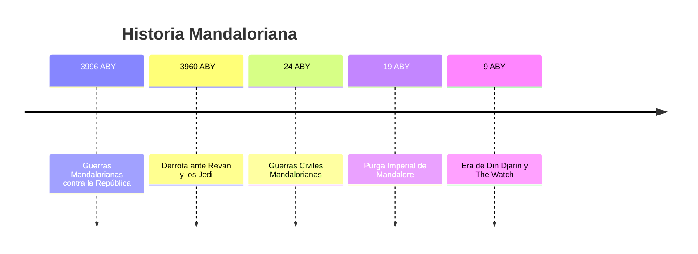
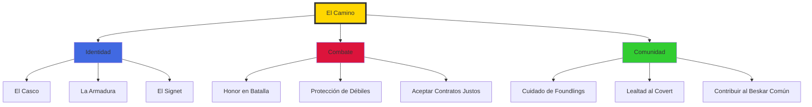
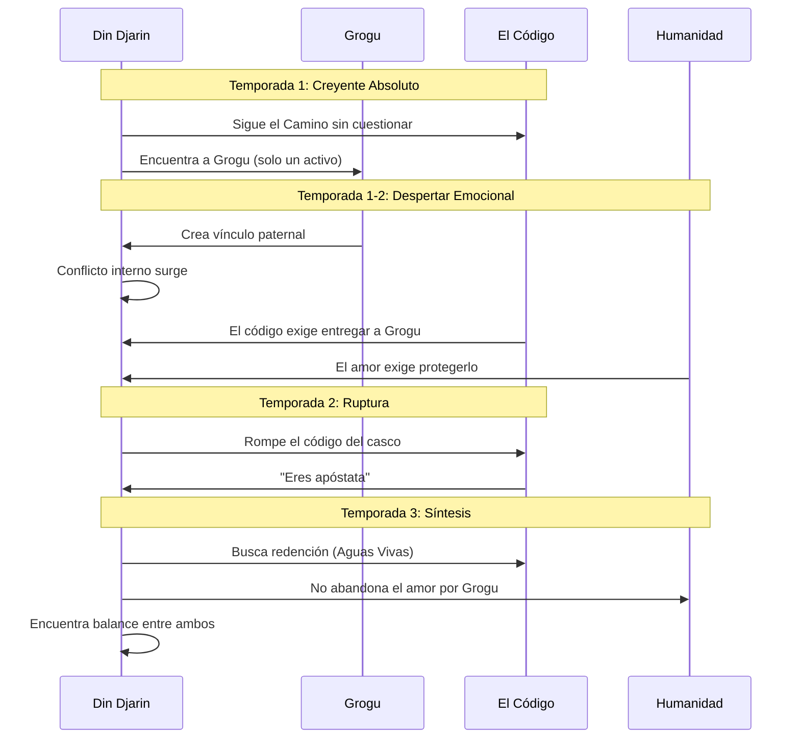
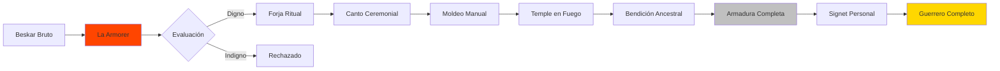
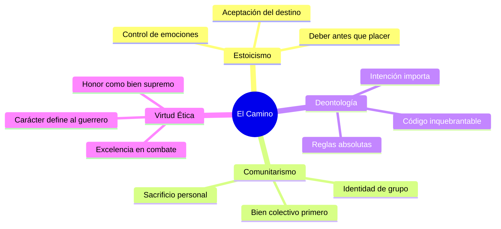
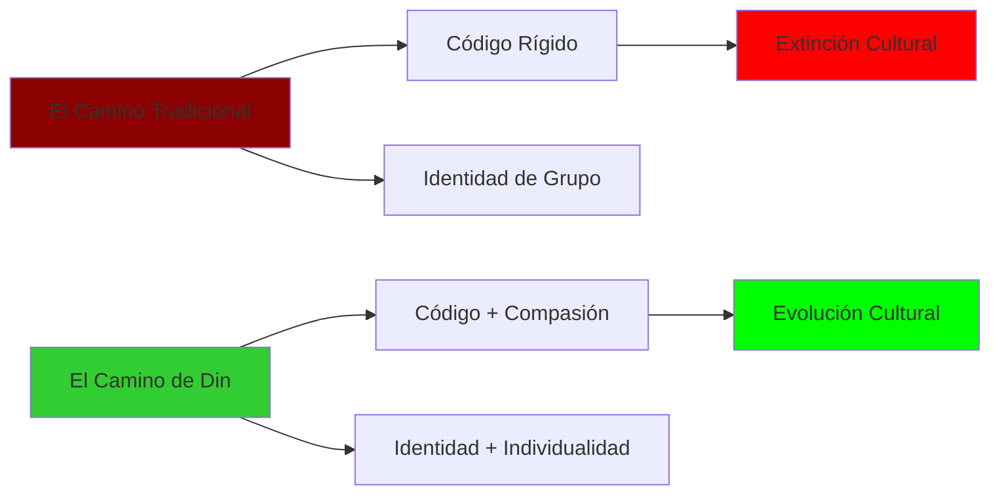

# 🌟 ARTÍCULO DESTACADO DEL MES - Octubre 2025

---

# 🛡️ El Camino del Mandaloriano

### *This is the Way* - Un Análisis del Código de Honor

---

**Breadcrumb:** [🏠 Inicio](index.md) > 🌟 Artículo Destacado

---

**📅 Fecha de creación:** 26 de octubre de 2025  
**🔄 Última actualización:** 26 de octubre de 2025  
**⏱️ Tiempo estimado de lectura:** 12 minutos  
**🏷️ Etiquetas:** `Mandalorianos` `Código de Honor` `The Mandalorian` `Filosofía` `Cultura` `Din Djarin`  
**🌟 Estado:** Artículo Destacado del Mes

---

## 📑 Tabla de Contenidos

1. [Introducción: "Este es el Camino"](#introducción-este-es-el-camino)
2. [Los Fundamentos del Código Mandaloriano](#los-fundamentos-del-código-mandaloriano)
3. [El Credo y sus Principios](#el-credo-y-sus-principios)
4. [Din Djarin: Evolución de un Creyente](#din-djarin-evolución-de-un-creyente)
5. [El Beskar: Más que un Metal](#el-beskar-más-que-un-metal)
6. [La Tensión entre Tradición y Cambio](#la-tensión-entre-tradición-y-cambio)
7. [Paralelos con Filosofías del Mundo Real](#paralelos-con-filosofías-del-mundo-real)
8. [Impacto Cultural de "This is the Way"](#impacto-cultural-de-this-is-the-way)
9. [Conclusiones: Honor en un Universo sin Ley](#conclusiones-honor-en-un-universo-sin-ley)
10. [Referencias](#referencias)

---

## Introducción: "Este es el Camino"

> **"This is the Way"**  
> *— El mantra que define una civilización*

La frase **"This is the Way"** (Este es el Camino) se ha convertido en uno de los **elementos más icónicos** de la serie *The Mandalorian* y, por extensión, de toda la cultura moderna de Star Wars. Más que un simple saludo o despedida, esta declaración encapsula toda una **filosofía de vida**, un código de honor inquebrantable que ha definido a la cultura [mandaloriana](glosario.md#mandalorianos) durante generaciones[1].

En la era post-Imperio, cuando las instituciones tradicionales han colapsado y el caos reina en los sistemas del [Borde Exterior](glosario.md#borde-exterior), el Camino representa algo más profundo que simples reglas: representa **identidad, propósito y pertenencia**. Para [Din Djarin](glosario.md#din-djarin), el protagonista de *The Mandalorian*, y su coverte, el Camino no es opcional — es la esencia misma de quiénes son.

Este artículo explora las **raíces filosóficas, implicaciones culturales y evolución narrativa** del código mandaloriano, examinando cómo una antigua tradición guerrera se adapta (o se resiste) a un universo en constante cambio. A través del viaje de Din Djarin y su relación con [Grogu](glosario.md#grogu), veremos cómo el honor, la lealtad y la rigidez doctrinal entran en conflicto con la compasión, la flexibilidad y el amor paternal.

---

## Los Fundamentos del Código Mandaloriano

### Orígenes Históricos

Los [mandalorianos](glosario.md#mandalorianos) no son una especie, sino una **cultura adoptiva** — un crisol de diferentes razas unidas bajo un código común. Históricamente, fueron **guerreros temidos** que casi conquistaron la galaxia en múltiples ocasiones, enfrentándose incluso a la [República Galáctica](glosario.md#república-galáctica) y la [Orden Jedi](glosario.md#jedi).

### Principios Fundamentales

| Principio | Descripción | Manifestación Práctica |
|-----------|-------------|------------------------|
| **"Este es el Camino"** | Aceptación inquebrantable del código | Respuesta ritual a directivas |
| **El Casco Nunca se Quita** | Identidad sublimada al colectivo | Anonimato ante otros seres vivos |
| **Lealtad al Clan** | El grupo antes que el individuo | Sacrificio personal por hermanos |
| **Los Foundlings son el Futuro** | Adopción y crianza de huérfanos | Grogu como foundling de Din |
| **El Beskar es Sagrado** | Respeto por tradiciones materiales | Solo armaduras de beskar genuino |
| **Fuerza a través del Honor** | Combate justo y directo | No hay ataques por la espalda |

<b>📖 Información adicional: La Tensión Doctrinal</b>

El código seguido por Din Djarin es específico de **"The Children of the Watch"** (Los Hijos de la Vigilia), una secta fundamentalista mandaloriana. Otros mandalorianos, como **Bo-Katan Kryze**, siguen interpretaciones más flexibles:

**The Watch (Fundamentalistas):**
- El casco nunca se quita ante seres vivos
- Interpretación literal de las antiguas tradiciones
- Rechazo a la asimilación con la sociedad galáctica
- Vida en coverts secretos

**Mandalorianos Tradicionales (Bo-Katan):**
- Pueden quitarse el casco
- Enfoque en reclamar Mandalore como planeta
- Participación en política galáctica
- Preservación de la cultura pero con pragmatismo

Esta tensión es **central** en la narrativa de The Mandalorian, planteando preguntas sobre pureza vs. supervivencia cultural.

---

## El Credo y sus Principios

### El Juramento del Guerrero

Cuando un foundling alcanza la mayoría de edad, debe pronunciar el **Credo Mandaloriano**. Aunque el texto completo nunca se revela en pantalla, conocemos fragmentos clave:

> *"I swear on my name and the names of the ancestors..."*  
> *"...that I shall walk the Way of the Mand'alor..."*  
> *"...and the words of the Creed shall be forever forged in my heart."*  
> — Fragmentos del Credo (reconstrucción de fans)

### Estructura del Código

### Reglas Específicas Observadas

1. **El Casco**: Una vez jurado el Credo, el casco no puede quitarse ante ningún ser vivo
2. **El Foundling**: Los huérfanos deben ser protegidos y criados en el Camino
3. **El Beskar**: El metal sagrado solo debe usarse para armaduras mandlorianas
4. **La Tribu Primero**: El individuo sirve al colectivo, no al revés
5. **Combate Honorable**: La victoria deshonrosa no es victoria

<b>🎓 Ejemplo detallado: La Crisis del Casco de Din Djarin</b>

La regla del casco crea el **conflicto central** de la Temporada 2:

**Episodio 15 - "The Believer":**
Din debe infiltrarse en una base imperial que requiere escaneo facial. Por primera vez desde la infancia, debe **quitarse el casco** ante otros (oficiales imperiales).

**Consecuencias:**
- Técnicamente rompe su Credo
- La Armorer lo declara "apóstata" en Temporada 3
- Debe redimirse bañándose en las Aguas Vivas de Mandalore
- Plantea pregunta filosófica: ¿El fin justifica los medios?

**Significado Narrativo:**
La serie usa esto para explorar **dogma vs. humanidad**. Din eligió salvar a Grogu sobre mantener su pureza ritual, mostrando que el amor puede trascender la doctrina.

---

## Din Djarin: Evolución de un Creyente

### Del Dogma a la Duda

### Tabla de Transformación

| Etapa | Estado Mental | Relación con Código | Relación con Grogu |
|-------|---------------|---------------------|-------------------|
| **Pre-Serie** | Devoto absoluto | Cumplimiento total | N/A |
| **T1 Ep1-3** | Seguro de sí mismo | Sin cuestionamientos | Distante (es un activo) |
| **T1 Ep4-8** | Primeras dudas | Conflicto emerge | Apego creciente |
| **T2 Ep1-4** | Dividido internamente | Priorizando a Grogu | Amor paternal pleno |
| **T2 Ep5-8** | Crisis de fe | Rompe código por Grogu | Autosacrificio |
| **T3 Ep1-4** | Buscando redención | Intenta reconciliar ambos | Relación madura |
| **T3 Ep5-8** | Síntesis lograda | Código + Compasión | Padre e hijo unidos |

---

## El Beskar: Más que un Metal

### Significado Cultural

El [beskar](glosario.md#beskar) (también conocido como "hierro mandaloriano") es **mucho más que un material** — es un símbolo de identidad, historia y resistencia. 

**Propiedades Físicas:**
- Extremadamente resistente (puede desviar sables de luz)
- Ligero pero increíblemente fuerte
- Rareza excepcional (solo en Mandalore)
- Trabajado con técnicas ancestrales

**Significado Simbólico:**
- Representa la **indestructibilidad** de la cultura mandaloriana
- Conexión tangible con los ancestros
- Prueba de legitimidad (solo verdaderos mandalorianos lo portan)
- Recurso comunal (todos contribuyen al covert)

### El Ritual de Forja

---

## La Tensión entre Tradición y Cambio

### El Dilema Central

La serie plantea una pregunta fundamental: **¿Puede una cultura sobrevivir sin evolucionar?**

| Perspectiva | Argumento | Representante |
|-------------|-----------|---------------|
| **Preservación Pura** | Las tradiciones son sagradas e inmutables; ceder es perder identidad | The Armorer, Paz Vizsla |
| **Adaptación Pragmática** | La supervivencia requiere flexibilidad; el dogma lleva a la extinción | Bo-Katan Kryze |
| **Síntesis (Din)** | Honor el pasado pero vive en el presente; la compasión no diluye la tradición | Din Djarin |

<b>⚖️ Datos históricos: Precedentes en Star Wars</b>

La tensión mandaloriana refleja conflictos históricos reales en Star Wars:

**Orden Jedi:**
- Código rígido vs. amor y apegos (Anakin Skywalker)
- Tradición vs. necesidad (militarización en Guerras Clon)
- Resultado: Extinción casi total por inflexibilidad

**Imperio Galáctico:**
- Orden a través de control absoluto
- Rechazo a diversidad y autonomía
- Resultado: Rebelión y colapso

**Lección para Mandalorianos:**
El fundamentalismo absoluto históricamente conduce a la destrucción. La síntesis de tradición y compasión (el camino de Din) puede ser la salvación.

---

## Paralelos con Filosofías del Mundo Real

### Comparación con Tradiciones Terrestres

El código mandaloriano resuena con varias filosofías y códigos de honor humanos:

| Tradición | Paralelo Mandaloriano | Elemento Común |
|-----------|----------------------|----------------|
| **Bushido (Samurái Japonés)** | Código del guerrero, honor sobre vida | Muerte antes que deshonra |
| **Código Caballeresco** | Protección de los débiles, combate justo | Nobleza en batalla |
| **Espartano** | Entrenamiento desde niñez, comunidad sobre individuo | Sociedad guerrera |
| **Monacato** | Renuncia a identidad personal (casco), votos | Sublimación del ego |
| **Adopción Romana** | Sistema de foundlings | Ciudadanía por cultura, no sangre |

### Principios Filosóficos Subyacentes

---

## Impacto Cultural de "This is the Way"

### Fenómeno en la Cultura Pop

La frase **"This is the Way"** trascendió la serie para convertirse en:

- **Meme universal** (2019-presente)
- **Filosofía de vida** adoptada por fans
- **Merchandising masivo** (camisetas, posters, tazas)
- **Expresión de compromiso** en contextos no-Star Wars

### Análisis del Impacto

| Aspecto | Impacto | Ejemplo |
|---------|---------|---------|
| **Lingüístico** | Frase incorporada al léxico fan | "This is the way" como respuesta a cualquier código/regla |
| **Comercial** | Generación de millones en merch | Productos con la frase superan otros quotes |
| **Social** | Comunidades basadas en "el Camino" | Grupos de cosplay, filosofía de vida |
| **Artístico** | Inspiración para creadores | Fan art, música, literatura |

> [!NOTE]
> "This is the Way" fue la **quinta frase más tuiteada** de 2020 relacionada con entretenimiento, superando incluso a frases de películas de Avengers.

---

## Conclusiones: Honor en un Universo sin Ley

### Lecciones del Camino Mandaloriano

El código mandaloriano, visto a través del viaje de Din Djarin, ofrece **reflexiones profundas** sobre:

1. **Identidad vs. Individualidad**: ¿Podemos mantener identidad cultural sin suprimir la individualidad?
2. **Tradición vs. Compasión**: ¿El amor y la flexibilidad debilitan o fortalecen una cultura?
3. **Dogma vs. Adaptación**: ¿La pureza doctrinal vale más que la supervivencia?
4. **Código vs. Contexto**: ¿Las reglas absolutas pueden coexistir con situaciones matizadas?

### La Respuesta de Din Djarin

Din encuentra una **tercera vía**: honrar el Camino mientras abraza la humanidad. No abandona su código al amar a Grogu; en cambio, **expande la definición** de lo que significa ser mandaloriano.

**"This is the Way"** evoluciona de significar:
- ❌ "Obedece sin cuestionar"
- ✅ "Encuentra honor en tus elecciones"

### Mensaje Universal

Al final, "El Camino del Mandaloriano" nos enseña que:

> **El verdadero honor no está en seguir reglas ciegamente,**  
> **sino en encontrar el balance entre tradición y humanidad,**  
> **entre el código y el corazón.**

En un universo post-Imperio donde las viejas estructuras han colapsado, tal vez lo que necesitamos no es **más rigidez**, sino **más compasión estructurada por honor**. Din Djarin demuestra que se puede ser ferozmente leal a una tradición mientras se evoluciona para proteger lo que realmente importa.

**This is the Way** — no como cadenas, sino como guía hacia algo mejor.

---

## Referencias

### Fuentes Principales

[1] Favreau, Jon & Filoni, Dave. *The Mandalorian* (Serie completa, Temporadas 1-3). Lucasfilm/Disney+, 2019-2023.

[2] Hidalgo, Pablo. *Star Wars: The Mandalorian - The Ultimate Visual Guide*. DK Publishing, 2020.

[3] *The Book of Boba Fett* (2021-2022) - Episodios con Din Djarin que expanden el canon mandaloriano.

### Referencias Externas

- **StarWars.com** - Mandalorian Cultural Database: https://www.starwars.com/databank/mandalorians
- **Wookieepedia** - Mandalorian Code: https://starwars.fandom.com/wiki/Mandalorian_code
- **[📖 Glosario](glosario.md)** - Términos: [Mandalorianos](glosario.md#mandalorianos), [Din Djarin](glosario.md#din-djarin), [Beskar](glosario.md#beskar), [Grogu](glosario.md#grogu)
- **[📚 Referencias Completas](referencias.md)** - IDs: SER-001, LIB-002, VID-003

---

## 🔗 Ver También

- [👶 Grogu (Baby Yoda)](articulo3.md) - La relación fundamental que cambió a Din
- [⚔️ Las Guerras Clon](articulo4.md) - Historia del conflicto que destruyó Mandalore
- [🏛️ Origen de la República](articulo2.md) - Contexto político galáctico
- [📖 Glosario Completo](glosario.md)
- [🏠 Página Principal](index.md)

---

## 🔗 Navegación

[← Volver al Inicio](index.md) | [Siguiente: Grogu →](articulo3.md)

[↑ Volver arriba](#-artículo-destacado-del-mes---octubre-2025)

---

**© 2025 Kevin Ponce - Wiki de Star Wars**  
*"Weapons are part of my religion."*

