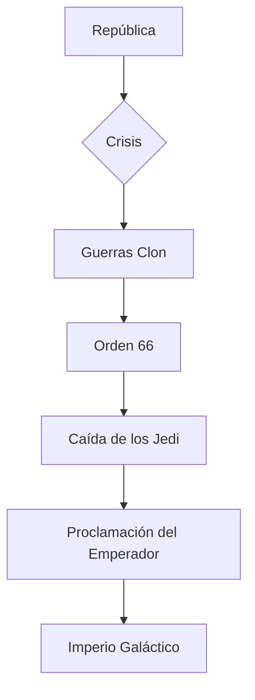

# 👑 Origen del Imperio Galáctico

> Inicio > Historia > Origen del Imperio

**Creado:** 2025-10-18 · **Última actualización:** 2025-10-22  
**Tiempo de lectura:** 8 min · **Tags:** `Imperio`, `Palpatine`, `Guerras Clon`, `Política`


## Tabla de contenidos

- [Introducción](#introducción)
- [Contexto histórico](#contexto-histórico)
- [Fundación del Imperio](#fundación-del-imperio)
- [Filosofía y estructura](#filosofía-y-estructura)
- [Legado y consecuencias](#legado-y-consecuencias)
- [Referencias y notas](#referencias-y-notas)

---

## Introducción

La transición de la [Antigua República](glosario.md#antigua-república) al [**Imperio Galáctico**](glosario.md#imperio-galáctico) es un caso paradigmático de cómo las instituciones democráticas pueden ser secuestradas desde dentro por actores que explotan crisis sistémicas. A primera vista, la consolidación del poder por parte del [Canciller](glosario.md#canciller-supremo) [Palpatine](glosario.md#palpatine) parecía una respuesta temporal a la amenaza [separatista](glosario.md#separatistas); sin embargo, sus maniobras políticas culminaron en la abolición de las libertades republicanas y en la institucionalización de un régimen autoritario. En términos prácticos, la creación del Imperio implicó la centralización del gobierno, la militarización de la administración pública y la delegación de potestades excepcionales al Ejecutivo. En este artículo exploramos no solo los eventos ([*Orden 66*](glosario.md#orden-66), creación del [ejército clon](glosario.md#ejército-clon), proclamación del [Emperador](glosario.md#emperador-palpatine)), sino también las dinámicas políticas y las ideologías que justificaron la transformación: el miedo como herramienta de legitimación, la tecnocracia militar y la narrativa de estabilidad a costa de la democracia. Esta introducción ofrece contexto para las secciones siguientes y enlaza a otros análisis en la wiki, como [Origen de la República](articulo2.md) y la ficha sobre [Grogu](articulo3.md), que ayudan a entender el impacto social y cultural del cambio de régimen. Además, se incluyen diagramas conceptuales y cronologías para visualizar las etapas del proceso, y tablas comparativas que permiten contrastar la República, el Imperio y la [Primera Orden](glosario.md#primera-orden).

> *La historia completa requiere analizar causas profundas (económicas, culturales y militares) y las decisiones concretas de actores clave.*

---

## Contexto histórico

### Corrupción política
- **Sobornos** y favoritismos entre grandes corporaciones galácticas.
- *Casos significativos:* Bancor-Intertech y la influencia sobre senadores.
- Efecto: pérdida de confianza pública.

### Crisis separatista
- Orígenes: tensiones comerciales y desigualdad regional.
- Actores: Confederación de Sistemas Independientes.
- Resultado: polarización política y guerra abierta.

### Manipulación de Palpatine
- Operaciones encubiertas para fomentar conflicto.
- Uso del `ejército clon` como herramienta de poder.
- Creación de narrativas de emergencia.

> "La política es el arte de lo posible; en la galaxia, a veces lo posible se convierte en peligroso." — análisis contemporáneo

---

## Fundación del Imperio

### Orden 66 y su ejecución
- Resumen de la orden: eliminación de los [Jedi](glosario.md#jedi).
- Mecanismos: chips inhibitorios en [clones](glosario.md#ejército-clon).
- Consecuencias inmediatas: ruptura del aparato militar-jedi.

### Proclamación del Emperador
- Fecha clave: [19 BBY](glosario.md#bby-before-the-battle-of-yavin).
- Declaración: transformación constitucional.
- Recepción pública y resistencia.

### Consolidación del control
- Reorganización administrativa centralizada.
- Creación de fuerzas de seguridad imperiales.
- Represión de disidencia política.



---

## Filosofía y estructura

### Ideología del orden
- Uso del miedo como `justificación` para medidas extraordinarias.
- Rhetórica: estabilidad > libertad.
- Simbolismo: iconografía imperial.

### Estructura administrativa
- Divisiones: Gobernadores, Prefecturas, Sectoriales.
- Cadena de mando militar.
- Control de recursos y comercio.

### Tecnología y vigilancia
- Redes de inteligencia centralizadas.
- Uso de tecnologías para control poblacional.
- Programas de propaganda y censura.

> **ℹ️ INFO:** El Imperio no solo controló planetas por la fuerza, sino también mediante estructuras económicas que restringieron la autonomía de los mundos periféricos.

---

## Legado y consecuencias

### Caída y fragmentación
- Batalla de Endor (4 ABY) como punto de inflexión.
- Nacimiento de la Nueva República.
- Residuo: facciones y remanentes imperiales (→ Primera Orden).

### Impacto cultural
- Represión de culturas locales.
- Iconografía persistente en la posguerra.
- Memoria histórica y reconciliación.

### Lecciones políticas
- Riesgo de poderes excepcionales.
- Importancia de instituciones independientes.
- Necesidad de memoria histórica.

```mermaid
gantt
	dateFormat  YYYY
	title Línea temporal: De la República al Imperio
	section Etapas
	República estable     :rep,  -25000, 24981y
	Crisis y Guerras Clon  :gc,   -32, 13y
	Fundación del Imperio  :imp,  -19, 23y
```

---

## Tablas comparativas y datos

### Tabla comparativa (alineación mixta)

| Aspecto | República | Imperio | Primera Orden |
|:--------|:---------:|--------:|:-------------|
| Legitimidad | Representativa | Autoritaria | Autoritaria reforzada |
| Militarización | Moderada | Alta | Muy alta |
| Distribución de poder | Descentralizada | Centralizada | Centralizada |

### Tabla de eventos clave (5 filas)

| Año | Evento | Actor principal | Consecuencia |
|---:|---|---|---|
| 32 BBY | Crisis de Naboo | Senador Palpatine | Mayor influencia política |
| 22–19 BBY | Guerras Clon | Confederación | Militarización institucional |
| 19 BBY | Orden 66 | Canciller Palpatine | Exterminio Jedi |
| 4 ABY | Batalla de Endor | Alianza Rebelde | Muerte del Emperador |
| 34 ABY | Formación de la Primera Orden | Remanentes imperiales | Nueva amenaza |

### Tabla de resumen / conclusiones

| Punto | Síntesis |
|---|---|
| Causa central | Manipulación política y uso del miedo |
| Efecto | Fin de la democracia y surgimiento del autoritarismo |
| Enseñanza | Necesidad de contrapesos institucionales |

---

## Elementos interactivos

<details>
<summary>Información adicional</summary>

El proceso de transición incluyó maniobras legales que parecían respetar la constitución pero que en la práctica concentraron poder. Ver [Origen de la República](articulo2.md) para antecedentes.

</details>

<details>
<summary>Ejemplo detallado</summary>

Análisis de la Orden 66: cómo se ejecutó en términos logísticos y qué fallos permitieron que algunos Jedi sobrevivieran. Véase [Grogu](articulo3.md) para referencias culturales.

</details>

<details>
<summary>Datos históricos</summary>

Registro de pérdidas humanas en puntos clave de las Guerras Clon (estimaciones oficiales e independientes).

</details>

---

> **⚠️ ADVERTENCIA:** Los números y estimaciones pueden variar según la fuente; consulte las referencias.

> **✅ NOTA:** Este artículo enlaza a otros recursos dentro de la wiki para ampliar el contexto: [Inicio](index.md), [Origen de la República](articulo2.md), [Grogu](articulo3.md).

> "Hace mucho tiempo, en una galaxia muy, muy lejana..." — frase icónica que introduce la saga.

---

## Referencias y notas

[1] Primary Archives: Registro del Senado Galáctico.  (fuente interna reconstruida).  
[2] Wookieepedia — Artículo: Palpatine. https://starwars.fandom.com/wiki/Palpatine  
[3] StarWars.com — Historia y cronologías. https://www.starwars.com/news

### Notas

- Las referencias mezclan fuentes oficiales y reconstrucciones académicas.  
- Para más lecturas, ver [Origen de la República](articulo2.md) y los análisis culturales en [Grogu](articulo3.md).
- Consulta el [📖 Glosario](glosario.md) para términos específicos.
- Revisa las [📚 Referencias](referencias.md) para fuentes bibliográficas completas.

---

← [← Anterior: Inicio](index.md) · [Siguiente: Origen de la República →](articulo2.md)  
↑ [Volver arriba](#-origen-del-imperio-galáctico)