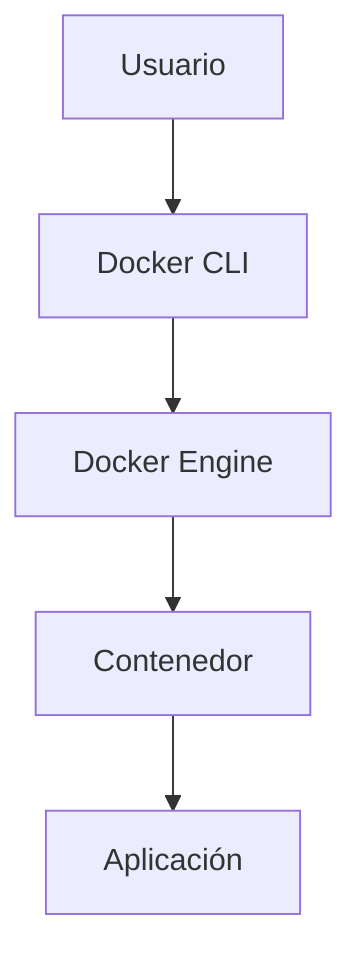

# Artículo 1: ¿Qué es Docker y cómo funciona? 

## Breadcrumb de navegación
Inicio > Artículos > ¿Qué es Docker?

## Fecha de creación y última actualización
- **Fecha de creación:** 2023-10-01
- **Última actualización:** 2024-06-01

## Tiempo estimado de lectura
- **Tiempo de lectura:** 8 minutos

## Etiquetas
- #Contenedores #Docker #DevOps #Educativo #Introducción

## Tabla de Contenidos
1. Introducción
2. ¿Qué es Docker?
   1. Historia y contexto
   2. Arquitectura de Docker
   3. Componentes principales
3. ¿Cómo funciona Docker?
   1. Imágenes y contenedores
   2. Docker Engine
   3. Docker Hub
4. Ejemplo práctico: Primer contenedor
5. Conclusiones

## Introducción
En este artículo descubrirás **qué es Docker**, cómo funciona y por qué ha revolucionado el desarrollo y despliegue de aplicaciones. Docker es una plataforma de código abierto que permite automatizar el despliegue de aplicaciones dentro de contenedores, proporcionando portabilidad, eficiencia y consistencia en diferentes entornos. Aprenderás los conceptos básicos, su arquitectura y cómo empezar a usarlo con ejemplos prácticos.

## Sección 1: ¿Qué es Docker?
### 1.1 Historia y contexto
Docker fue lanzado en 2013 y rápidamente se convirtió en un estándar para la virtualización ligera. Aprovecha tecnologías del kernel de Linux como *cgroups* y *namespaces* para aislar procesos.

### 1.2 Arquitectura de Docker
Docker se basa en una arquitectura cliente-servidor, donde el *Docker Engine* ejecuta y gestiona los contenedores.

### 1.3 Componentes principales
- **Imágenes:** Plantillas inmutables para crear contenedores.
- **Contenedores:** Instancias en ejecución de imágenes.
- **Docker Hub:** Repositorio de imágenes públicas y privadas.

## Sección 2: ¿Cómo funciona Docker?
### 2.1 Imágenes y contenedores
Las imágenes contienen todo lo necesario para ejecutar una aplicación. Los contenedores son instancias de estas imágenes.

### 2.2 Docker Engine
El motor de Docker es el responsable de crear, ejecutar y gestionar los contenedores.

### 2.3 Docker Hub
Permite compartir y descargar imágenes de la comunidad o privadas.

## Sección 3: Ejemplo práctico: Primer contenedor
Para ejecutar tu primer contenedor Docker:

```bash
docker run -d -p 80:80 nginx
```
Este comando descarga la imagen de Nginx y la ejecuta en un contenedor.

## Conclusiones
Docker facilita el desarrollo, despliegue y escalado de aplicaciones, permitiendo a los equipos trabajar de forma más ágil y eficiente.

## Elementos Visuales
### Diagrama Conceptual


### Tabla Comparativa
| Elemento      | Descripción                          | Importancia         |
|---------------|--------------------------------------|---------------------|
| Imágenes      | Plantillas para crear contenedores   | Alta                |
| Contenedores  | Instancias en ejecución              | Alta                |
| Docker Hub    | Repositorio de imágenes              | Media               |

## Elementos Interactivos
<details>
<summary>Información adicional</summary>
Docker está disponible para Windows, macOS y Linux, y se integra fácilmente con herramientas de CI/CD.
</details>

<details>
<summary>Ejemplo detallado</summary>
Puedes crear tu propia imagen Docker usando un archivo <code>Dockerfile</code> y el comando <code>docker build</code>.
</details>

<details>
<summary>Datos históricos</summary>
Docker fue creado por Solomon Hykes y presentado en PyCon 2013.
</details>

## Referencias y Citas
1. [Documentación oficial de Docker](https://docs.docker.com)
2. [Historia de Docker - Docker Blog](https://www.docker.com/blog/a-brief-history-of-docker/)
3. [Docker Hub](https://hub.docker.com)

### Notas
- [1] Docker Docs. "Get Started". Última consulta: 2024-06-01.
- [2] Docker Blog. "A Brief History of Docker". Última consulta: 2024-06-01.
- [3] Docker Hub. "Overview". Última consulta: 2024-06-01.

> "Docker cambió la forma en que desarrollamos y desplegamos aplicaciones."  
> "La portabilidad de los contenedores es clave para el desarrollo moderno."  
> "Aprender Docker es esencial para cualquier profesional de TI actual."

## Navegación
- [Siguiente →](articulo-2.md)
- [↑ Volver arriba](#qué-es-docker-y-cómo-funciona-🐳)
- Ver también: [Artículo 2](articulo-2.md), [Artículo 3](articulo-3.md), [Glosario](glosario.md)