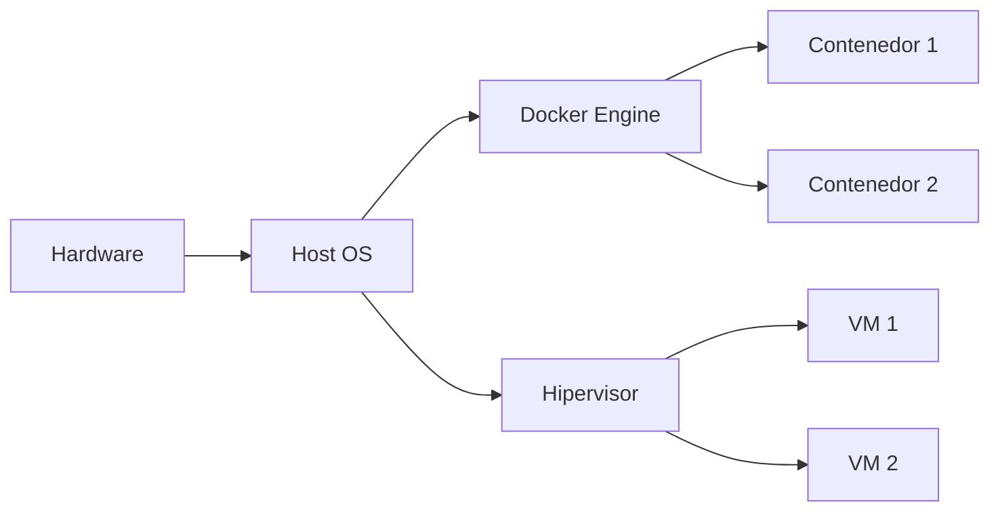
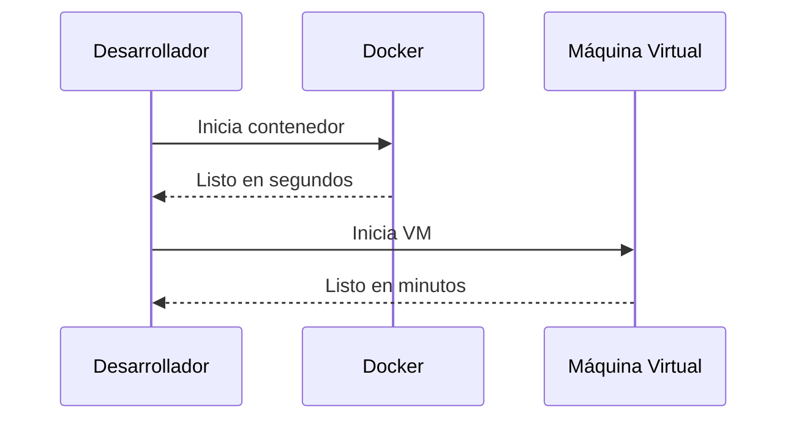

# Artículo 3: Diferencias clave entre Docker y las máquinas virtuales ⚖️

## Breadcrumb de Navegación
Inicio > Artículos > Diferencias clave

## Fecha de Creación y Última Actualización
- **Fecha de Creación:** 2023-10-03
- **Última Actualización:** 2024-06-01

## Tiempo Estimado de Lectura
- **Tiempo de Lectura:** 10 minutos

## Etiquetas
#Contenedores #Virtualización #Comparativas #Docker #MáquinasVirtuales #Educativo

## Tabla de Contenidos
1. Introducción
2. Arquitectura y funcionamiento
   1. Docker: arquitectura de contenedores
   2. Máquinas virtuales: arquitectura tradicional
   3. Comparación visual
3. Rendimiento y uso de recursos
   1. Consumo de memoria y CPU
   2. Velocidad de arranque
   3. Escalabilidad
4. Seguridad y aislamiento
   1. Aislamiento de procesos
   2. Superficie de ataque
   3. Actualizaciones y parches
5. Conclusiones

## Introducción
En este artículo analizamos las **diferencias clave entre Docker y las máquinas virtuales (VMs)**. Aunque ambas tecnologías permiten ejecutar aplicaciones en entornos aislados, su arquitectura, rendimiento, seguridad y casos de uso presentan diferencias fundamentales. Comprender estas diferencias es esencial para elegir la mejor solución según las necesidades de cada proyecto.

## Sección 1: Arquitectura y funcionamiento
### 1.1 Docker: arquitectura de contenedores
Docker utiliza el sistema operativo anfitrión para ejecutar múltiples contenedores de forma ligera, compartiendo el kernel pero aislando los procesos mediante *namespaces* y *cgroups*.

### 1.2 Máquinas virtuales: arquitectura tradicional
Las VMs ejecutan sistemas operativos completos sobre un hipervisor, lo que implica mayor consumo de recursos pero un aislamiento más fuerte.

### 1.3 Comparación visual
- **Docker:** Contenedores ligeros, rápidos de iniciar, comparten kernel.
- **VM:** Sistemas completos, mayor aislamiento, requieren más recursos.

## Sección 2: Rendimiento y uso de recursos
### 2.1 Consumo de memoria y CPU
Docker consume menos memoria y CPU, permitiendo ejecutar más instancias en el mismo hardware.

### 2.2 Velocidad de arranque
Los contenedores Docker arrancan en segundos, mientras que las VMs pueden tardar minutos.

### 2.3 Escalabilidad
Docker facilita el escalado horizontal gracias a su ligereza y portabilidad.

## Sección 3: Seguridad y aislamiento
### 3.1 Aislamiento de procesos
Las VMs ofrecen un aislamiento total a nivel de hardware, mientras que Docker aísla procesos a nivel de sistema operativo.

### 3.2 Superficie de ataque
Las VMs reducen el riesgo de ataques entre entornos, pero Docker ha mejorado mucho en seguridad con herramientas como seccomp y AppArmor.

### 3.3 Actualizaciones y parches
Actualizar contenedores es más rápido y sencillo, pero las VMs permiten aplicar parches a nivel de sistema operativo completo.

## Conclusiones
Docker y las máquinas virtuales tienen ventajas y desventajas según el contexto. Docker destaca en rapidez y eficiencia, mientras que las VMs ofrecen mayor aislamiento y compatibilidad. La elección depende de los requisitos de seguridad, rendimiento y flexibilidad del proyecto.

## Elementos Visuales
### Diagrama Conceptual

### Diagrama de Proceso

### Tablas
#### Tabla Comparativa
| Característica         | Docker           | Máquina Virtual    |
|-----------------------|------------------|-------------------|
| Consumo de recursos   | Bajo             | Alto              |
| Velocidad de arranque | Segundos         | Minutos           |
| Aislamiento           | Medio            | Alto              |
| Portabilidad          | Alta             | Media             |
| Seguridad             | Media            | Alta              |

#### Tabla de Datos
| Métrica         | Docker | VM   |
|-----------------|--------|------|
| RAM mínima      | ~50MB  | >512MB|
| Tiempo arranque | 2s     | 1-2min|
| Instancias/hw   | 10+    | 2-4  |
| Kernel propio   | No     | Sí   |
| SO completo     | No     | Sí   |

#### Tabla de Resumen
| Punto Clave         | Docker                        | VM                        |
|---------------------|------------------------------|---------------------------|
| Mejor para...       | Microservicios, CI/CD        | Sistemas legados, seguridad|
| Limitaciones        | Menos aislamiento             | Más recursos necesarios   |
| Escalabilidad       | Muy alta                      | Media                     |

## Elementos Interactivos

Información adicional

Docker usa el kernel del host, mientras que cada VM tiene su propio kernel y sistema operativo.

Ejemplo detallado

Ejecutar 10 contenedores Nginx en Docker consume menos recursos que 10 VMs con Nginx.

Datos históricos

Docker nació en 2013, mientras que la virtualización de VMs existe desde los años 60.

## Referencias y Citas
1. [Comparativa Docker vs VM - IBM](https://www.ibm.com/cloud/blog/docker-vs-vm)
2. [Documentación oficial de Docker](https://docs.docker.com)
3. [¿Qué es una máquina virtual? - Red Hat](https://www.redhat.com/es/topics/virtualization/what-is-a-virtual-machine)

### Notas
- [1] IBM Cloud. "Docker vs VM". Última consulta: 2024-06-01.
- [2] Docker Docs. "Get Started". Última consulta: 2024-06-01.
- [3] Red Hat. "Virtual Machines". Última consulta: 2024-06-01.

> "La clave está en elegir la herramienta adecuada para cada necesidad."  
> "Docker y las VMs pueden coexistir en arquitecturas híbridas."  
> "El futuro de la virtualización es la flexibilidad."

## Navegación
[← Anterior](articulo-2.md) | [Siguiente →](articulo-4.md) | [↑ Volver arriba](#diferencias-clave-entre-docker-y-las-máquinas-virtuales-️)

### Ver También
- [Artículo 1](articulo-1.md)
- [Artículo 2](articulo-2.md)
- [Artículo 4](articulo-4.md)
- [Artículo 5](articulo-5.md)